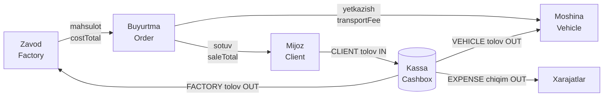
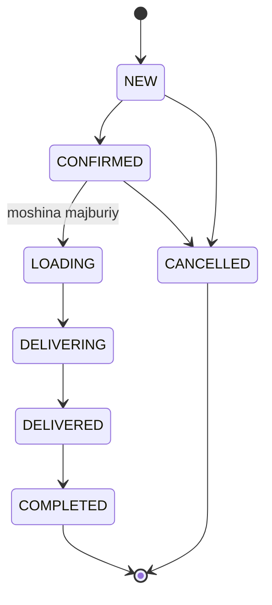

# 1. Umumiy tavsif

> Loyiha: SmartBlok CRM/ERP | Hujjat: Texnik topshiriq (TZ) | Versiya: 1.0 | Sana: 2026-07-09 | Branch: main (v2 order-lifecycle)

---

## 1.1. Loyiha maqsadi va biznes konteksti

**SmartBlok** — Xorazm viloyatida gazoblok (aerobeton / aerated concrete) mahsulotlarini **ulgurji savdo va yetkazib berish** biznesini boshqarish uchun moljallangan yaxlit CRM/ERP tizimidir. Loyiha ildiz `package.json` faylida tizim rasman `"CRM/ERP for gas-block (aerated concrete) wholesale distribution"` deb ta'riflangan.

Biznesning amaldagi ish jarayoni bir nechta zavoddan (masalan, `CAOLS KS`, `Navoiy`, `Arton`, `Samarkand`, `KKG`) gazoblok sotib olib, uni agentlar tarmogi orqali viloyat hududlaridagi (`Xorazm Beruniy`, `Urganch`, `Xazorasp`, `Shovot`, `Xonka`) mijozlarga yetkazib berishga asoslangan. Har bir bitim uch tomonlama moliyaviy munosabatni yuzaga keltiradi:

1. **Mijoz bizga qarzdor** — yetkazilgan mahsulot uchun (`saleTotal`).
2. **Biz zavodga qarzdormiz** — olingan mahsulot tannarxi uchun (`costTotal`).
3. **Biz moshinaga (transportga) qarzdormiz** — yetkazib berish xizmati uchun (`transportFee`).

### Asosiy biznes muammosi

Hozirga qadar bu hisob-kitoblar **qolda Excel jadvallarida** yuritilgan. Excel yondashuvi quyidagi cheklovlarga ega:

| Muammo | SmartBlok yechimi |
|---|---|
| Qolda hisoblanadigan qarz balanslari (mijoz/zavod/moshina) xatolarga moyil | Balanslar `Order` va `Payment` yozuvlaridan **avtomatik, real vaqtda** aggregatsiya qilinadi (10-bob. Qarzlar) |
| Tannarx (landed cost) va eng arzon zavodni tanlash qolda | **Tannarx matritsasi** moduli hudud boyicha eng arzon manbani avtomatik aniqlaydi (9-bob. Tannarx matritsasi) |
| Kassa (naqd/Click/Bank/dollar) qoldiqlari alohida sanaladi | Har tolov/xarajat kassaga **atomik** (bir tranzaksiyada) yoziladi; balans drift bolmaydi (8-bob. Tolovlar va kassalar) |
| Agentlar boyicha savdo/foyda/yigilgan tolov yigindisi qolda | Agent va svod hisobotlari avtomatik hisoblanadi (12-bob. Hisobotlar) |
| Rol va kirish nazorati yoq | JWT autentifikatsiya + rolga asoslangan RBAC (3-bob. Autentifikatsiya) |
| Tarixiy Excel malumotni kochirish qiyin | Mavjud gazoblok Excel faylini **import qilish** moduli (11-bob. Excel import) |

Loyihaning strategik maqsadi — **qoldagi Excel hisob-kitobini toliq raqamli, kop foydalanuvchili, rolga asoslangan tizimga kochirish** va shu orqali moliyaviy shaffoflik, hisobdorlik hamda tezkorlikni ta'minlash.

---

## 1.2. Tizim doirasi (Scope)

### 1.2.1. Doiraga kiradigan imkoniyatlar (In Scope)

Tizim quyidagi funksional bloklarni **amalda** qamrab oladi (barchasi koddа ishlaydigan holda mavjud):

- Agentlar, mijozlar va hududlar boshqaruvi (CRM yadrosi).
- Katalog: zavodlar, mahsulotlar, moshinalar.
- Buyurtma hayot-sikli (order lifecycle): yaratishdan yakunlashgacha 6 bosqichli oqim.
- Uch tomonlama tolovlar (mijozdan kirim, zavodga/moshinaga chiqim) va kassalar (naqd UZS, naqd USD, Click, Bank).
- Uch tomonlama qarzlar hisoboti va xarajatlar boshqaruvi.
- Tannarx (landed cost) matritsasi va hudud boyicha eng arzon manbani tanlash.
- Boshqaruv paneli (dashboard) va svod hisobotlari.
- Foydalanuvchilar va rollarni boshqarish (RBAC).
- Excel faylidan tarixiy malumotni import qilish.

### 1.2.2. Doiradan tashqari (Out of Scope)

Quyidagilar joriy versiyada (`v2 order-lifecycle`) **amalga oshirilmagan** yoki ataylab qamrovdan tashqarida qoldirilgan — bu koddagi haqiqatdan kelib chiqadi:

| Element | Holati / izoh |
|---|---|
| Hisobotlarni Excel/PDF ga eksport qilish (server tomonda) | Backendda YOQ. Frontendda faqat oddiy **CSV eksport** (`;` ajratgichli, `.xlsx` emas) mavjud |
| Kredit limiti (`creditLimit`) nazorati | Maydon saqlanadi, lekin buyurtma/tolovda **tekshirilmaydi** — faqat malumot sifatida |
| Marshrut darajasidagi rolga asoslangan himoya (frontend) | Frontend faqat menyu filtrlaydi; haqiqiy himoya backend `@Roles` orqali |
| Valyuta kursini avtomatik konvertatsiya (kassa balansda) | `rate` saqlanadi, lekin balans hisobida **konvertatsiya qilinmaydi** (har kassa bitta valyutada) |
| Buyurtma / xarajatni **tahrirlash** ba'zi joylarda | Xarajatlar uchun UPDATE endpointi yoq (faqat create/delete) |
| Prisma migratsiyalari | Migratsiya skriptlari yoq — dev'da `prisma db push` ishlatiladi |
| Graceful shutdown, ishlab chiqarish (production) darajasidagi xavfsizlik | Demo parollar zaif, `JWT_SECRET` fallback qattiq yozilgan — prodda almashtirish shart |
| Bildirishnomalar (notifications) | Oldingi versiyalarda bor edi, joriy versiyada olib tashlangan |

> **Eslatma.** SQLite (dev) va PostgreSQL (production) qollab-quvvatlanadi; ammo PostgreSQL ga otish qolda sxema ozgartirishini talab qiladi (infra tafsilotlari uchun 2-bob. Arxitektura va 4-bob. Malumotlar modeliga qarang).

---

## 1.3. Asosiy imkoniyatlar royxati (modullar)

Tizim NestJS backend'ida **20 ta feature modul** sifatida tashkil etilgan (`app.module.ts`). Quyida ular biznes bloklariga guruhlangan holda qisqacha keltirilgan:

### Savdo (CRM yadrosi)

| Modul | Vazifasi | Batafsil bob |
|---|---|---|
| **Agents** | Agentlar CRUD; agent yaratilganda login-user avtomatik ochiladi; savdo/foyda/yigilgan tolov korsatkichlari | 5-bob |
| **Clients** | Mijozlar CRUD; har mijoz uchun qoldiq (balance) va hisob-varaqa; AGENT roli uchun scoping | 5-bob |
| **Regions** | Hududlar (viloyat tumanlari) uchun oddiy CRUD | 5-bob |
| **Orders** | Buyurtma hayot-sikli, orderNo generatsiyasi, totals hisobi, status boshqaruvi | 7-bob |

### Katalog

| Modul | Vazifasi | Batafsil bob |
|---|---|---|
| **Factories** | Zavodlar katalogi; "biz zavodga qancha qarzdormiz" hisobi | 6-bob |
| **Products** | Mahsulotlar katalogi (zavodga bogliq, narx bilan) | 6-bob |
| **Vehicles** | Transport vositalari katalogi; "biz moshinaga qancha qarzdormiz" hisobi | 6-bob |
| **Procurement** | Tannarx (landed cost) matritsasi, narx va logistika marshrutlari | 9-bob |

### Moliya

| Modul | Vazifasi | Batafsil bob |
|---|---|---|
| **Payments** | Uch tomonlama tolovlar (CLIENT/FACTORY/VEHICLE), kassaga atomik posting | 8-bob |
| **Kassa** | Kassalar balansi, qolda kirim/chiqim, tranzaksiyalar tarixi | 8-bob |
| **Expenses** | Xarajatlar va xarajat kategoriyalari; kassadan chiqim | 10-bob |
| **Debts** | Uch tomonlama qarzlar xulosasi (faqat oqish) | 10-bob |

### Analitika va tizim

| Modul | Vazifasi | Batafsil bob |
|---|---|---|
| **Dashboard** | KPI, sotuv trendi, agent reytingi, buyurtma voronkasi | 12-bob |
| **Reports** | Svod (yigma) hisoboti — agentlar yakuni, zavod balansi | 12-bob |
| **Auth** | Login, JWT imzolash, profil (me) | 3-bob |
| **Users** | Foydalanuvchilar CRUD (faqat ADMIN) | 3-bob |
| **Import** | Excel workbook'dan orders va payments import qilish | 11-bob |

> Qolgan yordamchi modullar (`Prisma`, `Config`) infratuzilma qatlamiga tegishli (2-bob. Arxitektura).

---

## 1.4. Foydalanuvchi turlari (rollar)

Tizimda **4 ta rol** mavjud. Rollar Prisma sxemasida haqiqiy `enum` emas, `String` sifatida saqlanadi; ruxsat etilgan qiymatlar: `ADMIN | ACCOUNTANT | AGENT | CASHIER`. Har rolning kirish huquqi backend `@Roles` dekoratorlari orqali cheklanadi, frontend esa navigatsiya menyusini shu rollar boyicha filtrlaydi.

| Rol | Ozbekcha nom | Asosiy vakolatlari (qisqacha) |
|---|---|---|
| `ADMIN` | Administrator | Toliq huquq: barcha modullar, foydalanuvchilar boshqaruvi, ochirish amallari |
| `ACCOUNTANT` | Bosh buxgalter | Savdo, katalog, moliya, hisobotlar, import; ochirishning ayrim turlari |
| `AGENT` | Agent | Faqat oz mijozlari/buyurtmalari/tolovlari (agent-scoping); buyurtma va mijoz kiritish |
| `CASHIER` | Kassir | Tolovlar, kassalar va xarajatlar; alohida "Kassa paneli" dashboard |

Batafsil rol-huquq matritsasi va agent-scoping mexanizmi uchun **3-bob. Autentifikatsiya va RBAC** ga qarang.

---

## 1.5. Yuqori darajadagi biznes jarayoni

Quyidagi diagramma bitim (buyurtma) atrofidagi asosiy moliyaviy oqimni umumlashtiradi:

Buyurtma holatlar oqimi (order lifecycle) chiziqli, 6 bosqichli:

> **Muhim qoida.** Qarz va moliyaviy hisob-kitoblarga faqat status `DELIVERED` yoki `COMPLETED` bolgan buyurtmalar kiradi. `LOADING` va undan keyingi holatlar uchun moshina biriktirilishi shart. Batafsil oqim va cheklovlar uchun **7-bob. Buyurtmalar** ga qarang.

---

## 1.6. Terminlar lugati (Glossary)

Quyidagi atamalar butun hujjat davomida ishlatiladi:

| Atama | Ta'rifi |
|---|---|
| **Gazoblok** | Aerobeton (aerated concrete) bloklari — asosiy sotiladigan mahsulot. Olcham namunasi: `600x300x200`, `600x300x100` (mm). Olchov birligi — `m³` (kub metr) |
| **m³ (kub metr)** | Gazoblokning asosiy olchov va narxlash birligi. Buyurtma miqdori (`quantity`) va narxlar (`pricePerM3`, `costPricePerUnit`, `salePricePerUnit`) shu birlik boyicha |
| **Poddon / zalog** | Gazoblok tashiladigan yogoch tovoq (palet). Amaldagi joriy versiya kodida alohida poddon/zalog hisobi **modellashtirilmagan** (kelajakdagi kengaytma) |
| **Landed cost (yetkazilgan tannarx)** | Mijozgacha yetib boruvchi bir m³ ning toliq tannarxi. Formula: `landedCostPerM3 = pricePerM3 + costPerTruck / truckCapacityM3` (zavod narxi + logistika / mashina hajmi). Batafsil 9-bob |
| **Kassa (Cashbox)** | Pul saqlanadigan hisob-varaq. Turlari: naqd UZS, naqd USD, Click, Bank. Har tolov/xarajat tegishli kassaga yoziladi |
| **Svod (svodka)** | Agentlar boyicha yakuniy yigma hisobot (yetkazilgan tovar, tolangan, balans, foyda) + umumiy jamlar (12-bob) |
| **Marja / net cost** | Diler bonusidan keyingi haqiqiy tannarx: `netCostPerM3 = landed * (1 - dealerBonusPct)`. `dealerBonusPct` ulush (0..1) sifatida qabul qilinadi |
| **Tannarx (costTotal)** | Zavoddan olingan mahsulot qiymati: `costTotal = quantity * costPricePerUnit`. Izoh: "biz zavodga qarzdormiz" |
| **saleTotal** | Mijozga sotilgan qiymat: `saleTotal = quantity * salePricePerUnit`. Izoh: "mijoz bizga qarzdor" |
| **Foyda (profit)** | `profit = saleTotal - costTotal - transportFee`. Transport haqi foydadan ayriladi, lekin sotuv/tannarxga qoshilmaydi |
| **transportFee (transport haqi)** | Moshinaga tolanadigan yetkazib berish xizmati haqi |
| **Kurs (rate)** | USD dan UZS ga ayirboshlash kursi (masalan, frontend default `12700`). USD tolovda `amount = usdAmount * rate` |
| **Balance (qoldiq)** | Uch tomonlama qarz kolsatkichi: mijozda `delivered - paid` (musbat = bizga qarzdor); zavod/moshinada `owed - paid` (musbat = biz qarzdormiz); manfiy = avans/ortiqcha tolov |
| **Landed / cheapest** | Tannarx matritsasida hudud uchun eng arzon `landedCostPerM3` ga ega zavod — avtomatik tanlanadi |
| **orderNo** | Buyurtma raqami, format `B-0001`, `B-0002`, ... (`'B-' + count.padStart(4,'0')`) |
| **Reversal (bekor qilish)** | Tolov yoki xarajat ochirilganda unga bogliq kassa yozuvining avtomatik teskari (ochirib tashlash) mexanizmi |

---

## 1.7. Qisqartmalar

| Qisqartma | Toliq shakli | Izoh |
|---|---|---|
| **CRM** | Customer Relationship Management | Mijozlar bilan munosabatlarni boshqarish |
| **ERP** | Enterprise Resource Planning | Korxona resurslarini rejalashtirish/boshqarish |
| **RBAC** | Role-Based Access Control | Rolga asoslangan kirish nazorati |
| **JWT** | JSON Web Token | Autentifikatsiya tokeni (`JWT_EXPIRES_IN=7d`) |
| **KPI** | Key Performance Indicator | Asosiy samaradorlik korsatkichi (dashboard kartalari) |
| **DTO** | Data Transfer Object | Malumot uzatish obyekti (validatsiya uchun) |
| **FK** | Foreign Key | Tashqi kalit (relatsion bogliqlik) |
| **UUID** | Universally Unique Identifier | Barcha `id` maydonlari uchun opak identifikator |
| **SPA** | Single Page Application | Bir sahifali web-ilova (React frontend) |
| **API** | Application Programming Interface | Backend interfeysi (global prefiks `/api`) |
| **UZS / USD** | Ozbekiston somi / AQSH dollari | Kassa valyutalari |

---

## 1.8. Hujjatning keyingi bolimlariga havolalar

Ushbu bob umumiy kontekstni beradi. Chuqurroq tafsilotlar quyidagi boblarda:

- **2-bob. Arxitektura va infratuzilma** — texnologiya steki, NestJS/React tuzilishi, muhit ozgaruvchilari.
- **3-bob. Autentifikatsiya, foydalanuvchilar va RBAC** — JWT, rollar, agent-scoping.
- **4-bob. Malumotlar modeli** — Prisma sxemasi, ERD, barcha modellar.
- **5–12-boblar** — har bir funksional modul (yuqoridagi jadvallarda korsatilgan).

> Ushbu hujjatdagi barcha texnik identifikatorlar (maydon nomlari, endpointlar, enum qiymatlari) koddagi haqiqatga verbatim mos keladi. Faqat amalda ishga tushirilgan funksiyalar hujjatlashtirilgan.
