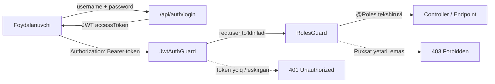
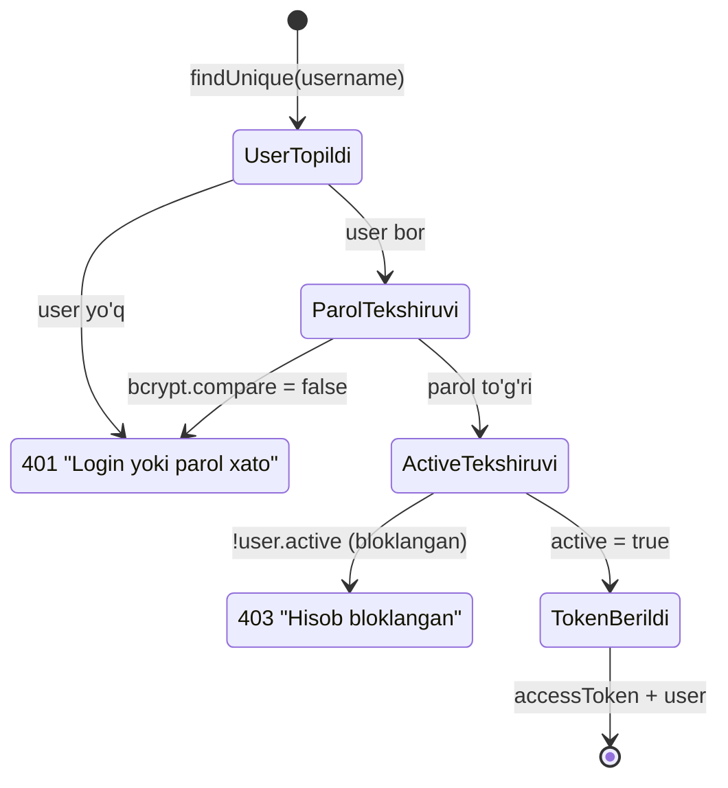

# 3. Foydalanuvchilar, rollar va xavfsizlik

> Loyiha: SmartBlok CRM/ERP | Hujjat: Texnik topshiriq (TZ) | Versiya: 1.0 | Sana: 2026-07-09 | Branch: main (v2 order-lifecycle)

Ushbu bob SmartBlok CRM/ERP tizimidagi foydalanuvchilar, ularning rollari, autentifikatsiya (kirish) mexanizmi, rolga asoslangan kirishni boshqarish (RBAC), agent darajasidagi ma'lumot cheklovi (agent-scoping) hamda amaldagi xavfsizlik choralarini rasmiy hujjatlashtiradi. Barcha tavsiflar tizimning haqiqiy kod bazasidagi amalga oshirilgan mantiqqa asoslangan. Ma'lumotlar modeli (User, Agent va boshqa entitylar maydonlari) haqida to'liq ma'lumot uchun **4-bob. Ma'lumotlar modeli**ga qarang.

---

## 3.1. Umumiy tavsif

Tizim xavfsizligi uch qatlamdan iborat:

1. **Autentifikatsiya (Authentication)** — foydalanuvchi kimligini `username` + `password` orqali aniqlash va unga JWT (JSON Web Token) berish.
2. **Avtorizatsiya / RBAC (Authorization)** — har bir HTTP endpointga faqat ruxsat etilgan rollar kirishini NestJS guardlar va `@Roles` dekoratori orqali ta'minlash.
3. **Ma'lumot cheklovi (Data scoping)** — `AGENT` roli uchun faqat o'ziga biriktirilgan agentning mijozlari, buyurtmalari va to'lovlarini ko'rsatish.

Barcha API yo'llari global prefiks `api` bilan boshlanadi (`app.setGlobalPrefix('api')`), ya'ni har bir endpoint `/api/...` ko'rinishida bo'ladi.



---

## 3.2. Rollar va ularning vakolatlari

Tizimda **4 ta rol** mavjud. Rollar Prisma ma'lumotlar bazasida haqiqiy `enum` sifatida emas, balki `User.role` ustunida oddiy `String` sifatida saqlanadi (default qiymat `"AGENT"`). Ruxsat etilgan qiymatlar faqat kod izohida va `@Roles` dekoratorlarida belgilangan; ma'lumotlar bazasi darajasida cheklov yo'q.

| Rol (verbatim) | O'zbekcha nomi (UI) | UI Badge rangi | Umumiy vazifasi |
|---|---|---|---|
| `ADMIN` | Administrator | violet | To'liq tizim boshqaruvi, foydalanuvchilar CRUD, o'chirish huquqlari |
| `ACCOUNTANT` | Buxgalter | blue | Moliya, katalog, hisobotlar boshqaruvi (foydalanuvchilarsiz) |
| `AGENT` | Agent | teal | Faqat o'z mijozlari/buyurtmalari/to'lovlari doirasida ishlash |
| `CASHIER` | Kassir | amber | Kassa, to'lovlar va xarajatlar bilan ishlash |

> UI'dagi nom va rang mapping'lari `roleLabel` va `roleTone` konstantalarida (`Users.tsx`, `Profile.tsx`, `Layout.tsx`) belgilangan.

### 3.2.1. Rollarning batafsil vakolatlari

**ADMIN (Administrator)**
- Barcha modullarga to'liq kirish.
- Yagona rol sifatida foydalanuvchilarni boshqaradi (`/api/users` — create/read/update/delete).
- Zavod, moshina, mijoz, agent, buyurtma yozuvlarini o'chirish (DELETE) huquqiga ega.

**ACCOUNTANT (Buxgalter)**
- Savdo, katalog (zavod/mahsulot/moshina/tannarx), moliya (to'lov/qarz/xarajat/kassa), hisobot va Excel import bilan ishlaydi.
- Ko'pgina yaratish/tahrirlash amallarini bajaradi, ba'zi o'chirishlar (buyurtma, to'lov, mahsulot) uchun ruxsatga ega.
- Foydalanuvchilarni boshqara olmaydi (`/api/users` faqat `ADMIN`).

**AGENT**
- Faqat buyurtmalar, mijozlar va to'lovlar modullarига kiradi.
- Ma'lumotlari o'z `agentId` bo'yicha avtomatik cheklanadi (3.6-bo'limga qarang).
- Katalog, kassa, qarzlar, hisobotlar va foydalanuvchilar modullariga kira olmaydi (nav menyusida ko'rinmaydi va backend guardlar rad etadi).

**CASHIER (Kassir)**
- To'lovlar, xarajatlar va kassalar modullari bilan ishlaydi.
- Boshqaruv panelida unga alohida **Kassa paneli** (`CashierDashboard`) ko'rsatiladi.
- Buyurtma, mijoz, agent, katalog va hisobot modullariga kira olmaydi.

---

## 3.3. Autentifikatsiya (Authentication)

### 3.3.1. Kirish oqimi (Login flow)

Kirish `username` va `password` orqali amalga oshiriladi (email orqali kirish yo'q). Endpoint: `POST /api/auth/login`, guard yo'q (ochiq).

Biznes-mantiq (`AuthService.validateAndLogin`):

1. `prisma.user.findUnique({ where: { username } })` — foydalanuvchi username bo'yicha topiladi.
2. Agar foydalanuvchi topilmasa **YOKI** `bcrypt.compare(password, user.password)` `false` bo'lsa → `UnauthorizedException('Login yoki parol xato')`.
3. Agar `!user.active` (hisob bloklangan) bo'lsa → `ForbiddenException('Hisob bloklangan')`.
4. Aks holda JWT imzolanadi va qaytariladi.

> **Xavfsizlik afzalligi:** foydalanuvchi mavjud emasligi va parol noto'g'riligi bir xil (`'Login yoki parol xato'`) xabar bilan qaytariladi — bu **user enumeration** (foydalanuvchilarni sanab chiqish) hujumini oldini oladi.

> **Diqqat (chekka holat):** `active` (bloklanganlik) tekshiruvi parol tekshiruvidan **keyin** amalga oshiriladi.



### 3.3.2. JWT (JSON Web Token) konfiguratsiyasi

| Parametr | Qiymat / manba | Izoh |
|---|---|---|
| Kutubxona | `@nestjs/jwt` + `passport-jwt` | NestJS standart JWT stack |
| Secret | `process.env.JWT_SECRET \|\| 'dev-secret-change-me'` | 2 joyda: `auth.module.ts` va `jwt.strategy.ts` |
| Amal muddati (`expiresIn`) | `process.env.JWT_EXPIRES_IN \|\| '7d'` | Default 7 kun |
| Token manbasi | `ExtractJwt.fromAuthHeaderAsBearerToken()` | `Authorization: Bearer <token>` |
| Muddatni tekshirish | `ignoreExpiration: false` | Muddati o'tgan token rad etiladi |

**JWT payload tarkibi (verbatim):**

```js
const payload = {
  sub: user.id,          // foydalanuvchi UUID
  username: user.username,
  role: user.role,
  name: user.name,
  agentId: user.agentId
};
```

Login javobining shakli:

```js
{
  accessToken: <imzolangan JWT>,
  user: { id, username, name, role, agentId }
}
```

Token tekshirilgach (`JwtStrategy.validate`), `req.user` obyekti quyidagicha to'ldiriladi:

```js
{ userId: payload.sub, username, role, name, agentId: payload.agentId ?? null }
```

> **Muhim chekka holat:** `JwtStrategy.validate` ma'lumotlar bazasidan foydalanuvchini **qayta yuklamaydi** — rol, `active` holati va `agentId` to'g'ridan-to'g'ri token ichidan olinadi. Natijada foydalanuvchi bloklansa yoki roli o'zgartirilsa, bu o'zgarish darhol kuchga kirmaydi — eski token **muddati tugagunicha (7 kun)** eski huquqlar bilan amal qiladi.

### 3.3.3. Parollarni himoyalash (Password hashing)

- Kutubxona: **`bcryptjs`** (`import * as bcrypt from 'bcryptjs'`).
- Salt rounds (aylanishlar soni): **10** — barcha joylarda (`bcrypt.hash(pwd, 10)`).
- Parol hech qачon ochiq matnda saqlanmaydi; `User.password` ustunida faqat bcrypt hash bo'ladi.
- API javoblarida parol hech qачon qaytarilmaydi — buning uchun `safe` select ishlatiladi (3.5.2-bo'lim).

### 3.3.4. Profil endpointlari

Login qilgan har qanday foydalanuvchi (rol cheklovsiz, faqat JWT bilan) o'z profilini ko'rishi va tahrirlashi mumkin:

| Metod | To'liq yo'l | Guard | Vazifasi |
|---|---|---|---|
| GET | `/api/auth/me` | `JwtAuthGuard` | Joriy foydalanuvchi ma'lumoti (`safe`) |
| PUT | `/api/auth/me` | `JwtAuthGuard` | Profilni yangilash (`UpdateProfileDto`) |

`updateProfile` orqali foydalanuvchi `name`, `username`, `email`, `phone` va `password` maydonlarini yangilay oladi. `password` faqat truthy bo'lganda qayta hashlanadi (`bcrypt.hash(pwd, 10)`), `email` bo'sh string bo'lsa `null` ga aylanadi.

> **Muhim:** Foydalanuvchi bu endpoint orqali **o'z `role` yoki `agentId` sini o'zgartira olmaydi** (bu maydonlar `UpdateProfileDto` da yo'q) — bu privilegiyani ko'tarish (privilege escalation) xavfini oldini oladi.

---

## 3.4. RBAC — Rolga asoslangan kirishni boshqarish

RBAC ikki NestJS guard va bitta dekorator kombinatsiyasiga asoslanadi. **Global guard yo'q** — har bir controllerda guardlar alohida `@UseGuards(...)` orqali qo'yiladi.

### 3.4.1. Komponentlar

| Komponent | Fayl | Vazifasi |
|---|---|---|
| `JwtAuthGuard` | `auth/jwt-auth.guard.ts` | `AuthGuard('jwt')` — token tekshiradi, `req.user` ni to'ldiradi |
| `RolesGuard` | `auth/roles.guard.ts` | `@Roles` metadata bilan rolni tekshiradi |
| `@Roles(...)` | `auth/roles.decorator.ts` | `SetMetadata(ROLES_KEY, roles)` — ruxsat etilgan rollar ro'yxati |
| `@CurrentUser()` | `auth/current-user.decorator.ts` | `req.user` yoki uning maydonini beradi (`@CurrentUser('userId')`) |

### 3.4.2. RolesGuard mantiqi

1. `Reflector.getAllAndOverride(ROLES_KEY, [handler, class])` — metod darajasidagi `@Roles` sinf darajasidagini **bosib o'tadi** (override).
2. Agar `@Roles` umuman berilmagan yoki bo'sh bo'lsa → `return true` (rol talab qilinmaydi, faqat autentifikatsiya yetarli).
3. `user && required.includes(user.role)` bo'lsa → ruxsat; aks holda `ForbiddenException('Ruxsat yetarli emas')`.

> **Muhim qoida:** `RolesGuard` o'zi autentifikatsiya qilmaydi — u faqat `req.user.role` ni tekshiradi. Shu sababli u **har doim `JwtAuthGuard` bilan birga** ishlatilishi shart: `@UseGuards(JwtAuthGuard, RolesGuard)`. Agar `@Roles` yo'q bo'lsa, endpoint har qanday autentifikatsiyalangan foydalanuvchiga ochiq bo'ladi.

### 3.4.3. Guard qo'llash usullari

- **Sinf (controller) darajasi:** `@UseGuards(JwtAuthGuard, RolesGuard)` + ixtiyoriy `@Roles(...)` — barcha endpointlarga taalluqli.
- **Metod darajasi:** alohida `@Roles(...)` sinf darajasidagini bosib o'tadi (masalan DELETE endpointlarini `ADMIN` bilan cheklash).

---

## 3.5. Rol × modul kirish matritsasi

### 3.5.1. Frontend navigatsiya ko'rinishi (`nav.ts`)

Quyidagi jadval frontend yon menyusida (`visibleGroups(role)`) har bir rolга qaysi sahifalar ko'rinishini belgilaydi. `✓` — menyuda ko'rinadi.

| Guruh | Sahifa (yo'l) | ADMIN | ACCOUNTANT | AGENT | CASHIER |
|---|---|:---:|:---:|:---:|:---:|
| UMUMIY | Boshqaruv paneli (`/`) | ✓ | ✓ | ✓ | ✓ |
| SAVDO | Buyurtmalar (`/orders`) | ✓ | ✓ | ✓ | — |
| SAVDO | Mijozlar (`/clients`) | ✓ | ✓ | ✓ | — |
| SAVDO | Agentlar (`/agents`) | ✓ | ✓ | — | — |
| KATALOG | Zavodlar (`/factories`) | ✓ | ✓ | — | — |
| KATALOG | Mahsulotlar (`/products`) | ✓ | ✓ | — | — |
| KATALOG | Moshinalar (`/vehicles`) | ✓ | ✓ | — | — |
| KATALOG | Tannarx matritsasi (`/procurement`) | ✓ | ✓ | — | — |
| MOLIYA | To'lovlar (`/payments`) | ✓ | ✓ | ✓ | ✓ |
| MOLIYA | Qarzlar (`/debts`) | ✓ | ✓ | — | — |
| MOLIYA | Xarajatlar (`/expenses`) | ✓ | ✓ | — | ✓ |
| MOLIYA | Kassalar (`/kassa`) | ✓ | ✓ | — | ✓ |
| HISOBOTLAR | Hisobot (`/reports`) | ✓ | ✓ | — | — |
| TIZIM | Foydalanuvchilar (`/users`) | ✓ | — | — | — |
| TIZIM | Excel import (`/import`) | ✓ | ✓ | — | — |

> **Muhim (frontend chekka holat):** marshrut darajasida rol tekshiruvi **yo'q** — `App.tsx` dagi `Protected` guard faqat token (yoki user) borligini tekshiradi. Menyuda ko'rinmasa ham, foydalanuvchi URL ni qo'lda kiritib sahifani ochishi mumkin. **Haqiqiy himoya backend `@Roles` orqali ta'minlanadi** — sahifa ochilsa ham, unga kerak bo'lgan API chaqiruvlari 403 bilan rad etiladi.

### 3.5.2. Backend endpoint × rol matritsasi (guardlardan)

Quyidagi jadval har bir controllerdagi `@UseGuards` va `@Roles` dekoratorlaridan olingan haqiqiy backend ruxsatlarni ko'rsatadi. "GET faqat JWT" — `@Roles` yo'q, ya'ni har qanday autentifikatsiyalangan rol kira oladi.

| Modul / endpoint | ADMIN | ACCOUNTANT | AGENT | CASHIER | Izoh |
|---|:---:|:---:|:---:|:---:|---|
| **Auth** `/me`, `/login` | ✓ | ✓ | ✓ | ✓ | Login ochiq; `/me` faqat JWT |
| **Users** `/users` (barcha CRUD) | ✓ | — | — | — | Sinf darajasida `@Roles('ADMIN')` |
| **Agents** GET | ✓ | ✓ | ✓ | ✓ | `@Roles` yo'q — faqat JWT |
| **Agents** POST/PUT | ✓ | ✓ | — | — | |
| **Agents** DELETE | ✓ | — | — | — | Metod override |
| **Clients** GET/POST/PUT | ✓ | ✓ | ✓ | — | Sinf `@Roles('ADMIN','ACCOUNTANT','AGENT')` |
| **Clients** DELETE | ✓ | — | — | — | Metod override |
| **Regions** GET | ✓ | ✓ | ✓ | ✓ | `@Roles` yo'q |
| **Regions** POST/PUT | ✓ | ✓ | — | — | |
| **Regions** DELETE | ✓ | — | — | — | |
| **Factories** GET | ✓ | ✓ | ✓ | ✓ | `@Roles` yo'q |
| **Factories** POST/PUT | ✓ | ✓ | — | — | |
| **Factories** DELETE | ✓ | — | — | — | |
| **Products** GET | ✓ | ✓ | ✓ | ✓ | `@Roles` yo'q |
| **Products** POST/PUT/DELETE | ✓ | ✓ | — | — | DELETE — `ADMIN` va `ACCOUNTANT` |
| **Vehicles** GET | ✓ | ✓ | ✓ | ✓ | `@Roles` yo'q |
| **Vehicles** POST/PUT | ✓ | ✓ | — | — | |
| **Vehicles** DELETE | ✓ | — | — | — | |
| **Procurement** `/matrix` | ✓ | ✓ | ✓ | — | |
| **Procurement** prices/routes CRUD | ✓ | ✓ | — | — | |
| **Orders** GET/POST/PUT/PATCH | ✓ | ✓ | ✓ | — | Sinf `@Roles('ADMIN','ACCOUNTANT','AGENT')` |
| **Orders** DELETE | ✓ | ✓ | — | — | Metod override — AGENT o'chira olmaydi |
| **Payments** GET/POST | ✓ | ✓ | ✓ | ✓ | Sinf 4 rol |
| **Payments** DELETE | ✓ | ✓ | — | — | Metod override |
| **Debts** `/summary` | ✓ | ✓ | — | — | |
| **Expenses** (barcha) | ✓ | ✓ | — | ✓ | CASHIER ham kiradi |
| **Kassa** (barcha) | ✓ | ✓ | — | ✓ | AGENT kira olmaydi |
| **Dashboard** (barcha) | ✓ | ✓ | ✓ | ✓ | Faqat `JwtAuthGuard`, `@Roles` yo'q |
| **Reports** `/svod` | ✓ | ✓ | — | — | |
| **Import** `/excel` | ✓ | ✓ | — | — | |

**`safe` select — parolni oshkor qilmaslik:**

API javoblarida foydalanuvchi obyekti parolsiz qaytariladi. Ikki xil `safe` tuzilishi mavjud (kichik farq bilan):

- `AuthService`: `{ id, username, email, name, role, phone, active, agentId }` — `createdAt` **yo'q**.
- `UsersService`: `{ id, username, email, name, role, phone, active, agentId, createdAt }` — `createdAt` **bor**.

---

## 3.6. AGENT ma'lumot cheklovi (Agent-scoping)

`AGENT` roli faqat o'ziga biriktirilgan agentning ma'lumotlarini ko'rishi kerak. Bu `User.agentId` maydoni orqali amalga oshiriladi: foydalanuvchi bitta `Agent` yozuviga bog'lanadi, `agentId` JWT payloadga yoziladi va so'rovlar shu bo'yicha filtrlanadi.

Barcha modullarda bir xil `scope(user)` shabloni ishlatiladi:

```ts
scope(user) => user?.role === 'AGENT' && user?.agentId ? { agentId: user.agentId } : {}
```

- **AGENT + `agentId` bor** → faqat `agentId = user.agentId` bo'lgan yozuvlar (filtr qo'llaniladi).
- **Boshqa rollar (ADMIN/ACCOUNTANT/CASHIER) yoki `agentId` yo'q** → filtr yo'q (`{}`), hamma yozuv qaytadi.

### 3.6.1. Scoping qamrovi (haqiqiy holat)

| Modul | Metod | Scoping bormi? | Izoh |
|---|---|:---:|---|
| Clients | `findAll` | ✓ | AGENT faqat o'z mijozlarini ko'radi |
| Clients | `create` | ✓ | AGENT yaratgan mijoz majburan o'z `agentId` ga bog'lanadi |
| Clients | `findOne` | ✗ | ID orqali boshqa agent mijozini ham ko'rish mumkin |
| Clients | `update` | ✗ | Egalik tekshirilmaydi |
| Orders | `findAll` | ✓ | AGENT faqat o'z buyurtmalarini ko'radi |
| Orders | `findOne`, `update`, `setStatus`, `advance` | ✗ | Egalik tekshirilmaydi (lekin DELETE `ADMIN/ACCOUNTANT` bilan cheklangan) |
| Orders | `create` | qisman | `agentId = dto.agentId \|\| client.agentId`; agent aniqlanmasa `BadRequestException` |
| Payments | `findAll` | ✓ | AGENT faqat o'z to'lovlarini ko'radi |
| Payments | `create` | ✓ | AGENT to'lovida `agentId = user.agentId` majburan qo'yiladi |
| Agents | barcha GET | ✗ | Rol cheklovsiz — AGENT barcha agentlar ro'yxatini ko'radi |

> **Muhim (mavjud xavfsizlik bo'shlig'i):** scoping faqat `findAll` (ro'yxat) so'rovlarida to'liq qo'llanadi. `findOne`, `update` va buyurtma holat o'zgartirish metodlarida **egalik (ownership) tekshiruvi yo'q**. Ya'ni `AGENT` foydalanuvchi boshqa agentga tegishli yozuvning ID sini bilса, uni ko'rishi yoki tahrirlashi mumkin. Kelajakdagi versiyada bu metodlarga ham scope/ownership tekshiruvini qo'shish tavsiya etiladi (3.9-bo'lim).

### 3.6.2. Agent yaratilganda login-user avtomatik ochilishi

`AgentsService.create` da agent yozuvi yaratilganda, unga bog'langan login-foydalanuvchi (`role: 'AGENT'`) **atomik tranzaksiya** (`prisma.$transaction`) ichida avtomatik yaratiladi (agar `d.createUser !== false` bo'lsa):

- **Username:** `d.username || d.name` dan generatsiya — kichik harflar, `[^a-z0-9]+` olib tashlanadi, 16 belgiga qisqartiriladi; band bo'lsa `base + i` (1, 2, …) bilan noyob qilinadi.
- **Parol:** `bcrypt.hash(d.password || 'agent123', 10)` — default `'agent123'`.
- Javobda `createdUsername` va (agar parol berilmagan bo'lsa) `defaultPassword: 'agent123'` **ochiq matnda** qaytariladi.

---

## 3.7. Demo hisoblar

Tizim `prisma/seed.ts` orqali quyidagi 4 ta demo foydalanuvchi bilan to'ldiriladi. Parollar `bcrypt.hash(p, 10)` bilan hashlanadi. Login sahifasida (`Login.tsx`) bu hisoblar tugmalar sifatida mavjud.

| Username | Parol | Ism | Rol | Email | Agent bog'lanishi |
|---|---|---|---|---|---|
| `admin` | `admin123` | Administrator | `ADMIN` | admin@smartblok.uz | — |
| `hisob` | `hisob123` | Bosh buxgalter | `ACCOUNTANT` | hisob@smartblok.uz | — |
| `kassa` | `kassa123` | Kassir | `CASHIER` | — | — |
| `jamol` | `agent123` | Jamol (agent) | `AGENT` | — | `Jamol 22-22` agenti |

> **Ogohlantirish:** bu demo parollar (`admin123` va h.k.) zaif va faqat ishlab chiqish/namoyish uchun mo'ljallangan. Ishlab chiqarish (production) muhitida ular albatta almashtirilishi shart.

---

## 3.8. Foydalanuvchilarni boshqarish (Users moduli)

`/api/users` endpointlari faqat `ADMIN` rolига ochiq (sinf darajasida `@UseGuards(JwtAuthGuard, RolesGuard)` + `@Roles('ADMIN')`).

| Metod | To'liq yo'l | Vazifasi |
|---|---|---|
| GET | `/api/users` | Foydalanuvchilar ro'yxati (`safe` + `agent{id,name}`) |
| POST | `/api/users` | Yangi foydalanuvchi yaratish |
| PUT | `/api/users/:id` | Foydalanuvchini yangilash |
| DELETE | `/api/users/:id` | Foydalanuvchini o'chirish (hard delete) |

Muhim jihatlar:
- **Yaratishda default parol:** agar parol berilmasa `bcrypt.hash('smartblok', 10)` — default parol `'smartblok'`.
- **Default rol:** `dto.role || 'AGENT'`.
- **O'chirish — hard delete:** `prisma.user.delete(...)`. Bu **soft delete emas** (`active=false` qilinmaydi). Yozuv butunlay o'chiriladi.
- **Bloklash:** foydalanuvchini vaqtincha o'chirish o'rniga `active` maydonini `false` qilib bloklash mumkin (login `ForbiddenException('Hisob bloklangan')` beradi).

> **Chekka holat:** Users create/update body'lari `@Body() d: any` sifatida qabul qilinadi — DTO/`class-validator` **yo'q**. Global `ValidationPipe` ning `whitelist: true` xususiyati bu yerda ta'sir qilmaydi. Shu sababli `role` maydoniga ixtiyoriy string yuborilishi mumkin (validatsiyasiz). Bu ma'lumot yaxlitligi uchun kelajakda qattiqroq DTO validatsiyasi bilan mustahkamlanishi tavsiya etiladi.

---

## 3.9. Xavfsizlik choralari va tavsiyalar

### 3.9.1. Amalga oshirilgan choralar

- **Parollar bcrypt bilan hashlanadi** (salt rounds = 10); ochiq matnda saqlanmaydi va API javoblarida qaytarilmaydi (`safe` select).
- **JWT stateless autentifikatsiya** — `Authorization: Bearer` orqali, muddat tekshiruvi bilan (`ignoreExpiration: false`).
- **User enumeration oldini olish** — login xatosida foydalanuvchi mavjudligi va parol noto'g'riligi bir xil xabar bilan qaytadi.
- **Bloklash mexanizmi** — `active=false` foydalanuvchi kira olmaydi.
- **Privilegiya himoyasi** — foydalanuvchi profil orqali o'z `role`/`agentId` sini o'zgartira olmaydi; Users CRUD faqat `ADMIN`.
- **RBAC guardlari** — har bir modul o'z `@UseGuards` + `@Roles` bilan himoyalangan; o'chirish (DELETE) huquqlari asosan `ADMIN` (ba'zan `ACCOUNTANT`) bilan cheklangan.
- **AGENT ma'lumot cheklovi** — ro'yxat (findAll) so'rovlarida agentga tegishli ma'lumotlar bilan cheklanadi.
- **Global ValidationPipe** — `whitelist: true` (DTO da bo'lmagan maydonlar tashlab yuboriladi), `transform: true`.
- **CORS cheklovi** — `CORS_ORIGIN` orqali ruxsat etilgan originlar (default `http://localhost:5173`), `credentials: true`.
- **Frontend token boshqaruvi** — 401 javobida `sb_token`/`sb_user` tozalanib, avtomatik `/login` ga yo'naltiriladi.

### 3.9.2. Ma'lum cheklovlar va tavsiyalar (production uchun)

Quyidagi jadval mavjud xavflarni va tavsiya etilgan choralarni jamlaydi:

| # | Xavf / cheklov | Tavsiya |
|---|---|---|
| 1 | **JWT secret** default `'dev-secret-change-me'` (hardcoded fallback, 2 joyda) | Production'da `JWT_SECRET` ni uzun, tasodifiy satr bilan majburiy o'rnatish; fallback'ni olib tashlash |
| 2 | **Zaif demo parollar** (`admin123`, `smartblok` va h.k.) | Deploy oldidan barcha demo parollarni almashtirish; kuchli parol siyosati joriy etish |
| 3 | **Parol siyosati zaif** — minimal uzunlik faqat 4 (`@MinLength(4)`), profilda; Users CRUD da umuman validatsiya yo'q | Minimal uzunlikni oshirish (masalan 8+), murakkablik talablari; barcha yaratish nuqtalarida qo'llash |
| 4 | **Token DB'dan qayta yuklanmaydi** — rol/active o'zgarishi 7 kungacha kuchга kirmaydi | Token muddatini qisqartirish; kritik amallarda DB'dan foydalanuvchini qayta tekshirish yoki token bekor qilish (revocation) mexanizmi |
| 5 | **Agent-scoping to'liq emas** — `findOne`/`update` da egalik tekshirilmaydi | Bu metodlarга ownership tekshiruvini qo'shish |
| 6 | **Frontend marshrut himoyasi yo'q** — faqat menyu filtri | Backend `@Roles` ga tayanish (mavjud); ixtiyoriy ravishda frontend route guard qo'shish |
| 7 | **DTO validatsiyasi yo'q** — ko'p endpointlarda `@Body() d: any`, `role` validatsiyasiz | Kuchli tiplangan DTO + `class-validator`; `forbidNonWhitelisted` yoqish |
| 8 | **Hard delete** hamma joyda | Muhim entitylar uchun soft-delete (`active=false`) ni ko'rib chiqish |
| 9 | **Email format validatsiyasi yo'q** (faqat `@IsString`) | `@IsEmail()` qo'shish |

### 3.9.3. Muhit o'zgaruvchilari (xavfsizlikка taalluqli)

Autentifikatsiya va xavfsizlikка bevosita ta'sir qiluvchi muhit o'zgaruvchilari (`.env`):

| O'zgaruvchi | Default | Vazifasi |
|---|---|---|
| `JWT_SECRET` | `"change-me-in-production-please-use-a-long-random-string"` | JWT imzolash kaliti — **production'da majburiy almashtirish** |
| `JWT_EXPIRES_IN` | `"7d"` | Token amal muddati |
| `CORS_ORIGIN` | `"http://localhost:5173"` | Ruxsat etilgan frontend originlar (vergul bilan bir nechta) |
| `API_PORT` | `4000` | Backend porti |

To'liq muhit sozlamalari uchun **2-bob. Infratuzilma va o'rnatish**ga qarang.

---

## 3.10. Bob xulosasi

SmartBlok tizimi 4 rolli (ADMIN, ACCOUNTANT, AGENT, CASHIER) RBAC modelini NestJS `JwtAuthGuard` + `RolesGuard` + `@Roles` mexanizmi orqali amalga oshiradi. Autentifikatsiya `username` + JWT (7 kunlik) asosida, parollar bcrypt bilan himoyalangan. AGENT roli uchun `agentId` orqali ma'lumot cheklovi ro'yxat so'rovlarida qo'llanadi. Tizim demo/ishlab chiqish uchun mos, ammo production'ga chiqarishdan oldin JWT secret, demo parollar va parol siyosatini mustahkamlash hamda agent-scoping va DTO validatsiyasini to'ldirish tavsiya etiladi.
