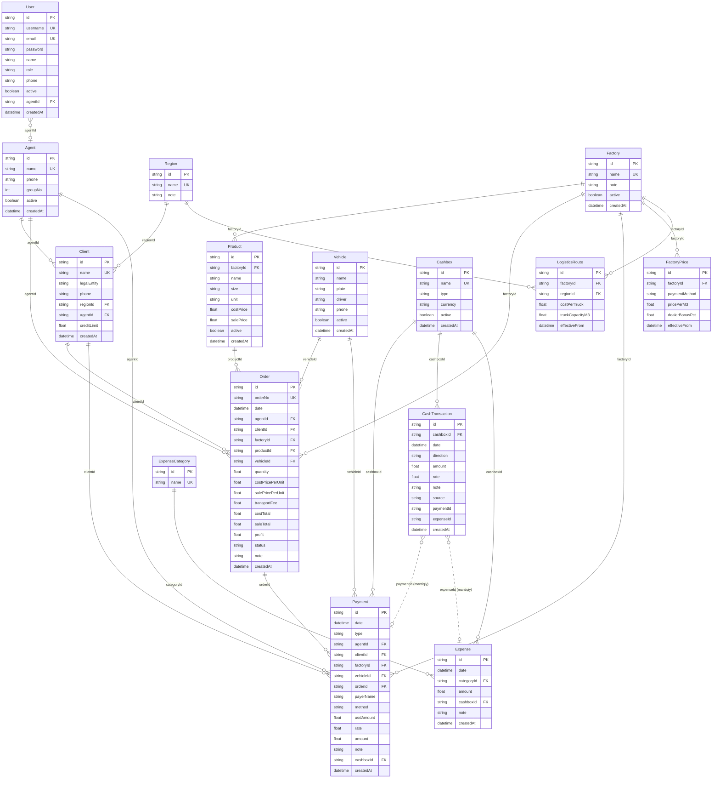
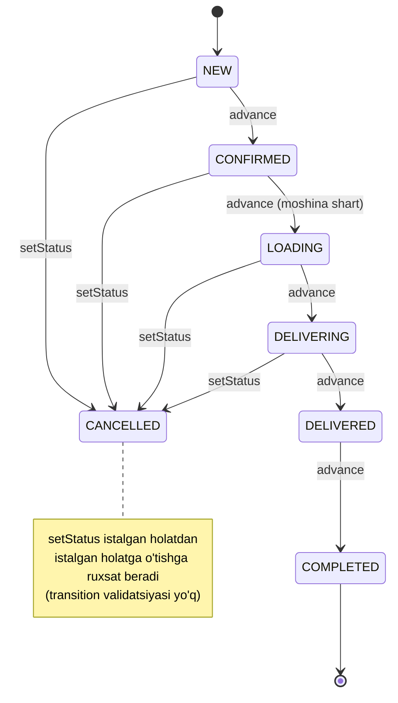

# 4. Ma'lumotlar modeli

Loyiha: SmartBlok CRM/ERP | Hujjat: Texnik topshiriq (TZ) | Versiya: 1.0 | Sana: 2026-07-09 | Branch: main (v2 order-lifecycle)

---

## 4.1. Umumiy tamoyillar

SmartBlok ma'lumotlar modeli **Prisma ORM** (`prisma-client-js` generatori) yordamida ta'riflangan va yagona manba fayli `apps/api/prisma/schema.prisma` hisoblanadi. Model **v2 — buyurtma-hayot-sikli (order-lifecycle) ERP** arxitekturasiga asoslangan bo'lib, quyidagi asosiy tamoyillarga rioya qiladi:

1. **Opak UUID identifikatorlar.** Barcha modellarda birlamchi kalit `id String @id @default(uuid())` shaklida. Ketma-ket (sequential) raqamlash umuman qo'llanilmaydi (schema faylining boshidagi izoh: *"no sequential enumeration"*). Bu ma'lumotlar hajmini yoki tartibini tashqi kuzatuvchidan yashiradi va migratsiya/birlashtirishni soddalashtiradi. Yagona istisno — inson o'qishi uchun mo'ljallangan `Order.orderNo` (masalan `B-0001`), u UUID emas, biznes-identifikator.
2. **Enum'lar `String` sifatida.** Loyihada haqiqiy Prisma `enum` konstruksiyalari **ishlatilmagan**. Barcha status/tur/yo'nalish/valyuta maydonlari oddiy `String` bo'lib, ruxsat etilgan qiymatlar faqat schema izohlarida hujjatlashtirilgan. DB darajasida hech qanday `CHECK`/enum cheklovi yo'q — validatsiya faqat servis (NestJS) kodida amalga oshiriladi. Batafsil: [4.5-bo'lim](#45-status-va-tur-qiymatlari-enumlar).
3. **Datasource — SQLite (dev).** `datasource db { provider = "sqlite"; url = env("DATABASE_URL") }`. Dev muhitda `file:./dev.db`, migratsiyasiz `prisma db push` bilan sinxronlanadi. Production uchun PostgreSQL (`postgres:16-alpine`, `docker-compose.yml`) mo'ljallangan, ammo `provider` ni qo'lda `postgresql` ga o'zgartirish talab etiladi.
4. **Pul maydonlari — `Float`.** Barcha moliyaviy qiymatlar (narx, summa, balans) `Float` (SQLite'da `REAL`) turida. Bu yaxlitlik (precision) cheklovlariga ega bo'lgani uchun TZ darajasida e'tiborga olinishi lozim (batafsil: [4.7-bo'lim](#47-cheklovlar-va-chekka-holatlar)).
5. **Yumshoq (soft) o'chirish qisman.** Bir qator modellarda `active Boolean @default(true)` mavjud, ammo amalda `active` ko'p joyda filtr sifatida ishlatilmaydi; o'chirish odatda **hard delete** orqali bajariladi.

> Autentifikatsiya, RBAC va rol tarqatilishi bo'yicha batafsil ma'lumot alohida bobda beriladi — bu bob faqat ma'lumotlar sxemasi, maydonlar, munosabatlar va enum qiymatlariga qaratilgan.

---

## 4.2. Modellar ro'yxati va tasnifi

Jami **15 ta** Prisma modeli mavjud. Ular vazifasiga ko'ra quyidagi guruhlarga bo'linadi:

| Guruh | Modellar | Tavsif |
|---|---|---|
| **Foydalanuvchilar va tashkilot** | `User`, `Agent`, `Region` | Kirish/rollar, savdo agentlari, hududlar |
| **Kontragentlar** | `Client`, `Factory`, `Vehicle` | Mijozlar, zavodlar, transport vositalari |
| **Katalog va narx** | `Product`, `FactoryPrice`, `LogisticsRoute` | Mahsulotlar, zavod narxlari, logistika marshrutlari |
| **Operatsion yadro** | `Order`, `Payment` | Buyurtmalar (hayot-sikli), ko'p-tomonlama to'lovlar |
| **Kassa (ledger)** | `Cashbox`, `CashTransaction` | Kassalar va kassa harakatlari |
| **Xarajatlar** | `ExpenseCategory`, `Expense` | Xarajat kategoriyalari va xarajatlar |

---

## 4.3. Modellar va maydonlar (batafsil)

Har bir jadvalda: **Maydon** (verbatim identifikator), **Tur**, **Default**, **Cheklov** (`@id`, `@unique`, majburiy/ixtiyoriy, FK), **Izoh**.

### 4.3.1. `User` — Foydalanuvchi

Tizimga kirish va rol egasi. Ixtiyoriy ravishda bitta `Agent` yozuvi bilan bog'lanadi (agent-scoping asosi).

| Maydon | Tur | Default | Cheklov | Izoh |
|---|---|---|---|---|
| `id` | String | `uuid()` | `@id` | Birlamchi kalit (UUID) |
| `username` | String | — | `@unique`, majburiy | Login identifikatori |
| `email` | String? | — | `@unique`, ixtiyoriy | Elektron pochta (nullable) |
| `password` | String | — | majburiy | bcrypt hash (10 rounds) saqlanadi |
| `name` | String | — | majburiy | Ism/familiya |
| `role` | String | `"AGENT"` | majburiy | `ADMIN \| ACCOUNTANT \| AGENT \| CASHIER` (izohda) |
| `phone` | String? | — | ixtiyoriy | Telefon |
| `active` | Boolean | `true` | — | Faollik holati (bloklash) |
| `agentId` | String? | — | FK → `Agent.id` | Bog'langan agent (ixtiyoriy) |
| `createdAt` | DateTime | `now()` | — | Yaratilgan vaqt |

**Munosabatlar:** `agent Agent?` (N:1, `agentId` orqali).

### 4.3.2. `Agent` — Savdo agenti

| Maydon | Tur | Default | Cheklov | Izoh |
|---|---|---|---|---|
| `id` | String | `uuid()` | `@id` | UUID |
| `name` | String | — | `@unique`, majburiy | Agent nomi (global unikal) |
| `phone` | String? | — | ixtiyoriy | Telefon |
| `groupNo` | Int? | — | ixtiyoriy | Guruh raqami (tartiblash uchun) |
| `active` | Boolean | `true` | — | Faollik holati |
| `createdAt` | DateTime | `now()` | — | Yaratilgan vaqt |

**Munosabatlar:** `clients Client[]`, `orders Order[]`, `payments Payment[]`, `users User[]` (barchasi 1:N).

### 4.3.3. `Region` — Hudud

| Maydon | Tur | Default | Cheklov | Izoh |
|---|---|---|---|---|
| `id` | String | `uuid()` | `@id` | UUID |
| `name` | String | — | `@unique`, majburiy | Hudud nomi |
| `note` | String? | — | ixtiyoriy | Izoh |

**Munosabatlar:** `clients Client[]`, `routes LogisticsRoute[]` (1:N).

### 4.3.4. `Client` — Mijoz

| Maydon | Tur | Default | Cheklov | Izoh |
|---|---|---|---|---|
| `id` | String | `uuid()` | `@id` | UUID |
| `name` | String | — | `@unique`, majburiy | Mijoz nomi (**global unikal**) |
| `legalEntity` | String? | — | ixtiyoriy | Yuridik shaxs |
| `phone` | String? | — | ixtiyoriy | Telefon |
| `regionId` | String? | — | FK → `Region.id` | Hudud (DB'da ixtiyoriy) |
| `agentId` | String? | — | FK → `Agent.id` | Agent (DB'da ixtiyoriy, servisda majburiy) |
| `creditLimit` | Float | `0` | — | Kredit limiti (**saqlanadi, tekshirilmaydi**) |
| `createdAt` | DateTime | `now()` | — | Yaratilgan vaqt |

**Munosabatlar:** `region Region?`, `agent Agent?` (N:1); `orders Order[]`, `payments Payment[]` (1:N).

> **Izoh:** `regionId`/`agentId` DB darajasida `String?` (ixtiyoriy), lekin servis mantiqida mijoz yaratishda `agentId` majburiy qilingan. `creditLimit` faqat saqlanadi — hech qanday buyurtma/to'lov mantiqida nazorat qilinmaydi.

### 4.3.5. `Factory` — Zavod

| Maydon | Tur | Default | Cheklov | Izoh |
|---|---|---|---|---|
| `id` | String | `uuid()` | `@id` | UUID |
| `name` | String | — | `@unique`, majburiy | Zavod nomi |
| `note` | String? | — | ixtiyoriy | Izoh |
| `active` | Boolean | `true` | — | Faollik holati |
| `createdAt` | DateTime | `now()` | — | Yaratilgan vaqt |

**Munosabatlar:** `products Product[]`, `orders Order[]`, `payments Payment[]`, `prices FactoryPrice[]`, `routes LogisticsRoute[]` (1:N).

### 4.3.6. `Product` — Mahsulot

Har bir mahsulot majburiy ravishda bitta zavodga tegishli.

| Maydon | Tur | Default | Cheklov | Izoh |
|---|---|---|---|---|
| `id` | String | `uuid()` | `@id` | UUID |
| `factoryId` | String | — | FK → `Factory.id`, **majburiy** | Zavod |
| `name` | String | — | majburiy | Mahsulot nomi |
| `size` | String? | — | ixtiyoriy | O'lcham (masalan `600x300x200`) |
| `unit` | String | `"m³"` | — | O'lchov birligi (schema default `"m³"`) |
| `costPrice` | Float | `0` | — | Kirim (tannarx) narxi |
| `salePrice` | Float | `0` | — | Sotuv narxi |
| `active` | Boolean | `true` | — | Faollik holati |
| `createdAt` | DateTime | `now()` | — | Yaratilgan vaqt |

**Munosabatlar:** `factory Factory` (N:1, majburiy), `orders Order[]` (1:N).

> **Nomuvofiqlik:** schema `unit` default'i `"m³"` (kub belgisi bilan), lekin servis `create` mantiqida yuborilmasa `'m3'` (belgisiz) yoziladi va DB default'ini bosib o'tadi.

### 4.3.7. `Vehicle` — Transport vositasi

| Maydon | Tur | Default | Cheklov | Izoh |
|---|---|---|---|---|
| `id` | String | `uuid()` | `@id` | UUID |
| `name` | String | — | majburiy (**@unique EMAS**) | Nomi/haydovchi |
| `plate` | String? | — | ixtiyoriy | Davlat raqami |
| `driver` | String? | — | ixtiyoriy | Haydovchi |
| `phone` | String? | — | ixtiyoriy | Telefon |
| `active` | Boolean | `true` | — | Faollik holati |
| `createdAt` | DateTime | `now()` | — | Yaratilgan vaqt |

**Munosabatlar:** `orders Order[]`, `payments Payment[]` (1:N).

> **Diqqat:** boshqa nomli modellardan farqli o'laroq, `Vehicle.name` da `@unique` **yo'q** — bir xil nomli transportlar bo'lishi mumkin.

### 4.3.8. `FactoryPrice` — Zavod narxi

Zavod narxlarining versiyalangan (effectiveFrom bo'yicha) ro'yxati. Kompozit unikallik yo'q — bitta zavod uchun bir nechta narx yozuvi bo'lishi mumkin.

| Maydon | Tur | Default | Cheklov | Izoh |
|---|---|---|---|---|
| `id` | String | `uuid()` | `@id` | UUID |
| `factoryId` | String | — | FK → `Factory.id` | Zavod |
| `paymentMethod` | String | `"TRANSFER"` | — | To'lov usuli (narx varianti) |
| `pricePerM3` | Float | — | **majburiy** | 1 m³ narxi |
| `dealerBonusPct` | Float | `0` | — | Diler bonusi ulush sifatida (0.05 = 5%) |
| `effectiveFrom` | DateTime | `now()` | — | Narx amal qilish sanasi |

**Munosabatlar:** `factory Factory` (N:1).

### 4.3.9. `LogisticsRoute` — Logistika marshruti

| Maydon | Tur | Default | Cheklov | Izoh |
|---|---|---|---|---|
| `id` | String | `uuid()` | `@id` | UUID |
| `factoryId` | String | — | FK → `Factory.id` | Zavod |
| `regionId` | String | — | FK → `Region.id` | Hudud |
| `costPerTruck` | Float | — | **majburiy** | Bir mashina uchun logistika narxi |
| `truckCapacityM3` | Float | `33` | — | Mashina hajmi (m³) |
| `effectiveFrom` | DateTime | `now()` | — | Amal qilish sanasi |

**Munosabatlar:** `factory Factory`, `region Region` (N:1). Kompozit unikallik yo'q.

### 4.3.10. `Order` — Buyurtma

Operatsion yadro. Buyurtma yaratilishida narxlar **snapshot** sifatida saqlanadi (`costPricePerUnit`/`salePricePerUnit`), ya'ni katalog narxi keyinchalik o'zgarsa ham buyurtma o'z qiymatlarini saqlaydi.

| Maydon | Tur | Default | Cheklov | Izoh |
|---|---|---|---|---|
| `id` | String | `uuid()` | `@id` | UUID |
| `orderNo` | String | — | `@unique`, majburiy | Biznes-raqam (`B-0001`) |
| `date` | DateTime | — (default yo'q) | majburiy | Buyurtma sanasi |
| `agentId` | String? | — | FK → `Agent.id` | Agent (ixtiyoriy) |
| `clientId` | String | — | FK → `Client.id`, **majburiy** | Mijoz |
| `factoryId` | String | — | FK → `Factory.id`, **majburiy** | Zavod |
| `productId` | String | — | FK → `Product.id`, **majburiy** | Mahsulot |
| `vehicleId` | String? | — | FK → `Vehicle.id` | Transport (ixtiyoriy) |
| `quantity` | Float | — | majburiy | Miqdor (m³) |
| `costPricePerUnit` | Float | — | majburiy | Birlik kirim narxi (snapshot) |
| `salePricePerUnit` | Float | — | majburiy | Birlik sotuv narxi (snapshot) |
| `transportFee` | Float | `0` | — | Transport haqi |
| `costTotal` | Float | `0` | — | *we owe factory* — biz zavodga qarz |
| `saleTotal` | Float | `0` | — | *client owes us* — mijoz bizga qarz |
| `profit` | Float | `0` | — | Foyda |
| `status` | String | `"NEW"` | — | Hayot-sikli holati (7 qiymat) |
| `note` | String? | — | ixtiyoriy | Izoh |
| `createdAt` | DateTime | `now()` | — | Yaratilgan vaqt |

**Munosabatlar:** `agent Agent?`, `client Client`, `factory Factory`, `product Product`, `vehicle Vehicle?` (N:1); `payments Payment[]` (1:N).

**Hisob-kitob formulalari** (servisda hisoblab, DB'ga yoziladi):

```
costTotal = quantity * costPricePerUnit
saleTotal = quantity * salePricePerUnit
profit    = saleTotal - costTotal - transportFee
```

> **Muhim nuans:** `transportFee` `profit`dan ayriladi, ammo `saleTotal`/`costTotal` ga qo'shilmaydi — u alohida xarajat sifatida faqat foydani kamaytiradi.

### 4.3.11. `Payment` — To'lov

Ko'p-tomonlama to'lov yozuvi: mijozdan kirim (`CLIENT`, IN), zavodga chiqim (`FACTORY`, OUT), moshinaga chiqim (`VEHICLE`, OUT). Har to'lov 4 ta kontragent FK (agent/client/factory/vehicle) va ixtiyoriy `order`ga bog'lanishi mumkin, hamda kassaga (`cashbox`) posting qilinadi.

| Maydon | Tur | Default | Cheklov | Izoh |
|---|---|---|---|---|
| `id` | String | `uuid()` | `@id` | UUID |
| `date` | DateTime | — (default yo'q) | majburiy | To'lov sanasi |
| `type` | String | `"CLIENT"` | — | `CLIENT (in) \| FACTORY (out) \| VEHICLE (out)` |
| `agentId` | String? | — | FK → `Agent.id` | Agent |
| `clientId` | String? | — | FK → `Client.id` | Mijoz |
| `factoryId` | String? | — | FK → `Factory.id` | Zavod |
| `vehicleId` | String? | — | FK → `Vehicle.id` | Transport |
| `orderId` | String? | — | FK → `Order.id` | Buyurtma (ixtiyoriy) |
| `payerName` | String? | — | ixtiyoriy | To'lovchi nomi |
| `method` | String | `"CASH"` | — | `CASH \| CLICK \| TERMINAL \| USD \| BANK` (+ `TRANSFER`) |
| `usdAmount` | Float | `0` | — | Dollar summasi (USD usulida) |
| `rate` | Float | `0` | — | Valyuta kursi |
| `amount` | Float | — | **majburiy** | So'mdagi summa (yagona default'siz raqam) |
| `note` | String? | — | ixtiyoriy | Izoh |
| `cashboxId` | String? | — | FK → `Cashbox.id` | Kassa |
| `createdAt` | DateTime | `now()` | — | Yaratilgan vaqt |

**Munosabatlar:** `agent Agent?`, `client Client?`, `factory Factory?`, `vehicle Vehicle?`, `order Order?`, `cashbox Cashbox?` (N:1).

> **Izoh:** `method` uchun servis kodi schema izohida ko'rsatilmagan **`TRANSFER`** usulini ham qabul qiladi (Bank kassaga tushadi). USD usulida `amount = usdAmount * rate` sifatida hisoblanadi.

### 4.3.12. `Cashbox` — Kassa

| Maydon | Tur | Default | Cheklov | Izoh |
|---|---|---|---|---|
| `id` | String | `uuid()` | `@id` | UUID |
| `name` | String | — | `@unique`, majburiy | Kassa nomi (servisda nom bo'yicha topiladi) |
| `type` | String | `"CASH"` | — | `CASH \| CLICK \| BANK` |
| `currency` | String | `"UZS"` | — | `UZS \| USD` |
| `active` | Boolean | `true` | — | Faollik (**filtr sifatida ishlatilmaydi**) |
| `createdAt` | DateTime | `now()` | — | Yaratilgan vaqt |

**Munosabatlar:** `transactions CashTransaction[]`, `payments Payment[]`, `expenses Expense[]` (1:N).

> **Diqqat:** `Cashbox.name` `@unique` bo'lgani va servis kassalarni **nom bo'yicha** (`CASHBOX_BY_METHOD` xaritasi orqali) topgani uchun kassa nomlarini o'zgartirish to'lov postingini buzadi.

### 4.3.13. `CashTransaction` — Kassa harakati (ledger)

Har bir to'lov yoki xarajat kassaga bitta `CashTransaction` sifatida posting qilinadi. To'lov/xarajat o'chirilganda tegishli harakat teskari qilinadi (reversal).

| Maydon | Tur | Default | Cheklov | Izoh |
|---|---|---|---|---|
| `id` | String | `uuid()` | `@id` | UUID |
| `cashboxId` | String | — | FK → `Cashbox.id`, **majburiy** | Kassa (Payment'dagidan farqli — nullable emas) |
| `date` | DateTime | `now()` | — | Harakat sanasi |
| `direction` | String | `"IN"` | — | `IN \| OUT` |
| `amount` | Float | — | majburiy | Summa |
| `rate` | Float | `0` | — | Kurs |
| `note` | String? | — | ixtiyoriy | Izoh |
| `source` | String | `"MANUAL"` | — | `MANUAL \| PAYMENT \| EXPENSE` |
| `paymentId` | String? | — | **FK EMAS** | `source=PAYMENT` bo'lganda to'ldiriladi (reversal uchun) |
| `expenseId` | String? | — | **FK EMAS** | `source=EXPENSE` bo'lganda to'ldiriladi (reversal uchun) |
| `createdAt` | DateTime | `now()` | — | Yaratilgan vaqt |

**Munosabatlar:** `cashbox Cashbox` (N:1, majburiy).

> **Muhim:** `paymentId`/`expenseId` — oddiy `String?`, **haqiqiy FK relation emas**. Bog'lanish faqat mantiqiy (o'chirishda `deleteMany({ where: { paymentId } })` orqali reversal). Shu sabab DB darajasida referensial yaxlitlik ta'minlanmaydi.

### 4.3.14. `ExpenseCategory` — Xarajat kategoriyasi

| Maydon | Tur | Default | Cheklov | Izoh |
|---|---|---|---|---|
| `id` | String | `uuid()` | `@id` | UUID |
| `name` | String | — | `@unique`, majburiy | Kategoriya nomi |

**Munosabatlar:** `expenses Expense[]` (1:N).

### 4.3.15. `Expense` — Xarajat

| Maydon | Tur | Default | Cheklov | Izoh |
|---|---|---|---|---|
| `id` | String | `uuid()` | `@id` | UUID |
| `date` | DateTime | — (default yo'q) | majburiy | Xarajat sanasi |
| `categoryId` | String? | — | FK → `ExpenseCategory.id` | Kategoriya (DB'da ixtiyoriy, servisda majburiy) |
| `amount` | Float | — | majburiy | Summa |
| `cashboxId` | String? | — | FK → `Cashbox.id` | Kassa (DB'da ixtiyoriy, servisda majburiy) |
| `note` | String? | — | ixtiyoriy | Izoh |
| `createdAt` | DateTime | `now()` | — | Yaratilgan vaqt |

**Munosabatlar:** `category ExpenseCategory?`, `cashbox Cashbox?` (N:1).

> **Nomuvofiqlik:** schema'da `categoryId`/`cashboxId` `String?` (ixtiyoriy), ammo servis `create()` ularni majburiy qiladi (aks holda `BadRequestException`).

---

## 4.4. Munosabatlar (relationships)

### 4.4.1. Munosabatlar jadvali

| Ota model | Bola model | Kardinallik | Tashqi kalit (FK) | Ixtiyoriylik |
|---|---|---|---|---|
| `Agent` | `User` | 1:N | `User.agentId` | ixtiyoriy |
| `Agent` | `Client` | 1:N | `Client.agentId` | ixtiyoriy |
| `Agent` | `Order` | 1:N | `Order.agentId` | ixtiyoriy |
| `Agent` | `Payment` | 1:N | `Payment.agentId` | ixtiyoriy |
| `Region` | `Client` | 1:N | `Client.regionId` | ixtiyoriy |
| `Region` | `LogisticsRoute` | 1:N | `LogisticsRoute.regionId` | **majburiy** |
| `Factory` | `Product` | 1:N | `Product.factoryId` | **majburiy** |
| `Factory` | `Order` | 1:N | `Order.factoryId` | **majburiy** |
| `Factory` | `Payment` | 1:N | `Payment.factoryId` | ixtiyoriy |
| `Factory` | `FactoryPrice` | 1:N | `FactoryPrice.factoryId` | **majburiy** |
| `Factory` | `LogisticsRoute` | 1:N | `LogisticsRoute.factoryId` | **majburiy** |
| `Product` | `Order` | 1:N | `Order.productId` | **majburiy** |
| `Vehicle` | `Order` | 1:N | `Order.vehicleId` | ixtiyoriy |
| `Vehicle` | `Payment` | 1:N | `Payment.vehicleId` | ixtiyoriy |
| `Client` | `Order` | 1:N | `Order.clientId` | **majburiy** |
| `Client` | `Payment` | 1:N | `Payment.clientId` | ixtiyoriy |
| `Order` | `Payment` | 1:N | `Payment.orderId` | ixtiyoriy |
| `Cashbox` | `Payment` | 1:N | `Payment.cashboxId` | ixtiyoriy |
| `Cashbox` | `CashTransaction` | 1:N | `CashTransaction.cashboxId` | **majburiy** |
| `Cashbox` | `Expense` | 1:N | `Expense.cashboxId` | ixtiyoriy (servisda majburiy) |
| `ExpenseCategory` | `Expense` | 1:N | `Expense.categoryId` | ixtiyoriy (servisda majburiy) |

**Mantiqiy (FK bo'lmagan) bog'lanishlar:**

| Manba | Nishon | Bog'lanish maydoni | Maqsad |
|---|---|---|---|
| `CashTransaction` | `Payment` | `paymentId` (String?) | To'lov o'chirilganda kassa yozuvini teskari qilish |
| `CashTransaction` | `Expense` | `expenseId` (String?) | Xarajat o'chirilganda kassa yozuvini teskari qilish |

> **Kaskad o'chirish yo'q.** Hech bir munosabatda `onDelete: Cascade` sozlanmagan. Bog'liq yozuvi bo'lgan obyektni (masalan buyurtmalari bor mijozni) o'chirishga urinish FK cheklovi tufayli DB xatosi beradi.

### 4.4.2. ERD — Mermaid diagramma



---

## 4.5. Status va tur qiymatlari (enum'lar)

Barcha quyidagi maydonlar `String` turida — haqiqiy Prisma `enum` emas. Ruxsat etilgan qiymatlar servis kodida (`BadRequestException` orqali) tekshiriladi yoki umuman tekshirilmaydi.

### 4.5.1. `Order.status` — Buyurtma holati

| Qiymat | Ma'no | Oqimda |
|---|---|---|
| `NEW` | Yangi (default) | ✅ (idx 0) |
| `CONFIRMED` | Tasdiqlandi | ✅ (idx 1) |
| `LOADING` | Yuklanmoqda | ✅ (idx 2) — moshina majburiy |
| `DELIVERING` | Yetkazilmoqda | ✅ (idx 3) |
| `DELIVERED` | Yetkazildi | ✅ (idx 4) |
| `COMPLETED` | Yakunlandi | ✅ (idx 5) |
| `CANCELLED` | Bekor qilindi | ❌ (oqimdan tashqari) |

Chiziqli oqim konstantasi: `ORDER_FLOW = ['NEW','CONFIRMED','LOADING','DELIVERING','DELIVERED','COMPLETED']`. `CANCELLED` bu massivda yo'q — u faqat `setStatus` orqali qo'yiladi. `LOADING` (idx 2) va undan keyingi holatlar uchun `vehicleId` majburiy (`assertVehicleFor`).

**Muhim biznes-qoida:** Barcha moliyaviy agregatsiyalar (mijoz qarzi, zavod qarzi, moshina qarzi, sotuv, foyda) **faqat `DELIVERED` yoki `COMPLETED`** statusli buyurtmalarni hisobga oladi. Qolgan statuslar qarz/hisobga ta'sir qilmaydi.



> **Eslatma:** `advance` faqat ketma-ket bir bosqich oldinga suradi (orqaga yo'q). `setStatus` esa istalgan holatga sakrashga ruxsat beradi — transition validatsiyasi mavjud emas, faqat vehicle constrainti tekshiriladi.

### 4.5.2. `Payment.type` — To'lov turi

| Qiymat | Ma'no | Yo'nalish (`direction`) |
|---|---|---|
| `CLIENT` | Mijozdan kirim (default) | `IN` |
| `FACTORY` | Zavodga chiqim | `OUT` |
| `VEHICLE` | Moshinaga chiqim | `OUT` |

Servis konstantasi: `TYPES = ['CLIENT','FACTORY','VEHICLE']`. Kassa yo'nalishi: `direction = type === 'CLIENT' ? 'IN' : 'OUT'`.

### 4.5.3. `Payment.method` — To'lov usuli

| Qiymat | Tegishli kassa (`CASHBOX_BY_METHOD`) |
|---|---|
| `CASH` | `Naqt kassa (UZS)` |
| `USD` | `Naqt kassa (USD)` |
| `CLICK` | `Click kassa` |
| `TERMINAL` | `Click kassa` |
| `BANK` | `Bank kassa` |
| `TRANSFER` | `Bank kassa` (schema izohida yo'q, servis qabul qiladi) |

> Schema izohi 5 usulni (`CASH \| CLICK \| TERMINAL \| USD \| BANK`) ko'rsatadi, ammo servis kodi 6-usulni — `TRANSFER` ni ham qabul qiladi. Frontend faqat 5 tasini ko'rsatadi.

### 4.5.4. `Cashbox.type` va `Cashbox.currency`

| Maydon | Ruxsat etilgan qiymatlar | Default |
|---|---|---|
| `type` | `CASH \| CLICK \| BANK` | `CASH` |
| `currency` | `UZS \| USD` | `UZS` |

### 4.5.5. `CashTransaction.direction` va `CashTransaction.source`

| Maydon | Ruxsat etilgan qiymatlar | Default |
|---|---|---|
| `direction` | `IN \| OUT` | `IN` |
| `source` | `MANUAL \| PAYMENT \| EXPENSE` | `MANUAL` |

`source` semantikasi: `PAYMENT` — to'lovdan avtomatik posting (`paymentId` to'ldiriladi); `EXPENSE` — xarajatdan avtomatik posting (`expenseId` to'ldiriladi); `MANUAL` — kassa modulida qo'lda kiritilgan kirim/chiqim.

### 4.5.6. `FactoryPrice.paymentMethod`

`String`, default `"TRANSFER"`. Kodda faqat `'TRANSFER'` fallback ishlatiladi; qiymatlar cheklanmagan (seed'da `TRANSFER` va `CASH` ishlatilgan).

### 4.5.7. `User.role` — Rol

`String`, default `"AGENT"`. Ruxsat etilgan qiymatlar: `ADMIN | ACCOUNTANT | AGENT | CASHIER` (faqat izohda). Rollarni RBAC bilan bog'lash alohida bobda yoritiladi.

---

## 4.6. UUID identifikator siyosati

1. **Barcha 15 model** birlamchi kalitni `id String @id @default(uuid())` sifatida oladi — UUID v4 opak identifikatorlar.
2. **Ketma-ket raqamlash yo'q** — schema faylining boshidagi izoh buni aniq bayon qiladi (*"no sequential enumeration"*). Bu API endpoint'larda obyekt ID'lari orqali ma'lumot hajmini yoki tartibini oshkor qilmaslikni ta'minlaydi.
3. **Yagona biznes-identifikator istisnosi** — `Order.orderNo` (`@unique String`, format `B-0001`). U inson o'qishi uchun mo'ljallangan va servisda `'B-' + String(count + 1).padStart(4, '0')` formulasi bilan generatsiya qilinadi. **Xavf:** u umumiy buyurtmalar soniga asoslanadi, shuning uchun o'chirish yoki bir vaqtda yaratish (concurrency) holatida takroriy `orderNo` hosil bo'lishi va `@unique` cheklovi xatosi berishi mumkin (tranzaksiya ishlatilmagan).
4. **FK maydonlar ham UUID (String)** — barcha tashqi kalitlar `String?` yoki `String` sifatida UUID qiymatini saqlaydi.

> **Frontend nomuvofiqligi (chekka holat):** frontend `AuthUser` interfeysida `id` va `agentId` `number` sifatida tiplangan, lekin backend/schema UUID (string) ishlatadi. Bu v2 UUID migratsiyasidan qolgan ehtimoliy tip nomuvofiqligi.

---

## 4.7. Cheklovlar va chekka holatlar

Quyidagi jihatlar ma'lumotlar modeli darajasida TZ uchun muhim va loyihalash/rivojlantirishda hisobga olinishi lozim:

1. **DB darajasida enum cheklovi yo'q.** Barcha status/tur/usul/yo'nalish maydonlari erkin `String`. Noto'g'ri qiymat DB'ga yozilishining oldi faqat servis validatsiyasi bilan olinadi; validatsiya bo'lmagan joylarda (masalan qo'lda `d: any` body) istalgan string yozilishi mumkin.
2. **`Float` pul maydonlari.** SQLite'da `REAL` sifatida saqlanadi — o'nlik aniqlik cheklovi bor. Katta summalar yoki ko'p operatsiyalarda yaxlitlash xatolari to'planishi mumkin.
3. **Reversal mexanizmi FK'siz.** `CashTransaction.paymentId`/`expenseId` haqiqiy FK emas. To'lov/xarajat o'chirilganda mos kassa yozuvi `deleteMany` orqali teskari qilinadi (tranzaksiya ichida). Ammo kassa modulida shu yozuvni qo'lda o'chirishga to'siq yo'q — bu ledger bog'lanishini buzishi mumkin.
4. **Kaskad o'chirish sozlanmagan.** Bog'liq yozuvli obyektni o'chirish FK xatosi beradi. Amalda faol mijoz/zavod/mahsulot/moshinani o'chirib bo'lmaydi.
5. **Servis vs schema majburiylik farqi.** `Client.agentId`, `Expense.categoryId`, `Expense.cashboxId` schema'da ixtiyoriy (`String?`), lekin servis ularni majburiy qiladi.
6. **`Order.date`, `Payment.date`, `Expense.date` default'siz** — yozuv yaratishda sana majburan berilishi kerak (servis odatda kelmagan holatda `new Date()` qo'yadi).
7. **`active` maydoni deyarli ishlatilmaydi.** `User`, `Agent`, `Factory`, `Product`, `Vehicle`, `Cashbox` da `active` bor, ammo ko'p modullar (ayniqsa `Cashbox`) uni filtr sifatida qo'llamaydi — nofaol yozuvlar ham ro'yxatlarda va operatsiyalarda ishtirok etadi.
8. **`Vehicle.name` unikal emas** — bir xil nomli transportlar yaratilishi mumkin (boshqa asosiy modellardan farqli).
9. **Kassa nomiga qat'iy bog'liqlik.** To'lov postingi `CASHBOX_BY_METHOD` xaritasidagi nomlar orqali kassalarni topadi; seed'dagi 4 ta kassa nomi (`Naqt kassa (UZS)`, `Naqt kassa (USD)`, `Click kassa`, `Bank kassa`) o'zgartirilsa to'lovlar "Kassa topilmadi" xatosi bilan yiqiladi.

---

## 4.8. Boshlang'ich (seed) ma'lumotlari

`apps/api/prisma/seed.ts` demo ma'lumotlarni yaratadi (`tsx prisma/seed.ts`). Avval barcha jadvallar FK tartibida `deleteMany()` bilan tozalanadi, so'ng quyidagilar yoziladi. Parollar `bcrypt.hash(p, 10)` bilan xeshlanadi.

| Entity | Soni | Izoh |
|---|---|---|
| `Region` | 5 | Xorazm Beruniy, Urganch, Xazorasp, Shovot, Xonka |
| `Factory` | 5 | CAOLS KS, Navoiy, Arton, Samarkand, KKG |
| `FactoryPrice` | 5 | TRANSFER/CASH variantlari (masalan KKG CASH: 545000) |
| `LogisticsRoute` | 4 | Barchasi Beruniy hududiga |
| `Product` | 4 | `Gazoblok <size>`, `unit: 'm3'` |
| `Agent` | 7 | Jamol 22-22 (groupNo 1) … O'tkir mini (6) |
| `User` | 4 | admin/hisob/kassa/jamol (rollar mos ravishda ADMIN/ACCOUNTANT/CASHIER/AGENT) |
| `Client` | 13 | `creditLimit: 100000000`, default hudud Beruniy |
| `Vehicle` | 3 | Isuzu — Baxtiyor, MAN — Sanjar, Kamaz — Otabek |
| `Cashbox` | 4 | Naqt (UZS), Naqt (USD), Click, Bank |
| `Order` | 10 | `B-0001`…`B-0010`, aralash statuslar, qty=32.8 |
| `Payment` | 10 | 6 CLIENT, 2 FACTORY, 2 VEHICLE (ba'zilari qisman → qarz) |
| `ExpenseCategory` | 5 | Yoqilgi, Ish haqi, Ofis, Soliq, Boshqa |
| `Expense` | 3 | Barchasi `Naqt kassa (UZS)` dan |

Seed'dagi buyurtma hisob-kitobi va to'lov→kassa postingi servis mantiqi bilan bir xil (`costTotal = qty*cost`, `direction = type==='CLIENT' ? 'IN' : 'OUT'`, `source: 'PAYMENT'`/`'EXPENSE'`, mos `paymentId`/`expenseId`).

**Demo login ma'lumotlari:**

| username | password | rol |
|---|---|---|
| `admin` | `admin123` | ADMIN |
| `hisob` | `hisob123` | ACCOUNTANT |
| `kassa` | `kassa123` | CASHIER |
| `jamol` | `agent123` | AGENT (Jamol 22-22 ga bog'langan) |

> **Xavfsizlik eslatmasi:** demo parollar zaif — production muhitida albatta almashtirilishi shart.

---

## 4.9. Xulosa

SmartBlok ma'lumotlar modeli **15 ta modeldan** iborat bo'lib, buyurtma hayot-siklini markazga qo'ygan (`Order` → `Payment` → `CashTransaction`) integratsiyalashgan CRM/ERP sxemasidir. Asosiy jihatlar:

- **UUID-asoslangan** opak identifikatorlar (yagona biznes-raqam — `Order.orderNo`).
- **Enum'lar `String` sifatida** — moslashuvchan, lekin DB cheklovisiz; yaxlitlik servis darajasida ta'minlanadi.
- **Ledger butunligi** — to'lov/xarajat va kassa harakati tranzaksiya ichida birga yoziladi/o'chiriladi (drift-siz), ammo reversal bog'lanishi FK emas, mantiqiy.
- **Statusga bog'liq moliyaviy hisob** — qarz/sotuv/foyda faqat `DELIVERED`/`COMPLETED` buyurtmalardan hisoblanadi.
- **Bir qator nomuvofiqliklar** (unit default, TRANSFER usuli, schema vs servis majburiyligi, frontend tip) — [4.7-bo'lim](#47-cheklovlar-va-chekka-holatlar)da qayd etilgan.

Modelga tegishli biznes-jarayonlar (buyurtma oqimi, to'lov postingi, qarz agregatsiyasi) tegishli funksional boblarda batafsil yoritiladi.
