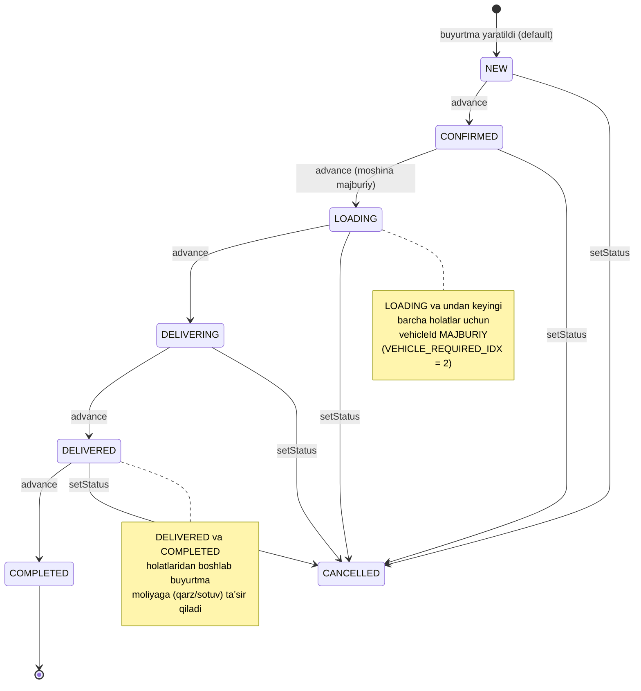
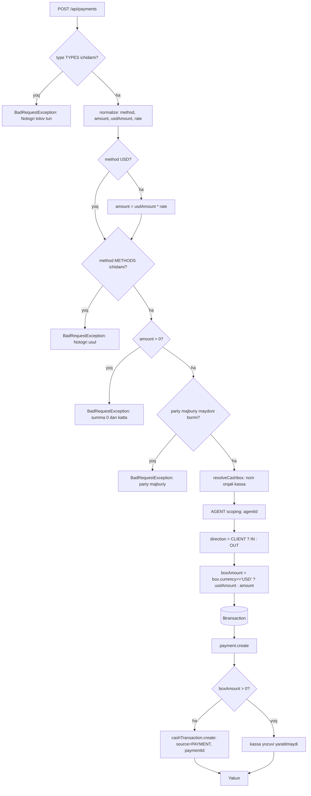
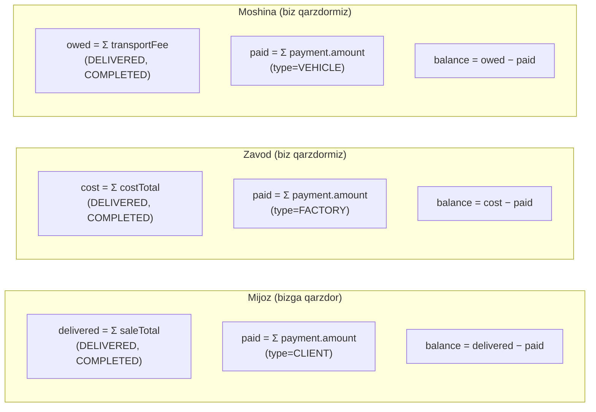
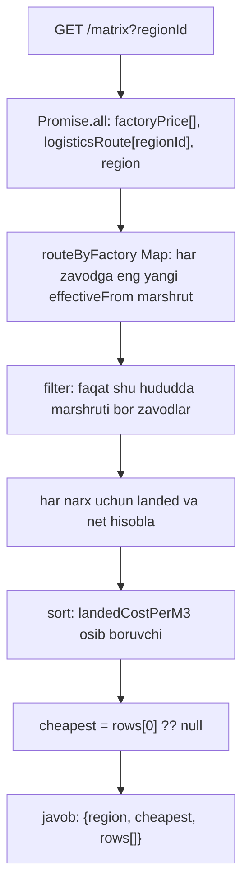

# 5. Biznes jarayonlari va hisob-kitob formulalari

> Loyiha: SmartBlok CRM/ERP | Hujjat: Texnik topshiriq (TZ) | Versiya: 1.0 | Sana: 2026-07-09 | Branch: main (v2 order-lifecycle)

Ushbu bob SmartBlok tizimining moliyaviy "yuragi"ni — buyurtma hayotiy tsikli, avtomatik hisob-kitob formulalari, kassaga posting va reversal mexanizmi, kop tomonlama qarzlar, tannarx (landed cost) va valyuta konvertatsiyasini — koddagi haqiqiy amalga oshirishga qatʼiy mos ravishda tavsiflaydi. Barcha maydon, enum va endpoint identifikatorlari verbatim (ingliz tilida) keltirilgan. Maʼlumotlar modeli (jadvallar, maydon turlari) toʻliq **4-bob. Maʼlumotlar modeli**da; RBAC/rollar **2-bob. Autentifikatsiya va RBAC**da bayon etilgan — bu yerda faqat jarayon va formulalarga eʼtibor qaratiladi.

---

## 5.1. Umumiy prinsiplar

Tizimning moliyaviy mantigʻi bir nechta doimiy prinsipga tayanadi:

1. **Qarzlar alohida jadvalda saqlanmaydi.** DBʼda "Debt" jadvali **yoʻq**. Barcha qarz balanslari `Order` va `Payment` jadvallaridan real vaqtda `groupBy`/`aggregate` bilan hisoblanadi (5.6-boʻlim). Tarixiy snapshot saqlanmaydi.
2. **Faqat yetkazilgan buyurtmalar moliyaga taʼsir qiladi.** Deyarli barcha qarz va sotuv hisoblari faqat `status ∈ {DELIVERED, COMPLETED}` boʻlgan buyurtmalarni oladi. `NEW`, `CONFIRMED`, `LOADING`, `DELIVERING`, `CANCELLED` statusli buyurtmalar qarz/sotuv agregatlariga kirmaydi.
3. **Har bir pul harakati kassada aks etadi.** Har `Payment` (mijoz/zavod/moshina) va har `Expense` bitta tranzaksiya ichida mos `CashTransaction` yozuvini yaratadi — "ledger hech qachon siljimaydi" (drift-free).
4. **Snapshot narxlar.** Buyurtma yaratilganda mahsulotning joriy `costPrice`/`salePrice` qiymatlari `Order.costPricePerUnit`/`salePricePerUnit` maydonlariga koʻchiriladi (snapshot). Keyinchalik katalog narxi oʻzgarsa, mavjud buyurtmalar oʻzgarmaydi.
5. **Pul turi — `Float`.** SQLiteʼda barcha pul maydonlari `Float` (REAL). Yaxlitlash faqat koʻrsatishda (`Math.round`, `fmtUZS`) qoʻllaniladi.

Barcha endpointlar `/api` global prefiksiga ega (`setGlobalPrefix('api')`).

---

## 5.2. Buyurtma hayotiy tsikli (order lifecycle)

Buyurtma — tizimning markaziy hujjati. U yetti bosqichli chiziqli oqim (`ORDER_FLOW`) va alohida `CANCELLED` holatidan iborat.

### 5.2.1. Holat mashinasi

Kodda (`orders.service.ts`) chiziqli oqim quyidagicha eʼlon qilingan:

```ts
export const ORDER_FLOW = ['NEW', 'CONFIRMED', 'LOADING', 'DELIVERING', 'DELIVERED', 'COMPLETED'];
const VEHICLE_REQUIRED_IDX = ORDER_FLOW.indexOf('LOADING'); // = 2
```

`CANCELLED` bu massivda **yoʻq** — u faqat `setStatus` orqali oʻrnatiladi va oqim hisob-kitobiga (`advance`) kirmaydi.



### 5.2.2. Holatlar maʼnosi va rangi (UI)

| Status | Yorliq (UI) | Rang (tone) | Moliyaga taʼsiri |
|---|---|---|---|
| `NEW` | Yangi | neutral | Yoʻq |
| `CONFIRMED` | Tasdiqlandi | blue | Yoʻq |
| `LOADING` | Yuklanmoqda | amber | Yoʻq (moshina talab qilinadi) |
| `DELIVERING` | Yetkazilmoqda | violet | Yoʻq |
| `DELIVERED` | Yetkazildi | teal | **Bor** (qarz/sotuv hisobga olinadi) |
| `COMPLETED` | Yakunlandi | green | **Bor** |
| `CANCELLED` | Bekor qilindi | red | Yoʻq |

### 5.2.3. Holatni oʻzgartirishning ikki usuli

Tizim holat oʻzgarishining ikki mexanizmini taqdim etadi:

**A) `advance(id)` — ketma-ket bir bosqich oldinga surish**
`PATCH /api/orders/:id/advance` (rollar: ADMIN, ACCOUNTANT, AGENT).

- `idx = ORDER_FLOW.indexOf(order.status)`.
- Agar `idx < 0` (status oqimda yoʻq, mas. `CANCELLED`) yoki `idx >= ORDER_FLOW.length - 1` (oxirgi `COMPLETED`) → `BadRequestException('Bu buyurtmani yana oldinga surib boʻlmaydi')`.
- `next = ORDER_FLOW[idx + 1]`; moshina tekshiruvi (`assertVehicleFor`) oʻtsa, status `next`ga oʻrnatiladi.
- **Faqat oldinga**, bir bosqichga; orqaga qaytarish yoʻq.

**B) `setStatus(id, status)` — toʻgʻridan-toʻgʻri oʻrnatish**
`PATCH /api/orders/:id/status` body `{ status }` (rollar: ADMIN, ACCOUNTANT, AGENT).

- Ruxsat etilgan qiymatlar: `[...ORDER_FLOW, 'CANCELLED']`. Aks holda `BadRequestException('Notogʻri status')`.
- Moshina tekshiruvi (`assertVehicleFor`) qoʻllaniladi.
- **Muhim:** holat oʻtishlari (transition) **tekshirilmaydi** — istalgan holatdan istalgan holatga sakrash mumkin (mas. `NEW → COMPLETED`, hatto `COMPLETED → NEW`). Yagona cheklov — moshina majburiyligi.

### 5.2.4. Moshina majburiyligi qoidasi

`assertVehicleFor(status, vehicleId)` (private):

```ts
idx = ORDER_FLOW.indexOf(status);
if (idx >= VEHICLE_REQUIRED_IDX && !vehicleId)
  throw BadRequestException('Avval moshina biriktiring — moshinasiz yuklashga oʻtib boʻlmaydi');
```

- `LOADING` (idx 2) va undan keyingi barcha holatlar uchun `vehicleId` boʻlishi shart.
- `CANCELLED` (`indexOf` = -1) tekshiruvdan oʻtadi — moshina talab qilinmaydi.
- **Chekka holat:** bu tekshiruv faqat `setStatus`/`advance`da ishlaydi. `create`/`update`da moshina majburiyligi **tekshirilmaydi** — yaʼni `status = 'LOADING'` va `vehicleId = null` holatda buyurtmani yaratish mumkin (keyingi `advance` bloklanadi).

### 5.2.5. Buyurtma raqami (orderNo) generatsiyasi

```ts
const count = await this.prisma.order.count();
return 'B-' + String(count + 1).padStart(4, '0');
```

- Format: `B-0001`, `B-0002`, … (4 xonali, chapdan nol bilan).
- Asos — **umumiy buyurtmalar soni + 1** (yildan mustaqil).
- **Xavf:** oʻchirish (`remove`) count ni kamaytiradi → keyingi yaratishda takroriy `orderNo`; concurrency (bir vaqtda ikki create) holatida ham dublikat mumkin. `orderNo` DBʼda `@unique` boʻlgani uchun collision xatosi berishi mumkin. Tranzaksiya ishlatilmagan.

---

## 5.3. Buyurtma hisob-kitob formulalari (totals)

Buyurtma yaratish/yangilashda `totals(d)` funksiyasi asosiy moliyaviy maydonlarni hisoblaydi. Kirish qiymatlari `Number(...) || 0` bilan xavfsiz oʻqiladi.

### 5.3.1. Kirish oʻzgaruvchilari

| Belgi | Maydon | Oʻqilishi |
|---|---|---|
| `q` | `quantity` | `Number(d.quantity) || 0` |
| `c` | `costPricePerUnit` | `Number(d.costPricePerUnit) || 0` |
| `s` | `salePricePerUnit` | `Number(d.salePricePerUnit) || 0` |
| `transport` | `transportFee` | `Number(d.transportFee) || 0` |

### 5.3.2. Asosiy formulalar (verbatim koddan)

```
costTotal = quantity * costPricePerUnit          // biz zavodga qarzdormiz
saleTotal = quantity * salePricePerUnit          // mijoz bizga qarzdor
profit    = saleTotal - costTotal - transportFee
```

**Muhim nuans:** `transportFee` `profit`dan **ayriladi**, ammo `saleTotal` yoki `costTotal`ga qoʻshilmaydi. Yaʼni transport haqi alohida xarajat sifatida faqat foydani kamaytiradi va mustaqil qarz kanali (moshina qarzi) hosil qiladi.

### 5.3.3. Narxlarni avtomatik toʻldirish (default)

Buyurtma yaratishda narxlar kelmasa, mahsulot katalog narxidan olinadi:

```ts
costPricePerUnit = numOr(dto.costPricePerUnit, product.costPrice);
salePricePerUnit = numOr(dto.salePricePerUnit, product.salePrice);
// numOr(v, fallback) = (v === undefined || v === null || v === '') ? fallback : Number(v)
```

Frontend (`Orders.tsx`) mahsulot tanlanganda ushbu qiymatlarni avtomatik toʻldiradi (`pickProduct`) va real vaqtda **preview** koʻrsatadi (aynan bir xil formula bilan): `costTotal = q*c`, `saleTotal = q*s`, `profit = q*s - q*c - t`.

### 5.3.4. Yaratishdagi biznes validatsiyalari

`create(dto)` quyidagi majburiy tekshiruvlarni bajaradi:

1. `dto.clientId` yoʻq → `BadRequestException('Mijoz majburiy')`.
2. `dto.productId` yoʻq → `BadRequestException('Mahsulot majburiy')`.
3. Mijoz/mahsulot topilmasa → `'Mijoz topilmadi'` / `'Mahsulot topilmadi'`.
4. `factoryId = dto.factoryId || product.factoryId`; agar `product.factoryId !== factoryId` → `BadRequestException('Mahsulot tanlangan zavodga tegishli emas')`.
5. `agentId = dto.agentId || client.agentId`; ikkalasi yoʻq → `BadRequestException('Agent majburiy — mijozga agent biriktirilmagan')`.

`update(id, dto)` — partial (qisman) yangilash: `totals({ ...existing, ...dto })` bilan qayta hisoblaydi, yaʼni `quantity`/narx/`transportFee` oʻzgarsa `costTotal`/`saleTotal`/`profit` avtomatik yangilanadi. Update factory/product mosligini yoki moshina majburiyligini qayta tekshirmaydi.

### 5.3.5. Buyurtma oʻchirishda tolovlarni uzish

`remove(id)`:

```ts
await this.prisma.payment.updateMany({ where: { orderId: id }, data: { orderId: null } });
return this.prisma.order.delete({ where: { id } });
```

Buyurtmaga bogʻliq tolovlar **oʻchirilmaydi**, faqat `orderId = null` qilinadi (uziladi), soʻng buyurtma hard-delete qilinadi. Tranzaksiya yoʻq. **Muhim:** buyurtma oʻchirish uni kassaga taʼsir qilmaydi — chunki buyurtmaning oʻzi kassaga posting qilmaydi (faqat tolovlar qiladi, 5.4-boʻlim).

---

## 5.4. Tolov → kassa avtomatik posting va reversal

Tolov (`Payment`) — pulning haqiqiy harakati. Har tolov mos kassaga (`Cashbox`) avtomatik `CashTransaction` yozuvi sifatida joylanadi. Butun jarayon bitta `$transaction` ichida — ledger siljimaydi.

### 5.4.1. Tolov turlari va yoʻnalishi

| `type` | Maʼnosi | `direction` | Majburiy party maydoni |
|---|---|---|---|
| `CLIENT` | Mijozdan kirim | `IN` | `clientId` |
| `FACTORY` | Zavodga chiqim | `OUT` | `factoryId` |
| `VEHICLE` | Moshinaga chiqim | `OUT` | `vehicleId` |

```ts
direction = type === 'CLIENT' ? 'IN' : 'OUT';
PARTY_KEY = { CLIENT: 'clientId', FACTORY: 'factoryId', VEHICLE: 'vehicleId' };
```

### 5.4.2. Tolov usuli → kassa xaritasi

Tolov usuli (`method`) qatʼiy nom orqali kassaga bogʻlanadi (`CASHBOX_BY_METHOD`):

| `method` | Kassa nomi (`Cashbox.name`) | Valyuta |
|---|---|---|
| `CASH` | `Naqt kassa (UZS)` | UZS |
| `USD` | `Naqt kassa (USD)` | USD |
| `CLICK` | `Click kassa` | UZS |
| `TERMINAL` | `Click kassa` | UZS |
| `BANK` | `Bank kassa` | UZS |
| `TRANSFER` | `Bank kassa` | UZS |

**Eslatmalar:**
- `TERMINAL` va `CLICK` bir kassaga (`Click kassa`) tushadi.
- `TRANSFER` — backend qabul qiladi (Bank kassa), lekin schema izohi va frontend uni koʻrsatmaydi (hujjatlashtirilmagan kengaytma). Frontend faqat 5 usulni koʻrsatadi.
- `resolveCashbox(method)` kassani DBʼdagi **nom orqali** topadi (`cashbox.findFirst({ where: { name } })`). Kassa topilmasa → `BadRequestException('Kassa topilmadi: <name>')` — pul jimgina yoʻqolmasligi uchun. Bu seedʼdagi kassa nomlariga qatʼiy bogʻliqlik hosil qiladi.

### 5.4.3. Posting jarayoni (create)



Yaratiladigan `CashTransaction` maydonlari: `cashboxId = box.id`, `direction`, `amount = boxAmount`, `rate`, `source = 'PAYMENT'`, `date`, `note = dto.note || "Tolov: <type>"`, `paymentId = payment.id`.

### 5.4.4. Reversal (tolov oʻchirilganda)

`DELETE /api/payments/:id` (rollar: **faqat ADMIN, ACCOUNTANT**):

```ts
$transaction:
  tx.cashTransaction.deleteMany({ where: { paymentId: id } });  // kassa yozuvini bekor qiladi
  tx.payment.delete({ where: { id } });
```

Reversal — kompensatsion teskari yozuv **emas**, balki kassa yozuvini oddiy **oʻchirish**. Shu sabab kassa balansi avtomatik qayta hisoblanadi (5.7-boʻlim). `paymentId` FK boʻlmagani uchun DB kaskadi yoʻq — qoʻlda `deleteMany` qilinadi.

**Asimmetriya (chekka holat):** `DELETE /api/kassa/transactions/:id` orqali `source=PAYMENT` yozuvini **qoʻlda** oʻchirish mumkin — parent tolov esa qoladi, natijada tolov ↔ kassa bogʻlanishi buziladi. Bunga hech qanday toʻsiq yoʻq.

---

## 5.5. Xarajat → kassa posting

Xarajat (`Expense`) — kassadan chiqim. Tolovga oʻxshab, xarajat ham bitta tranzaksiya ichida mos `CashTransaction` yaratadi.

### 5.5.1. Yaratish validatsiyasi va posting

`POST /api/expenses` (rollar: ADMIN, ACCOUNTANT, CASHIER):

1. `amount = Number(dto.amount) || 0`; agar `!amount || amount <= 0` → `BadRequestException("Xarajat summasi 0 dan katta boʻlishi kerak")`.
2. `!dto.categoryId` → `BadRequestException('Xarajat kategoriyasi majburiy')`.
3. `!dto.cashboxId` → `BadRequestException("Kassa majburiy — pul qaysi kassadan chiqishini tanlang")`.

> Diqqat: schema'da `categoryId`/`cashboxId` nullable, lekin service `create()` ularni majburiy qiladi.

Tranzaksiya ("so the ledger can never drift"):

```ts
$transaction:
  expense.create({ data: { date, categoryId, amount, cashboxId, note } });
  cashTransaction.create({ data: {
    cashboxId, direction: 'OUT', amount, source: 'EXPENSE', date,
    note: dto.note ?? 'Xarajat', expenseId: expense.id
  }});
```

Xarajat har doim kassadan **chiqim** (`direction: 'OUT'`).

### 5.5.2. Reversal (xarajat oʻchirilganda)

`DELETE /api/expenses/:id`:

```ts
$transaction:
  cashTransaction.deleteMany({ where: { expenseId: id } });  // kassa chiqimini bekor qiladi
  expense.delete({ where: { id } });
```

**Cheklov:** xarajatni **UPDATE** qilish endpointi yoʻq — faqat create/delete. Kassa summasini oʻzgartirish uchun xarajatni oʻchirib, qayta yaratish kerak.

### 5.5.3. Xarajat xulosasi

`GET /api/expenses/summary` → `expense.groupBy({ by: ['categoryId'], _sum: { amount } })`, soʻng:

```
total = Σ (_sum.amount ?? 0)   // barcha kategoriyalar boʻyicha
```

Kategoriya boʻyicha taqsimot hisoblanadi, ammo javobda faqat `{ total }` qaytariladi.

---

## 5.6. Koʻp tomonlama qarzlar (mijoz / zavod / moshina)

Qarzlar `GET /api/debts/summary` (rollar: ADMIN, ACCOUNTANT) orqali real vaqtda hisoblanadi. Servis 9 ta parallel `Promise.all` soʻrovi bilan uch tomonlama balanslarni chiqaradi. Har uch tomon **bir umumiy prinsip**ga tayanadi, ammo turli maydonlardan.

### 5.6.1. Uch tomonlama balans modeli



### 5.6.2. Formulalar (verbatim koddan)

| Tomon | Yetkazilgan qiymat | Toʻlangan | Balans | Musbat balans maʼnosi |
|---|---|---|---|---|
| **Mijoz** | `delivered = Σ saleTotal` (status ∈ DELIVERED, COMPLETED) | `paid = Σ amount` (type=CLIENT) | `delivered − paid` | Mijoz bizga qarzdor |
| **Zavod** | `cost = Σ costTotal` (status ∈ DELIVERED, COMPLETED) | `paid = Σ amount` (type=FACTORY) | `cost − paid` | Biz zavodga qarzdormiz |
| **Moshina** | `owed = Σ transportFee` (status ∈ DELIVERED, COMPLETED) | `paid = Σ amount` (type=VEHICLE) | `owed − paid` | Biz moshinaga qarzdormiz |

**Umumiy qoida:** `balance > 0` — kimdir bizga (mijoz) yoki biz kimgadir (zavod/moshina) qarzdormiz; `balance < 0` — avans/ortiqcha toʻlov; `balance = 0` — qarz yoʻq. Toʻlovlar statusdan/sanadan qatʼi nazar faqat `type` boʻyicha yigʻiladi.

Har uch guruh uchun qatorlar `.filter(r => r.balance !== 0)` bilan filtrlanadi va `.sort((a, b) => b.balance - a.balance)` (kamayish) tartiblanadi.

### 5.6.3. Umumiy jamlar (totals)

```
clientsOweUs   = Σ max(0, r.balance)     // faqat musbat mijoz balanslari
clientsAdvance = Σ max(0, -r.balance)    // manfiy mijoz balanslari (avans)
weOweFactories = Σ r.balance             // BARCHA zavod balanslari (max/min filtri YOʻQ)
weOweVehicles  = Σ r.balance             // BARCHA moshina balanslari
```

**Muhim assimetriya:** mijozlar uchun qarz va avans `Math.max` bilan alohida ajratiladi; zavod/moshina uchun ajratilmaydi — ortiqcha toʻlangan (manfiy) zavod/moshina balansi umumiy `weOwe*` summasini kamaytiradi. UIʼda manfiy balans "(ortiqcha)"/"(avans)" deb koʻrsatiladi.

### 5.6.4. Bir tomon boʻyicha detal (statement)

Har entitining detail sahifasi oʻz balansini `totals` bilan qaytaradi:

- **Mijoz** (`GET /api/clients/:id`): `delivered = Σ saleTotal` (DELIVERED/COMPLETED), `paid = Σ amount` (type=CLIENT), `balance = delivered − paid`. Javobda `orders[]`, `payments[]` va `totals` (toʻliq hisob-varaqa). Agent detalida esa `outstanding`/`advance` **mijoz darajasida** netlanadi: `Σ max(0, delivered_c − paid_c)` va `Σ max(0, paid_c − delivered_c)`.
- **Zavod** (`GET /api/factories/:id`): `cost = Σ costTotal` (DELIVERED/COMPLETED), `paid = Σ amount` (type=FACTORY), `balance = cost − paid`. Izoh koddan: `balance > 0 → biz zavodga qarzdormiz; balance < 0 → oldindan toʻlaganmiz (avans)`.
- **Moshina** (`GET /api/vehicles/:id`): `owed = Σ transportFee` (DELIVERED/COMPLETED), `paid = Σ amount` (type=VEHICLE), `balance = owed − paid`.

> Katalog agregatlarida bitta nuans: `findAll` da buyurtmalar soni (`_count.orders`) **barcha** statuslarni sanaydi, ammo `costTotal`/`transportTotal` faqat DELIVERED/COMPLETED — yaʼni son va pul turli toʻplamni oʻlchaydi.

---

## 5.7. Kassa balansi

Kassa balansi `GET /api/kassa/cashboxes` (va `summary`) orqali `CashTransaction` yozuvlaridan hisoblanadi.

### 5.7.1. Balans formulasi

```ts
cashTransaction.groupBy({ by: ['cashboxId', 'direction'], _sum: { amount } });
// har kassa uchun:
inSum  = Σ amount (direction = IN)
outSum = Σ amount (direction = OUT)
balance = inSum - outSum
```

Har kassaga `inTotal`, `outTotal`, `balance` qoʻshiladi.

**Muhim:** hisob **valyutani ajratmaydi** — bir kassaning barcha `amount` qiymatlari toʻppa-toʻgʻri qoʻshiladi. Bu ishlaydi, chunki har kassa bitta valyutada (`currency`), lekin `rate` konvertatsiya uchun **ishlatilmaydi**.

### 5.7.2. Kassa xulosasi

`GET /api/kassa/summary` → `{ boxes, totalUZS, totalUSD }`:

```
totalUZS = Σ balance (currency = UZS boʻlgan kassalar)
totalUSD = Σ balance (currency = USD boʻlgan kassalar)
```

### 5.7.3. Kassa yozuvining uch manbasi

`CashTransaction.source` uchta qiymatga ega:

| `source` | Kelib chiqishi | Reversal |
|---|---|---|
| `PAYMENT` | Tolovdan avtomatik (`paymentId` bilan) | Tolov oʻchirilganda avtomatik |
| `EXPENSE` | Xarajatdan avtomatik (`expenseId` bilan) | Xarajat oʻchirilganda avtomatik |
| `MANUAL` | Qoʻlda kirim/chiqim (`POST /api/kassa/transactions`) | Faqat qoʻlda |

Qoʻlda yozuvda `direction: d.direction === 'OUT' ? 'OUT' : 'IN'` (nomaʼlum qiymat → IN), `amount: Number(d.amount) || 0` (0 ga ruxsat — validatsiya yoʻq), `source: 'MANUAL'`, `paymentId`/`expenseId` toʻldirilmaydi.

---

## 5.8. USD kurs konvertatsiyasi

Dollar (USD) tolovlari maxsus konvertatsiya bilan ishlanadi. Kurs (`rate`) frontendʼda default `12700`.

### 5.8.1. Tolovdagi konvertatsiya

`normalize(dto)` ichida:

```ts
method = dto.method || 'CASH';
amount    = Number(dto.amount) || 0;
usdAmount = Number(dto.usdAmount) || 0;
rate      = Number(dto.rate) || 0;
if (method === 'USD') amount = usdAmount * rate;   // somdagi ekvivalent
```

Yaʼni USD tolovida foydalanuvchi `usdAmount` (dollar) va `rate` (kurs) kiritadi, tizim esa somdagi ekvivalent `amount`ni hisoblaydi. Frontend preview: `amountPreview = method === 'USD' ? usdAmount * rate : amount`.

### 5.8.2. Kassaga yoziladigan summa

```ts
boxAmount = box.currency === 'USD' ? usdAmount : amount;
```

- USD kassaga (`Naqt kassa (USD)`) **dollar** summasi (`usdAmount`) yoziladi.
- Boshqa (UZS) kassalarga **som** summasi (`amount`) yoziladi.

Shu tariqa har kassa oʻz valyutasida toza qoladi va 5.7-boʻlimdagi valyuta-agnostik balans toʻgʻri ishlaydi. `rate` `CashTransaction`da saqlanadi, lekin balans hisobida qayta konvertatsiya uchun ishlatilmaydi.

---

## 5.9. Landed cost (tannarx matritsasi) va eng arzon manba

Tannarx matritsasi (`GET /api/procurement/matrix?regionId=`, rollar: ADMIN, ACCOUNTANT, AGENT) — hudud boʻyicha zavodlarni klientgacha yetkazib berish tannarxi boʻyicha taqqoslaydigan va eng arzon manbani avtomatik topadigan hisob-kitob moduli.

### 5.9.1. Landed cost formulasi

`landed-cost.util.ts`:

```ts
landedCostPerM3(pricePerM3, costPerTruck, truckCapacityM3):
  if (!truckCapacityM3 || truckCapacityM3 <= 0) return pricePerM3;   // nolga bolishdan himoya
  return pricePerM3 + costPerTruck / truckCapacityM3;
```

Yaʼni:

```
Klientgacha tannarx (m³) = zavod narxi (m³) + logistika narxi (mashina) / mashina hajmi (m³)
```

Izohda qayd etilgan: bu "factory-comparison sheet"ga aniq mos keladi.

### 5.9.2. Diler bonusidan keyingi net tannarx

```ts
netCostAfterBonus(landed, dealerBonusPct = 0):
  return landed * (1 - (dealerBonusPct || 0));
```

- `dealerBonusPct` — **ulush** (0..1), foiz emas (mas. `0.05` = 5%).
- Diler bonusi alohida rebate — u koʻrsatiladigan `landedCostPerM3`ni **oʻzgartirmaydi**, faqat haqiqiy marja tahlili uchun `netCostPerM3`da qoʻllaniladi.
- **Xavf:** agar foydalanuvchi `5` (foiz) kiritsa, `net` manfiy chiqadi — validatsiya yoʻq.

### 5.9.3. Matritsa qurilishi va eng arzon manba



Bosqichlar:
1. Parallel: barcha `factoryPrice` (`effectiveFrom desc`), berilgan hudud `logisticsRoute` (`effectiveFrom desc`), `region`.
2. `routeByFactory` — har zavod uchun eng yangi (`effectiveFrom` desc, birinchi kelgan) marshrut saqlanadi.
3. Faqat shu hududda marshruti bor zavodlar qoldiriladi (`prices.filter(p => routeByFactory.has(p.factoryId))`).
4. Har narx uchun `landedCostPerM3` va `netCostPerM3` (`Math.round` bilan) hisoblanadi.
5. `.sort((a, b) => a.landedCostPerM3 - b.landedCostPerM3)` — osib boruvchi.
6. `cheapest = rows[0] ?? null` — eng arzon landed cost.

**Chekka holatlar:**
- Marshruti yoʻq zavod matritsaga tushmaydi.
- Berilgan hududda hech qanday marshrut boʻlmasa — `rows = []`, `cheapest = null`.
- Narx **factory boʻyicha dedup qilinmaydi** — bir zavodda bir nechta `factoryPrice` boʻlsa, har biri alohida satr sifatida chiqadi (marshrut esa faqat eng yangisi olinadi).

> **Muhim:** landed cost — bu faqat **tahliliy/reja** hisobi (qaysi zavoddan olish arzon). Buyurtmaning haqiqiy tannarxi (`costTotal`) buyurtmadagi snapshot `costPricePerUnit` asosida hisoblanadi (5.3-boʻlim) va landed cost'dan mustaqil. Procurement moduli hech qanday kassa/moliyaviy posting qilmaydi (sof kalkulyatsiya).

---

## 5.10. Dashboard va hisobot agregatlari

Boshqaruv paneli (`/api/dashboard/*`) va svod hisoboti (`/api/reports/svod`) yuqoridagi formulalarni butun tizim boʻyicha jamlaydi. Ikkalasi ham **sof oʻqish** (yozuv/posting yoʻq). Umumiy konstanta:

```ts
const DELIVERED = { status: { in: ['DELIVERED', 'COMPLETED'] } };
```

### 5.10.1. Dashboard summary formulalari

| Maydon | Formula |
|---|---|
| `totalSales` | `Σ saleTotal` (DELIVERED) |
| `totalProfit` | `Σ profit` (DELIVERED) |
| `totalCubes` | `Σ quantity` (DELIVERED) |
| `ordersCount` | DELIVERED/COMPLETED buyurtmalar soni |
| `activeOrders` | `count(status ∈ NEW, CONFIRMED, LOADING, DELIVERING)` |
| `totalPaid` | `Σ amount` (type=CLIENT) |
| `clientsDebtToUs` | `sale − paidCli` (5.6 mijoz balansi umumiy) |
| `weOweFactory` | `cost − paidFac` |
| `weOweVehicle` | `transport − paidVeh` |
| `totalExpense` | `Σ amount` (barcha xarajatlar, filtrsiz) |
| `cashBalance` | `cashIn − cashOut` (barcha kassa IN − OUT) |

`salesTrend()` — kunlik guruhlash (`date.toISOString().slice(0,10)`, UTC), har kun `sales`/`profit` yigʻindisi. `agentPerformance()` — agent boʻyicha `sales`/`profit`/`deliveries`/`collected`, `sales` boʻyicha kamayish tartibida. `orderFunnel()` — barcha statuslar boʻyicha `count`.

### 5.10.2. Svod (reports) formulalari

Har agent uchun:
```
delivered = Σ saleTotal (DELIVERED)     paid = Σ amount (type=CLIENT)
balance   = delivered − paid            profit = Σ profit (DELIVERED)
```

Umumiy jamlar:
```
totalGoods     = Σ saleTotal (DELIVERED)
totalCost      = Σ costTotal (DELIVERED)
totalProfit    = Σ profit (DELIVERED)
factoryPaid    = Σ amount (type=FACTORY)
factoryBalance = totalCost − factoryPaid    // zavodga qolgan qarz (TANNARX asosida)
```

`factoryBalance` sotuv narxi emas, **tannarx** (`costTotal`) asosida — bu dashboarddagi `weOweFactory` bilan bir xil formula.

---

## 5.11. Yigʻma formulalar jadvali

Quyidagi jadval bobdagi barcha hisob-kitoblarni bir joyda jamlaydi.

| Koʻrsatkich | Formula | Filtr/shart | Manba |
|---|---|---|---|
| `costTotal` | `quantity × costPricePerUnit` | — | `orders.service.ts` totals |
| `saleTotal` | `quantity × salePricePerUnit` | — | totals |
| `profit` | `saleTotal − costTotal − transportFee` | — | totals |
| Buyurtma narxi (default) | `numOr(dto.price, product.price)` | narx kelmasa | create |
| Mijoz balansi | `delivered − paid` | `delivered`=Σ saleTotal (DELIVERED/COMPLETED); `paid`=Σ amount (CLIENT) | debts/clients |
| Zavod balansi | `cost − paid` | `cost`=Σ costTotal (DELIVERED/COMPLETED); `paid`=Σ amount (FACTORY) | debts/factories |
| Moshina balansi | `owed − paid` | `owed`=Σ transportFee (DELIVERED/COMPLETED); `paid`=Σ amount (VEHICLE) | debts/vehicles |
| `clientsOweUs` | `Σ max(0, balance)` | musbat mijoz balanslari | debts totals |
| `clientsAdvance` | `Σ max(0, −balance)` | manfiy mijoz balanslari | debts totals |
| `weOweFactories` | `Σ balance` | barcha zavod balanslari (filtrsiz) | debts totals |
| `weOweVehicles` | `Σ balance` | barcha moshina balanslari (filtrsiz) | debts totals |
| Agent outstanding | `Σ max(0, delivered_c − paid_c)` | mijoz darajasida netlash | agents.findOne |
| Agent advance | `Σ max(0, paid_c − delivered_c)` | mijoz darajasida netlash | agents.findOne |
| Tolov yoʻnalishi | `type === 'CLIENT' ? 'IN' : 'OUT'` | — | payments |
| USD → som | `amount = usdAmount × rate` | `method === 'USD'` | payments normalize |
| Kassaga summa | `currency === 'USD' ? usdAmount : amount` | — | payments |
| Kassa balansi | `inSum − outSum` | kassa boʻyicha IN/OUT | kassa.service.ts |
| `totalUZS` | `Σ balance (UZS kassalar)` | — | kassa summary |
| `totalUSD` | `Σ balance (USD kassalar)` | — | kassa summary |
| Xarajat jami | `Σ amount` | barcha xarajatlar | expenses summary |
| Landed cost | `pricePerM3 + costPerTruck / truckCapacityM3` | `truckCapacityM3 > 0` (aks holda faqat pricePerM3) | landed-cost.util |
| Net tannarx | `landed × (1 − dealerBonusPct)` | `dealerBonusPct` ∈ 0..1 | landed-cost.util |
| Dashboard `cashBalance` | `cashIn − cashOut` | barcha kassa yozuvlari | dashboard |
| `factoryBalance` (svod) | `totalCost − factoryPaid` | tannarx asosida | reports |

---

## 5.12. Muhim chekka holatlar va cheklovlar (jarayon darajasida)

Loyihalash va sinovda hisobga olinishi kerak boʻlgan asosiy jihatlar:

1. **Holat oʻtish validatsiyasi yoʻq** (`setStatus`) — istalgan holatdan istalgan holatga sakrash mumkin; faqat `advance` ketma-ketlikni majburlaydi.
2. **Moshina majburiyligi** faqat `setStatus`/`advance`da (LOADING+), `create`/`update`da emas.
3. **`orderNo` dublikat xavfi** — oʻchirish/concurrency `count + 1` asosidagi raqamlashni buzishi mumkin (tranzaksiya yoʻq).
4. **Kassa reversal assimetriyasi** — `PAYMENT`/`EXPENSE` manbali kassa yozuvini qoʻlda oʻchirishga toʻsiq yoʻq (parent yozuv qoladi).
5. **`paymentId`/`expenseId` FK emas** — DB darajasida referensial yaxlitlik yoʻq, faqat mantiqiy bogʻlanish.
6. **`resolveCashbox` nomga bogʻliq** — kassa nomi oʻzgarsa yoki seed ishlatilmasa, barcha tolovlar "Kassa topilmadi" bilan yiqiladi.
7. **`creditLimit` qoʻllanilmaydi** — mijoz kredit limiti saqlanadi, lekin buyurtma yaratishda tekshirilmaydi.
8. **Xarajatni UPDATE qilib boʻlmaydi** — faqat create/delete.
9. **Valyuta `rate` balansda ishlatilmaydi** — konvertatsiya faqat tolov yaratishda; kassa balansi valyuta-agnostik.
10. **Zavod/moshina totals manfiy balansni filtrlamaydi** (mijozdan farqli) — ortiqcha toʻlov umumiy qarzni kamaytiradi.
11. **Pul turi `Float`** — SQLite REAL, precision cheklovi bor (yirik summalarda yaxlitlash xatosi ehtimoli).
12. **Import kassaga posting qilmaydi** — Excel import toʻgʻridan-toʻgʻri `order`/`payment` yaratadi, hech qanday `CashTransaction` yozmaydi (5.4/5.5'dan farqli). Bu import qilingan tolovlar kassa balansiga taʼsir qilmasligini anglatadi.

---

*Havolalar: maʼlumotlar modeli va maydon turlari — 4-bob; rollar va ruxsatlar (RBAC) — 2-bob; API endpointlar toʻliq roʻyxati — 6-bob (API spetsifikatsiyasi).*
