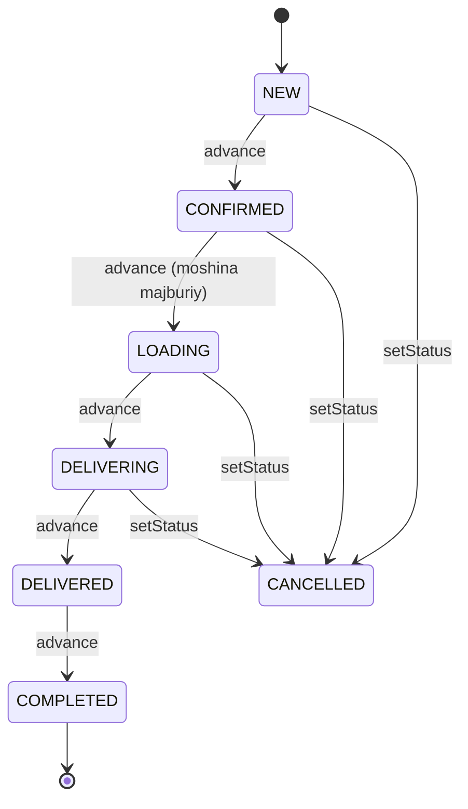
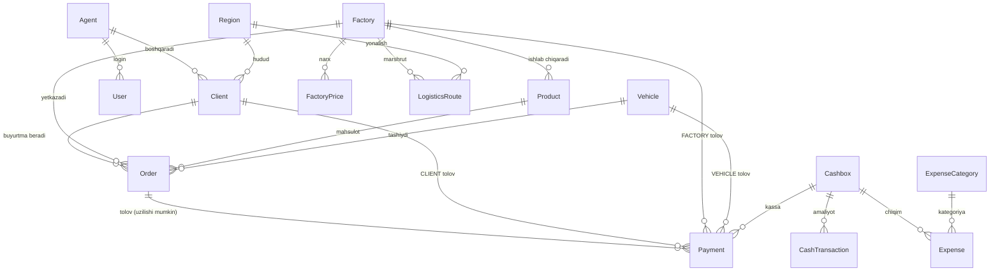
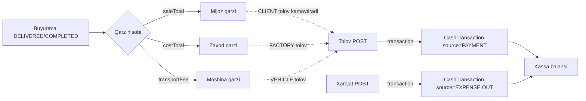

# 6. Funksional talablar (modullar boyicha)

> Loyiha: SmartBlok CRM/ERP | Hujjat: Texnik topshiriq (TZ) | Versiya: 1.0 | Sana: 2026-07-09 | Branch: main (v2 order-lifecycle)

---

## 6.0. Kirish va oqish qoidalari

Ushbu bob SmartBlok CRM/ERP tizimining barcha funksional modullari uchun aniq, olchanadigan va koddagi haqiqiy implementatsiyaga toliq mos keladigan talablarni belgilaydi. Har bir talab `FR-<MODUL>-<raqam>` formatida raqamlangan va tekshiriladigan (verifikatsiya qilinadigan) tarzda yozilgan.

Talablar quyidagi tuzilmada beriladi:

| Bolim | Mazmuni |
|---|---|
| (a) Maqsad | Modulning biznes vazifasi |
| (b) Foydalanuvchi rollari | Modulga kirish huquqiga ega rollar (RBAC) |
| (c) Funksiyalar | CRUD amallari va maxsus operatsiyalar (FR raqamlari bilan) |
| (d) UI elementlari | Jadval ustunlari, forma maydonlari, filtr/qidiruv, drawer/detail, KPI |
| (e) Validatsiya va biznes qoidalari | Tekshiruvlar, formulalar, cheklovlar |
| (f) Chekka holatlar | Maxsus/xatolik holatlari va cheklovlar |

**Umumiy texnik kontekst** (batafsil: 3-bob "Arxitektura" va 4-bob "Malumotlar modeli"):

- Barcha API endpointlar `/api` global prefiksi bilan boshlanadi (`setGlobalPrefix('api')`).
- Autentifikatsiya — JWT (`Authorization: Bearer <token>`), token muddati 7 kun (`JWT_EXPIRES_IN`).
- Rollar: `ADMIN`, `ACCOUNTANT`, `AGENT`, `CASHIER` (String sifatida saqlanadi, Prisma enum emas).
- Barcha `id` — opak UUID (ketma-ket raqamlash yoq).
- Frontend: React 18 + TanStack Query; pul formatlash `fmtUZS` (ru-RU, "so'm").
- **Balans belgisi konvensiyasi (yagona haqiqat manbasi):** `balance > 0` → kimdir bizga qarzdor (mijoz) yoki biz qarzdormiz (zavod/moshina); `balance < 0` → avans (ortiqcha tolov); `balance = 0` → qarz yoq.
- **Yakunlangan sotuv sharti:** barcha qarz/sotuv/foyda agregatlari faqat `status IN ('DELIVERED', 'COMPLETED')` bolgan buyurtmalardan hisoblanadi.

**Modullar royxati va ularning marshrut/rol xaritasi:**

| Modul | Frontend marshruti | Backend prefiksi | Korish huquqi (menyu) |
|---|---|---|---|
| Boshqaruv paneli | `/` | `/api/dashboard` | Barcha rollar |
| Buyurtmalar | `/orders` | `/api/orders` | ADMIN, ACCOUNTANT, AGENT |
| Mijozlar | `/clients`, `/clients/:id` | `/api/clients` | ADMIN, ACCOUNTANT, AGENT |
| Agentlar | `/agents`, `/agents/:id` | `/api/agents` | ADMIN, ACCOUNTANT |
| Zavodlar | `/factories`, `/factories/:id` | `/api/factories` | ADMIN, ACCOUNTANT |
| Mahsulotlar | `/products` | `/api/products` | ADMIN, ACCOUNTANT |
| Moshinalar | `/vehicles`, `/vehicles/:id` | `/api/vehicles` | ADMIN, ACCOUNTANT |
| Tannarx matritsasi | `/procurement` | `/api/procurement` | ADMIN, ACCOUNTANT |
| Tolovlar | `/payments` | `/api/payments` | ADMIN, ACCOUNTANT, AGENT, CASHIER |
| Qarzlar | `/debts` | `/api/debts` | ADMIN, ACCOUNTANT |
| Xarajatlar | `/expenses` | `/api/expenses` | ADMIN, ACCOUNTANT, CASHIER |
| Kassalar | `/kassa` | `/api/kassa` | ADMIN, ACCOUNTANT, CASHIER |
| Hisobot (Svod) | `/reports` | `/api/reports` | ADMIN, ACCOUNTANT |
| Foydalanuvchilar | `/users` | `/api/users` | ADMIN |
| Excel import | `/import` | `/api/import` | ADMIN, ACCOUNTANT |
| Profil | `/profile` | `/api/auth/me` | Barcha rollar |

> **Muhim xavfsizlik izohi:** Frontend marshrut darajasida rol tekshiruvi YOQ — `Protected` guard faqat token borligini tekshiradi. Rolga asoslangan korinish faqat navigatsiya menyusida (`visibleGroups`) filtrlash orqali. Haqiqiy himoya backend `@Roles` dekoratori orqali taminlanadi. Ushbu bobdagi "korish huquqi" ustuni menyu filtrini, "rollar" bolimlari esa backend enforcementini bildiradi.

---

## 6.1. Boshqaruv paneli (Dashboard)

### (a) Maqsad
Rahbariyat va foydalanuvchilarga tizimning umumiy holatini (sotuv, foyda, qarzlar, kassa balansi, agent reytingi, buyurtma voronkasi) real vaqtda korsatuvchi bosh panel. `CASHIER` roli uchun alohida soddalashtirilgan "Kassa paneli" korinishi mavjud.

### (b) Foydalanuvchi rollari
Backend: `/api/dashboard/*` endpointlari faqat `JwtAuthGuard` bilan himoyalangan — **rol tekshiruvi yoq**, ya'ni har qanday autentifikatsiyalangan foydalanuvchi barcha KPIlarga kira oladi. Menyuda barcha rollar uchun korinadi.

### (c) Funksiyalar

| FR-ID | Talab |
|---|---|
| FR-DASH-01 | Tizim `GET /api/dashboard/summary` orqali asosiy KPI toplamini qaytarishi shart: `totalSales`, `totalProfit`, `totalCubes`, `ordersCount`, `activeOrders`, `totalPaid`, `paymentsCount`, `clientsDebtToUs`, `weOweFactory`, `weOweVehicle`, `clientCount`, `agentCount`, `totalExpense`, `cashBalance`. |
| FR-DASH-02 | Tizim `GET /api/dashboard/sales-trend` orqali kunlik sotuv/foyda dinamikasini `Array<{date, sales, profit}>` (sana osish tartibida) shaklida qaytarishi shart. |
| FR-DASH-03 | Tizim `GET /api/dashboard/agent-performance` orqali agentlar reytingini (`sales` boyicha kamayish tartibida) qaytarishi shart: har agent uchun `agentId, agent, groupNo, sales, profit, deliveries, collected`. |
| FR-DASH-04 | Tizim `GET /api/dashboard/order-funnel` orqali barcha buyurtmalarni status boyicha guruhlab `Array<{status, count}>` qaytarishi shart (filtrsiz). |
| FR-DASH-05 | Frontend `user.role === 'CASHIER'` bolganda umumiy KPIlar ornida faqat kassa paneli (`CashierDashboard`) korsatishi shart va boshqa query'larni ishga tushirmasligi kerak. |

### (d) UI elementlari

**Umumiy Dashboard KPI kartalari** (`KpiCard`, `useCountUp` animatsiya bilan):

| KPI | Manba | Xususiyat |
|---|---|---|
| Jami sotuv | `s.totalSales` | hero, hint: `{ordersCount} yakunlangan` |
| Umumiy foyda | `s.totalProfit` | — |
| Faol buyurtmalar | `s.activeOrders` | — |
| Kassa balansi | `s.cashBalance` | — |
| Mijoz qarzi | `s.clientsDebtToUs` | — |
| Zavodga qarz | `s.weOweFactory` | — |
| Moshinaga qarz | `s.weOweVehicle` | — |
| Xarajatlar | `s.totalExpense` | — |

**Grafiklar (Recharts):**
- "Sotuv va foyda dinamikasi" — AreaChart, ikki qatlam: `sales` (stroke `#2563EB`), `profit` (stroke `#F59E0B`); `date` `dd.mm` formatga otkaziladi.
- "Buyurtmalar holati" — BarChart, `name = statusMeta[status].label`.

**Agentlar reytingi jadvali:** ustunlar — Agent, Guruh (`groupNo`), Buyurtma (`deliveries`), Sotuv (`sales`), Foyda (`profit`), Yigilgan (`collected`).

**CASHIER paneli KPIlari:** Naqd jami (`totalUZS`, hero), Dollar kassa (`totalUSD`, `$`), va har `boxes[]` elementi uchun karta (`name`, `balance`, valyuta suffiks).

### (e) Validatsiya va biznes qoidalari (formulalar)

Oraliq: `DELIVERED = { status: { in: ['DELIVERED','COMPLETED'] } }`.

| Maydon | Formula |
|---|---|
| `totalSales` | `SUM(order.saleTotal WHERE DELIVERED)` |
| `totalProfit` | `SUM(order.profit WHERE DELIVERED)` |
| `activeOrders` | `COUNT(order WHERE status IN NEW,CONFIRMED,LOADING,DELIVERING)` |
| `clientsDebtToUs` | `sale − paidCli` (jami sotuv − CLIENT tolovlari) |
| `weOweFactory` | `cost − paidFac` (jami tannarx − FACTORY tolovlari) |
| `weOweVehicle` | `transport − paidVeh` (jami transport − VEHICLE tolovlari) |
| `cashBalance` | `cashIn − cashOut` (barcha CashTransaction IN − OUT) |

### (f) Chekka holatlar
- FR-DASH-06: `totalExpense` va `cashBalance` sanadan/roldan filtrsiz — butun tarixni oladi.
- `salesTrend` guruhlashi UTC sana (`toISOString().slice(0,10)`) asosida — mahalliy vaqt zonasi hisobga olinmaydi; faqat kunlik (oy/hafta guruhi yoq).
- `profit` DBda oldindan hisoblangan ustun; dashboard uni faqat yigadi, qayta hisoblamaydi.
- "Kassir uchun boshqa KPI" mantiqi faqat frontendda (backend hamma rolga bir xil malumot qaytaradi).

---

## 6.2. Buyurtmalar (Orders)

### (a) Maqsad
Buyurtma hayot-siklini (order lifecycle) boshqarish: yaratish, tahrirlash, holatni ketma-ket oldinga surish, bekor qilish va ochirish. Zanjir: **agent → mijoz → zavod → mahsulot → moshina**. Har buyurtma tannarx, sotuv va foyda snapshot qiymatlarini saqlaydi.

### (b) Foydalanuvchi rollari
Controller darajasida `@Roles('ADMIN','ACCOUNTANT','AGENT')`. `DELETE` — faqat `ADMIN, ACCOUNTANT` (AGENT ochira olmaydi). AGENT roli uchun `findAll` da avtomatik scope (faqat oz `agentId` buyurtmalari).

### (c) Funksiyalar

| FR-ID | Metod / endpoint | Rollar | Talab |
|---|---|---|---|
| FR-ORD-01 | `GET /api/orders` | ADMIN, ACCOUNTANT, AGENT | Buyurtmalar royxati; query filtrlar: `status, agentId, clientId, factoryId, vehicleId`; `orderBy date desc`; include: agent, client, factory, product, vehicle. AGENT uchun scope qollanadi. |
| FR-ORD-02 | `GET /api/orders/:id` | ⇧ | Bitta buyurtma (payments ham include). Topilmasa `NotFoundException('Buyurtma topilmadi')`. |
| FR-ORD-03 | `POST /api/orders` | ⇧ | Yangi buyurtma yaratish (quyidagi validatsiya bilan). |
| FR-ORD-04 | `PUT /api/orders/:id` | ⇧ | Partial update; totals qayta hisoblanadi. |
| FR-ORD-05 | `PATCH /api/orders/:id/status` | ⇧ | Statusni tori qoyish (`{status}`); ruxsat etilgan qiymatlar + vehicle constraint. |
| FR-ORD-06 | `PATCH /api/orders/:id/advance` | ⇧ | Keyingi bosqichga surish (ketma-ket). |
| FR-ORD-07 | `DELETE /api/orders/:id` | ADMIN, ACCOUNTANT | Buyurtmani ochirish (bogliq tolovlar uziladi). |

### (d) UI elementlari

**Jadval ustunlari:** № (`orderNo`, mono), Sana, Mijoz (`client.name`), Agent (`agent.name`), Mahsulot (`product.name`), Miqdor (`quantity` + " m³"), Summa (`saleTotal`), Holat (`statusMeta` Badge + dot).

**Qidiruv:** `orderNo`, `client.name`, `agent.name`. Eksport nomi: `buyurtmalar`.

**Amallar (har qator):** Batafsil (Eye → detail Drawer), Keyingi holat (ChevronRight → `advance`, faqat oxirgi bosqich bolmasa), Ochirish (Trash2).

**Yaratish formasi (Drawer) maydonlari:** Sana (required), Agent (Select), Mijoz (Select, required), Zavod (Select, required), Mahsulot (Select, required — `factoryId` boyicha filtr), Moshina (Select), Miqdor (m³, step 0.01), Kirim narxi (MoneyInput), Sotuv narxi (MoneyInput), Transport haqi (MoneyInput), Izoh. Pastda preview: Kirim summa / Sotuv summa / Foyda.

**Frontend yordamchi mantiq:**
- Mahsulot tanlanganda `costPricePerUnit`, `salePricePerUnit`, `factoryId` avtomatik toldiriladi.
- Zavod ozgarsa `productId` tozalanadi.

**Detail Drawer:** sarlavha `Buyurtma {orderNo}`, subtitle = status label. Korsatadi: Mijoz, Agent, Zavod, Mahsulot, Moshina, Sana, Miqdor, Kirim (`costTotal`), Sotuv (`saleTotal`), Foyda (`profit`), va "Keyingi holatga otkazish" tugmasi (oxirgi bosqich bolmasa).

### (e) Validatsiya va biznes qoidalari

**Yaratishdagi majburiy tekshiruvlar:**
- `clientId` yoq → `BadRequestException('Mijoz majburiy')`.
- `productId` yoq → `BadRequestException('Mahsulot majburiy')`.
- Mijoz/mahsulot topilmasa → mos xato.
- `product.factoryId !== factoryId` → `BadRequestException('Mahsulot tanlangan zavodga tegishli emas')`.
- `agentId` (dto yoki `client.agentId`) yoq → `BadRequestException('Agent majburiy — mijozga agent biriktirilmagan')`.

**Formulalar (`totals`):**
```
costTotal = quantity * costPricePerUnit
saleTotal = quantity * salePricePerUnit
profit    = saleTotal - costTotal - transportFee
```
> `transportFee` foydadan ayriladi, lekin `saleTotal`/`costTotal` ga qoshilmaydi.

**Narx defaultlari:** `costPricePerUnit = numOr(dto, product.costPrice)`, `salePricePerUnit = numOr(dto, product.salePrice)` — foydalanuvchi qiymat bermasagina katalog narxiga tushadi.

**orderNo generatsiyasi:** `'B-' + String(order.count() + 1).padStart(4,'0')` → `B-0001`, `B-0002`, ...

**Holat lifecycle (state diagram):**



- `ORDER_FLOW = ['NEW','CONFIRMED','LOADING','DELIVERING','DELIVERED','COMPLETED']` — chiziqli. `CANCELLED` flowdan tashqarida.
- `advance` — bir bosqich oldinga; oxirgi (`COMPLETED`) yoki flowdan tashqari (`CANCELLED`) statusda → `BadRequestException('Bu buyurtmani yana oldinga surib bolmaydi')`.
- `setStatus` — istalgan qiymatga (transition validatsiyasi YOQ, mas. NEW → COMPLETED mumkin); notogri qiymat → `BadRequestException('Notogri status')`.
- **Vehicle constraint:** `LOADING` (indeks 2) va undan keyingi statuslar uchun `vehicleId` majburiy → `BadRequestException('Avval moshina biriktiring...')`. Bu tekshiruv faqat `setStatus`/`advance` da (create/update da EMAS).

### (f) Chekka holatlar
- FR-ORD-08: `remove` avval `payment.updateMany({orderId: id}, {orderId: null})` bilan tolovlarni uzadi, songra hard delete. Transaction YOQ.
- orderNo `count()+1` asosida — ochirish/concurrency da dublikat xavfi (`orderNo` unique bolsa collision).
- Scope faqat `findAll` da — AGENT `findOne/update/status/advance` da boshqa agent buyurtmasini ozgartira oladi (ownership tekshiruvi yoq; faqat delete cheklangan).
- `create`/`update` da moshina majburiyligi va factory-product mosligi (update da) qayta tekshirilmaydi.
- DTO kuchli tiplangan emas (`@Body() d: any`) — validatsiya qolda `BadRequestException` orqali.

---

## 6.3. Mijozlar (Clients)

### (a) Maqsad
Mijozlarni CRUD qilish, har mijoz uchun qoldiq (`balance = delivered − paid`) hisoblash va toliq hisob-varaqa (statement: buyurtmalar + tolovlar) taqdim etish. AGENT roli uchun avtomatik scope.

### (b) Foydalanuvchi rollari
Controller: `@Roles('ADMIN','ACCOUNTANT','AGENT')`. `DELETE` — faqat `ADMIN`.

### (c) Funksiyalar

| FR-ID | Metod / endpoint | Rollar | Talab |
|---|---|---|---|
| FR-CLI-01 | `GET /api/clients` | ADMIN, ACCOUNTANT, AGENT | Mijozlar + qoldiq; AGENT uchun scope (`agentId`). Include: agent, region. |
| FR-CLI-02 | `GET /api/clients/:id` | ⇧ | Bitta mijoz + statement (orders, payments, totals). Topilmasa `NotFoundException('Mijoz topilmadi')`. |
| FR-CLI-03 | `POST /api/clients` | ⇧ | Yangi mijoz; agentId majburiy (biznes qoida). |
| FR-CLI-04 | `PUT /api/clients/:id` | ⇧ | Partial update. |
| FR-CLI-05 | `DELETE /api/clients/:id` | ADMIN | Ochirish. |

### (d) UI elementlari

**Royxat jadvali ustunlari:** Mijoz (`name`), Agent (`agent.name`), Hudud (`region.name`), Buyurtma (`delivered`), Tolangan (`paid`), Qoldiq (`balance`).

**Qoldiq Badge:** `balance > 0` → red `{fmtUZS} qarz`; `< 0` → green `{fmtUZS} avans`; `= 0` → neutral `0`.

**Qidiruv:** `name`, `agent.name`. Eksport: `mijozlar`.

**Yaratish formasi:** Nomi (required), Agent (Select, required), Hudud (Select), Telefon, Yuridik shaxs (`legalEntity`).

**ClientDetail (statement) sahifasi:**
- KPI: Jami buyurtma (`totals.delivered`, hint `{ordersCount} ta buyurtma`), Jami tolangan (`totals.paid`), Qoldiq bloki (`balance > 0` → "Bizga qarzi" qizil; `< 0` → "Avans (biz qarzmiz)" yashil; `= 0` → "Qarz yoq"; qiymat `fmtUZS(abs(balance))`).
- Buyurtmalar bloki: `orderNo · product.name`, `date · quantity m³ · factory.name`, `saleTotal`, status Badge.
- Tolovlar tarixi: usul + `payerName`, `date` + `note`, summa yashil.
- "Tolov qabul qilish" Drawer → `createPayment({type:'CLIENT', clientId, ...})`. Usullar: CASH, CLICK, TERMINAL, USD, BANK (default CASH).

### (e) Validatsiya va biznes qoidalari
- **agentId majburiy:** AGENT yaratsa → majburan `user.agentId`; boshqa rollar → `d.agentId`. Yoq bolsa → `BadRequestException("Mijoz agentga bog'lanishi shart — agent tanlang")`.
- **Scope:** `role === 'AGENT' && agentId` → `{agentId: user.agentId}`, aks holda `{}` (hammasi).
- **Qoldiq formulasi:** `delivered = SUM(saleTotal WHERE DELIVERED)`, `paid = SUM(payment.amount WHERE type=CLIENT)`, `balance = delivered − paid`.
- `creditLimit` — saqlanadi (default 0), lekin hech qanday order/tolov mantiqida tekshirilmaydi (faqat malumot).
- `name` — global @unique.

### (f) Chekka holatlar
- FR-CLI-06 (xavfsizlik boshligi): `findOne`, `update` da scope YOQ — AGENT ID orqali boshqa agentga tegishli mijozni korishi/yangilashi mumkin. TZda bu kamchilik sifatida qayd etiladi.
- `findAll` dagi groupBy'lar butun bazadan hisoblanadi, keyin Map bilan skoplangan mijozlarga bogla­nadi.
- Hard delete — bogliq orders/payments FK bolsa xato.

---

## 6.4. Agentlar (Agents)

### (a) Maqsad
Agentlarni CRUD qilish va ular boyicha savdo/foyda/yigilgan tolov korsatkichlarini agregatsiya qilish. Agent yaratilganda unga boglangan login-user (`AGENT` roli) avtomatik va atomik (transaction) yaratiladi.

### (b) Foydalanuvchi rollari
Controller: `@UseGuards(JwtAuthGuard, RolesGuard)`. GET endpointlarda `@Roles` YOQ (har autentifikatsiyalangan foydalanuvchi korishi mumkin). `POST`/`PUT` — `ADMIN, ACCOUNTANT`. `DELETE` — `ADMIN`. Menyuda ADMIN/ACCOUNTANT.

### (c) Funksiyalar

| FR-ID | Metod / endpoint | Rollar | Talab |
|---|---|---|---|
| FR-AGN-01 | `GET /api/agents` | (barcha auth) | Agentlar + korsatkichlar; `orderBy groupNo asc`; `_count{clients,orders,payments}`, users{id,username}. |
| FR-AGN-02 | `GET /api/agents/:id` | (barcha auth) | Agent + clients + orders + totals. Topilmasa `NotFoundException('Agent topilmadi')`. |
| FR-AGN-03 | `POST /api/agents` | ADMIN, ACCOUNTANT | Agent + (ixtiyoriy) login-user yaratish. |
| FR-AGN-04 | `PUT /api/agents/:id` | ADMIN, ACCOUNTANT | Partial update (`name, phone, groupNo, active`). |
| FR-AGN-05 | `DELETE /api/agents/:id` | ADMIN | Ochirish. |

### (d) UI elementlari

**Jadval ustunlari:** Agent (avatar + `name` + `@username`), Guruh (`groupNo` Badge), Telefon, Mijoz (`_count.clients`), Sotuv (`sales`), Foyda (`profit` yashil).

**Qidiruv:** `name`, `phone`. Eksport: `agentlar`.

**Yaratish formasi:** Ismi (required), Telefon, Guruh (number), va "Login malumotlari (ixtiyoriy — bosh qoldirsangiz avtomatik)": Foydalanuvchi nomi (placeholder "avtomatik"), Parol (placeholder "agent123"). Muvaffaqiyatda `res.createdUsername` toastda korsatiladi.

**AgentDetail (faqat oqish):**
- KPI: Mijozlar (`clientsCount`), Sotuv (`sales`), Yigilgan tolov (`collected`), Qoldiq bloki (`outstanding > 0` → "Mijozlar qarzi (bizga)" qizil; `advance > 0` → "Mijozlar avansi" yashil; aks "Qarz yoq"; pastda Foyda).
- Mijozlar bloki (bosilsa `/clients/:id`), Buyurtmalar bloki (bosilsa `/clients/{clientId}`).

### (e) Validatsiya va biznes qoidalari
- **Avtomatik user yaratish (`create`):** agar `d.createUser !== false`:
  - `base` = (`username || name || 'agent'`) → lowercase, faqat `[a-z0-9]`, 16 belgi; unikallik uchun `base + i` (1,2,...).
  - Parol: `bcrypt.hash(d.password || 'agent123', 10)`.
  - `$transaction`: `agent.create` + `user.create({role:'AGENT', agentId})`. Javobda `createdUsername` va (parol berilmagan bolsa) `defaultPassword: 'agent123'`.
- **Agent totals (`findOne`):** `sales = SUM(delivered.saleTotal)`, `profit = SUM(delivered.profit)`, `collected = SUM(CLIENT payments)`. Muhim: `outstanding` va `advance` **mijoz darajasida** netlanadi:
  - `outstanding = Σ_clients max(0, delivered_c − paid_c)`
  - `advance = Σ_clients max(0, paid_c − delivered_c)`
- `name` @unique; `groupNo` @unique EMAS.

### (f) Chekka holatlar
- FR-AGN-06: GET endpointlarda rol cheklovi yoqligi sababli AGENT/CASHIER barcha agentlar korsatkichlarini korishi mumkin (clients modulidan farqli).
- `update` boglangan userga tarqamaydi (agent nomi/telefoni ozgarsa user yozuvi ozgarmaydi).
- Default parol `'agent123'` javobda ochiq matnda qaytadi.
- Hard delete — FK bogliqliklar (clients/orders/payments/users) bolsa xato (kaskad yoq).

---

## 6.5. Zavodlar (Factories)

### (a) Maqsad
Zavodlar katalogini CRUD qilish va har zavod boyicha "biz zavodga qancha qarzdormiz" hisobini (`balance = costTotal − paid`) buyurtmalar va `FACTORY` tolovlaridan agregatlash. Detail sahifada zavod buyurtmalari, tolovlari, narxlari (`prices`) va marshrutlari (`routes`) korsatiladi.

### (b) Foydalanuvchi rollari
GET — `@Roles` yoq (barcha auth). `POST`/`PUT` — `ADMIN, ACCOUNTANT`. `DELETE` — `ADMIN`. Menyuda ADMIN/ACCOUNTANT.

### (c) Funksiyalar

| FR-ID | Metod / endpoint | Rollar | Talab |
|---|---|---|---|
| FR-FAC-01 | `GET /api/factories` | (barcha auth) | Zavodlar + `{costTotal, paid, balance}`; `orderBy name asc`; include products, `_count{orders,products}`. |
| FR-FAC-02 | `GET /api/factories/:id` | (barcha auth) | Zavod + products + prices + routes + orders + payments + totals. Topilmasa `null`. |
| FR-FAC-03 | `POST /api/factories` | ADMIN, ACCOUNTANT | `{name, note}`. |
| FR-FAC-04 | `PUT /api/factories/:id` | ADMIN, ACCOUNTANT | `data: d` (butun body). |
| FR-FAC-05 | `DELETE /api/factories/:id` | ADMIN | Ochirish. |

### (d) UI elementlari

**Jadval ustunlari:** Zavod (`name`), Mahsulot (`_count.products`), Buyurtma (`_count.orders`), Biz qarzmiz (`balance > 0` → red `fmtUZS`, aks green `0`).

**Qidiruv:** `name`. Eksport: `zavodlar`. Yaratish formasi: Nomi (required, placeholder "CAOLS KS"), Izoh.

**FactoryDetail:**
- KPI: Olingan mahsulot (`totals.cost`), Tolangan (`totals.paid`), Qoldiq bloki (`balance > 0` → "Biz qarzmiz" qizil; `< 0` → "Avans (biz oldindan toladik)" yashil; `= 0` → "Qarz yoq").
- Mahsulotlari bloki: `name`, `kirim {costPrice} · sotuv {salePrice}`.
- Olingan buyurtmalar: `orderNo · client.name`, **`costTotal`** (sotuv emas), status Badge.
- Tolovlar tarixi: usul + note, `date` + `cashbox.name`, summa qizil `−`.
- "Zavodga tolov" Drawer → `createPayment({type:'FACTORY', factoryId, ...})`. Usullar: CASH, CLICK, BANK, USD (default **BANK**).

### (e) Validatsiya va biznes qoidalari
- `balance = SUM(costTotal WHERE DELIVERED) − SUM(payment.amount WHERE type=FACTORY)`.
- `balance > 0` → biz zavodga qarzdormiz; `< 0` → biz avans (oldindan) tolaganmiz.
- `name` @unique. Yon tasir yoq (faqat CRUD/oqish).

### (f) Chekka holatlar
- `findAll` da `_count.orders` barcha statuslarni sanaydi, lekin `costTotal` faqat DELIVERED/COMPLETED — hisoblar turli tolamda.
- `update` butun bodyni filtrsiz Prismaga uzatadi (notogri maydon → xato).
- `FactoryPrice`/`LogisticsRoute` bu modulda faqat oqishda korinadi; ularni yaratish/tahrirlash **Tannarx matritsasi** (procurement) modulida (6.8).
- Hard delete — bogliq yozuvlar bolsa FK xato.

---

## 6.6. Mahsulotlar (Products)

### (a) Maqsad
Mahsulotlar (gazoblok olchamlari) katalogini CRUD qilish. Har mahsulot bir zavodga bogliq (`factoryId`), `costPrice`/`salePrice`/`size`/`unit` bilan. Detail sahifa yoq — inline tahrirlash.

### (b) Foydalanuvchi rollari
GET — `@Roles` yoq. `POST`/`PUT`/`DELETE` — `ADMIN, ACCOUNTANT`. (Eslatma: DELETE bu yerda ACCOUNTANT ham; Factory/Vehicle DELETE faqat ADMIN.) Menyuda ADMIN/ACCOUNTANT.

### (c) Funksiyalar

| FR-ID | Metod / endpoint | Rollar | Talab |
|---|---|---|---|
| FR-PRD-01 | `GET /api/products` | (barcha auth) | Mahsulotlar; ixtiyoriy `?factoryId=` filtr; `orderBy name asc`; include factory, `_count.orders`. |
| FR-PRD-02 | `POST /api/products` | ADMIN, ACCOUNTANT | `{factoryId, name, size, unit, costPrice, salePrice}`. |
| FR-PRD-03 | `PUT /api/products/:id` | ADMIN, ACCOUNTANT | Tanlangan maydonlar update. |
| FR-PRD-04 | `DELETE /api/products/:id` | ADMIN, ACCOUNTANT | Ochirish. |

### (d) UI elementlari

**Jadval ustunlari:** Mahsulot (`name`), Zavod (`factory.name` teal Badge), Olcham (`size`), Kirim narxi (`costPrice`), Sotuv narxi (`salePrice`), Buyurtma (`_count.orders`).

**Qidiruv:** `name`, `factory.name`. Eksport: `mahsulotlar`. Amallar: Tahrirlash (Pencil), Ochirish (Trash2).

**Forma (`empty` default):** `{factoryId:'', name:'', size:'', unit:'m3', costPrice:500000, salePrice:730000}`. Maydonlar: Zavod (Select, required), Nomi (required, placeholder "Gazoblok 600x300x200"), Olcham, Kirim narxi (MoneyInput), Sotuv narxi (MoneyInput).

### (e) Validatsiya va biznes qoidalari
- `create`: `unit: d.unit || 'm3'`, `costPrice: Number(d.costPrice) || 0`, `salePrice: Number(d.salePrice) || 0`.
- `update`: faqat `['factoryId','name','size','unit','active']` (undefined bolmasa) + `costPrice`/`salePrice` (`Number || 0`).
- `costPrice`/`salePrice` — faqat katalog qiymati; buyurtma yaratishda order oz `costPricePerUnit`/`salePricePerUnit` snapshotini alohida saqlaydi.

### (f) Chekka holatlar
- FR-PRD-05: `unit` default nomuvofiqligi — schema `@default("m³")` vs service `'m3'`. Service qiymati DB defaultini bosib otadi.
- `findAll` da `active` boyicha filtr yoq — nofaol mahsulotlar ham qaytadi.
- Hard delete — buyurtmalarga bogliq bolsa FK xato.

---

## 6.7. Moshinalar (Vehicles)

### (a) Maqsad
Transport vositalari katalogini CRUD qilish va har moshina boyicha "biz moshinaga qancha qarzdormiz" hisobini transport haqi (`transportFee`) va `VEHICLE` tolovlaridan agregatlash.

### (b) Foydalanuvchi rollari
GET — `@Roles` yoq. `POST`/`PUT` — `ADMIN, ACCOUNTANT`. `DELETE` — `ADMIN`. Menyuda ADMIN/ACCOUNTANT.

### (c) Funksiyalar

| FR-ID | Metod / endpoint | Rollar | Talab |
|---|---|---|---|
| FR-VEH-01 | `GET /api/vehicles` | (barcha auth) | Moshinalar + `{transportTotal, paid, balance}`; `orderBy name asc`; `_count.orders`. |
| FR-VEH-02 | `GET /api/vehicles/:id` | (barcha auth) | Moshina + orders + payments + totals. Topilmasa `null`. |
| FR-VEH-03 | `POST /api/vehicles` | ADMIN, ACCOUNTANT | `{name, plate, driver, phone}`. |
| FR-VEH-04 | `PUT /api/vehicles/:id` | ADMIN, ACCOUNTANT | `data: d`. |
| FR-VEH-05 | `DELETE /api/vehicles/:id` | ADMIN | Ochirish. |

### (d) UI elementlari

**Jadval ustunlari:** Moshina (`name`), Davlat raqami (`plate`), Haydovchi (`driver`), Telefon, Reyslar (`_count.orders`), Biz qarzmiz (`balance > 0` → red, aks green `0`).

**Qidiruv:** `name`, `plate`, `driver`. Eksport: `moshinalar`. Yaratish formasi: Nomi (required, placeholder "Isuzu — Baxtiyor"), Davlat raqami (placeholder "90 A 123 BC"), Haydovchi, Telefon.

**VehicleDetail:**
- KPI: Xizmat haqi (`totals.owed`, hint `{orders.length} reys`), Tolangan (`totals.paid`), Qoldiq bloki (`balance > 0` → "Biz qarzmiz"; `< 0` → "Avans"; `= 0` → "Qarz yoq").
- Tashigan buyurtmalar: `orderNo · client.name`, **`transportFee`** (asosiy summa), status Badge.
- "Moshinaga tolov" Drawer → `createPayment({type:'VEHICLE', vehicleId, ...})`. Usullar: CASH, CLICK, BANK (default CASH).

### (e) Validatsiya va biznes qoidalari
- `balance = SUM(transportFee WHERE DELIVERED) − SUM(payment.amount WHERE type=VEHICLE)`.
- `Vehicle.name` @unique EMAS (bir xil nomli moshinalar mumkin).

### (f) Chekka holatlar
- `update` filtrsiz body. Hard delete — bogliq yozuvlar bolsa FK xato. Kassaga posting/reversal yoq.

---

## 6.8. Tannarx matritsasi (Procurement / Landed Cost)

### (a) Maqsad
Hudud boyicha zavodlar tannarxini taqqoslaydigan matritsa: klientgacha yetkazib berish narxini (zavod narxi + logistika/mashina m³) hisoblab, eng arzon manbani avtomatik topadi. Shuningdek zavod narxlari (`FactoryPrice`) va logistika marshrutlari (`LogisticsRoute`) uchun CRUD taminlaydi.

### (b) Foydalanuvchi rollari
`matrix` — `ADMIN, ACCOUNTANT, AGENT`. Qolgan barcha (prices/routes CRUD) — `ADMIN, ACCOUNTANT`. Menyuda ADMIN/ACCOUNTANT.

### (c) Funksiyalar

| FR-ID | Metod / endpoint | Rollar | Talab |
|---|---|---|---|
| FR-PROC-01 | `GET /api/procurement/matrix?regionId=` | ADMIN, ACCOUNTANT, AGENT | `{region, regionId, cheapest, rows[]}`. |
| FR-PROC-02 | `GET /api/procurement/prices` | ADMIN, ACCOUNTANT | `FactoryPrice[]` (include factory). |
| FR-PROC-03 | `POST /api/procurement/prices` | ADMIN, ACCOUNTANT | `{factoryId, paymentMethod, pricePerM3, dealerBonusPct}`. |
| FR-PROC-04 | `PUT /api/procurement/prices/:id` | ADMIN, ACCOUNTANT | `data: d` (normalizatsiyasiz). |
| FR-PROC-05 | `DELETE /api/procurement/prices/:id` | ADMIN, ACCOUNTANT | Ochirish. |
| FR-PROC-06 | `GET /api/procurement/routes` | ADMIN, ACCOUNTANT | `LogisticsRoute[]` (include factory, region). |
| FR-PROC-07 | `POST /api/procurement/routes` | ADMIN, ACCOUNTANT | `{factoryId, regionId, costPerTruck, truckCapacityM3}`. |
| FR-PROC-08 | `PUT /api/procurement/routes/:id` | ADMIN, ACCOUNTANT | `data: d`. |
| FR-PROC-09 | `DELETE /api/procurement/routes/:id` | ADMIN, ACCOUNTANT | Ochirish. |

### (d) UI elementlari

**Sahifa:** yuqorida hudud Select (PageHeader action; default — nomida "beruniy" bolgan hudud, aks birinchi). "Eng arzon manba" banner (Trophy, `cheapest`).

**Matritsa jadvali ustunlari:** Zavod, Tolov (`methodLabel = {CASH:'Naqd', TRANSFER:"O'tkazma"}`), Zavod narxi (`pricePerM3`), Logistika (`logisticsCostPerTruck`), Mashina m³ (`truckCapacityM3`), Klientgacha (`landedCostPerM3`, bold), Bonus (`dealerBonusPct` %), Bonusdan keyin (`netCostPerM3`).

Birinchi qator (`i===0`) — "eng arzon" (yashil fon + Badge). Bosh: "Bu hudud uchun marshrut yoq".

### (e) Validatsiya va biznes qoidalari

**Landed cost formulasi:**
```
landedCostPerM3 = pricePerM3 + costPerTruck / truckCapacityM3
```
- Agar `truckCapacityM3 <= 0` yoki falsy → `landedCostPerM3 = pricePerM3` (nolga bolish himoyasi).

**Net cost (bonusdan keyin):**
```
netCostPerM3 = landed * (1 - dealerBonusPct)
```
- `dealerBonusPct` — ulush (0..1, mas. 0.05 = 5%). Diler bonusi alohida rebate — korsatiladigan `landedCostPerM3` ni ozgartirmaydi, faqat `netCostPerM3` da qollanadi.

**Matritsa qurilishi:**
1. Barcha `FactoryPrice` (`orderBy effectiveFrom desc`) + shu hudud `LogisticsRoute` (`desc`) + region.
2. Zavod boyicha eng yangi marshrut (`routeByFactory`).
3. Faqat shu hududda marshruti bor zavodlar filtrlanadi.
4. Har narx uchun `landed`, `net` (Math.round).
5. `sort(a.landed − b.landed)` osish tartibida; `cheapest = rows[0] ?? null`.

**CRUD normalizatsiya:** `createPrice`: `paymentMethod || 'TRANSFER'`, `Number(...) || 0`. `createRoute`: `truckCapacityM3: Number(...) || 33`.

### (f) Chekka holatlar
- FR-PROC-10: narx `effectiveFrom` boyicha factory-dedup QILINMAYDI — bir zavodda bir nechta `FactoryPrice` bolsa har biri alohida satr; marshrut esa faqat eng yangisi.
- `dealerBonusPct` foiz (5) sifatida kiritilsa `netCostPerM3` manfiy — validatsiya yoq.
- `updatePrice`/`updateRoute` xom `d` (Number cast yoq). Bosh hudud → `rows=[]`, `cheapest=null`.
- Kassaga posting/reversal yoq — sof malumotnoma/kalkulyatsiya moduli.

---

## 6.9. Tolovlar (Payments)

### (a) Maqsad
Uch xil tolov turini boshqarish: mijozdan kirim (`CLIENT`, IN), zavodga chiqim (`FACTORY`, OUT), moshinaga chiqim (`VEHICLE`, OUT). Har tolov `method` orqali tegishli kassaga (Cashbox) atomik (transaction) tarzda yoziladi. Tolov ochirilganda kassa yozuvi teskari qilinadi (reversal).

### (b) Foydalanuvchi rollari
Controller: `@Roles('ADMIN','ACCOUNTANT','AGENT','CASHIER')`. `DELETE` — faqat `ADMIN, ACCOUNTANT`. AGENT roli uchun scope (faqat oz tolovlari).

### (c) Funksiyalar

| FR-ID | Metod / endpoint | Rollar | Talab |
|---|---|---|---|
| FR-PAY-01 | `GET /api/payments` | ADMIN, ACCOUNTANT, AGENT, CASHIER | Tolovlar; query `type, clientId, factoryId, vehicleId`; scope; `orderBy date desc`; include agent, client, factory, vehicle, order, cashbox. |
| FR-PAY-02 | `POST /api/payments` | ⇧ | Tolov yaratish + kassa yozuvi (transaction). |
| FR-PAY-03 | `DELETE /api/payments/:id` | ADMIN, ACCOUNTANT | Tolov + kassa reversal (transaction). |

### (d) UI elementlari

**Jadval ustunlari:** Sana, Turi (Badge — `CLIENT:'Mijozdan'/green/IN`, `FACTORY:'Zavodga'/red/OUT`, `VEHICLE:'Moshinaga'/amber/OUT`), Kim (party nomi yoki "—"), Usul, Summa (IN yashil ↑ / OUT qizil ↓, `fmtUZS`).

**Qidiruv:** party nomi + `payerName`. Eksport: `tolovlar`. Amal: Ochirish.

**Drawer (Yangi tolov):** 3 tugmali tur tanlash (CLIENT/FACTORY/VEHICLE); Sana (required), Usul (Select, required), turga qarab Mijoz/Zavod/Moshina Select; `method==='USD'` → Dollar ($) + Kurs, aks holda Summa (MoneyInput); CLIENT da Tolovchi (`payerName`); Izoh. "Jami" preview.

**Metod yorliqlari (frontend):** `CASH:'Naqd', CLICK:'Click', TERMINAL:'Terminal', USD:'Dollar', BANK:'Bank'`. Default forma: `type:'CLIENT', method:'CASH', rate:12700`.

### (e) Validatsiya va biznes qoidalari

**Kassa xaritasi (`CASHBOX_BY_METHOD`):**

| method | Kassa nomi |
|---|---|
| CASH | Naqt kassa (UZS) |
| USD | Naqt kassa (USD) |
| CLICK | Click kassa |
| TERMINAL | Click kassa |
| BANK | Bank kassa |
| TRANSFER | Bank kassa |

**Yaratish oqimi:**
1. `type` `['CLIENT','FACTORY','VEHICLE']` da bolishi shart → aks `BadRequestException("Notog'ri to'lov turi")`.
2. `normalize`: `method || 'CASH'`; agar `method==='USD'` → `amount = usdAmount * rate`.
3. `method` `METHODS` da bolishi shart → aks `BadRequestException("Notog'ri to'lov usuli")`.
4. `!amount || amount <= 0` → `BadRequestException("To'lov summasi 0 dan katta bo'lishi kerak")`.
5. `partyId = dto[PARTY_KEY[type]]` (CLIENT→clientId, FACTORY→factoryId, VEHICLE→vehicleId) bosh bolsa → xato.
6. `resolveCashbox(method)`: kassa DBda topilmasa → `BadRequestException('Kassa topilmadi: <name>')`.
7. Scope: AGENT → `agentId = user.agentId`.
8. `direction = type==='CLIENT' ? 'IN' : 'OUT'`; `boxAmount = box.currency==='USD' ? usdAmount : amount`.

**Yon tasir (transaction):** `payment.create` + (agar `boxAmount` truthy) `cashTransaction.create({direction, amount: boxAmount, source:'PAYMENT', paymentId})`. Tolov va kassa yozuvi bir transaksiyada — ledger drift bolmaydi.

**Reversal (`remove`, transaction):** `cashTransaction.deleteMany({paymentId})` + `payment.delete`.

### (f) Chekka holatlar
- FR-PAY-04: `TRANSFER` usuli backend qabul qiladi (Bank kassaga), lekin schema izohi va frontend uni korsatmaydi (hujjatlashtirilmagan kengaytma).
- `boxAmount === 0` bolsa kassa yozuvi yaratilmaydi (amaliyotda amount<=0 rad etilgani uchun deyarli yuz bermaydi).
- `agentId` frontend formada yashirin (`empty` da bor, UI maydoni yoq).

---

## 6.10. Qarzlar (Debts)

### (a) Maqsad
Uch tomonlama qarzlar xulosasini (mijoz/zavod/moshina) real vaqtda hisoblab korsatish. **Alohida "Debt" jadvali yoq** — barcha qarzlar `Order` va `Payment` jadvallaridan agregatsiya qilinadi (tarixiy snapshot saqlanmaydi). Faqat oqish (read-only).

### (b) Foydalanuvchi rollari
Controller: `@Roles('ADMIN','ACCOUNTANT')`. Menyuda ADMIN/ACCOUNTANT.

### (c) Funksiyalar

| FR-ID | Metod / endpoint | Rollar | Talab |
|---|---|---|---|
| FR-DEBT-01 | `GET /api/debts/summary` | ADMIN, ACCOUNTANT | `{clients[], factories[], vehicles[], totals{}}` — 9 parallel Prisma sorovi. |

### (d) UI elementlari

**KPI (4 ta):** Mijozlar bizga qarz (`clientsOweUs`, green, hero), Mijozlar avansi (`clientsAdvance`, teal), Biz zavodga qarz (`weOweFactories`, red), Biz moshinaga qarz (`weOweVehicles`, amber).

**3 jadval (EntityTable):**
- Mijozlar: Mijoz, Agent, Buyurtma (`delivered`), Tolagan (`paid`), Qoldiq (`balance`). Bosilsa `/clients/:id`. Eksport `mijoz-qarzlari`. Bosh: "Qarzdor mijoz yoq".
- Zavodlar: Zavod, Olingan (`cost`), Tolangan (`paid`), Qoldiq. Bosilsa `/factories/:id`. Eksport `zavod-qarzlari`.
- Moshinalar: Moshina, Xizmat (`owed`), Tolangan (`paid`), Qoldiq. Bosilsa `/vehicles/:id`. Eksport `moshina-qarzlari`.

**BalanceCell rang mantiqi:** `v < 0` → amber (mijozda "(avans)", zavod/moshinada "(ortiqcha)"); aks `weOwe` → red, aks emerald. `fmtUZS(abs(v))`.

### (e) Validatsiya va biznes qoidalari (formulalar)

| Guruh | balance | Manba |
|---|---|---|
| Mijoz | `delivered − paid` | `delivered = SUM(saleTotal WHERE DELIVERED)`, `paid = SUM(amount WHERE type=CLIENT)` |
| Zavod | `cost − paid` | `cost = SUM(costTotal WHERE DELIVERED)`, `paid = type=FACTORY` |
| Moshina | `owed − paid` | `owed = SUM(transportFee WHERE DELIVERED)`, `paid = type=VEHICLE` |

- Qatorlar `filter(balance !== 0)` + `sort(desc)`.
- **Totals:** `clientsOweUs = SUM(max(0, balance))`, `clientsAdvance = SUM(max(0, -balance))`; `weOweFactories = SUM(balance)`, `weOweVehicles = SUM(balance)`.

### (f) Chekka holatlar
- FR-DEBT-02: mijozlar uchun qarz/avans `Math.max` bilan ajratilgan, lekin zavod/moshina uchun ajratilmagan — manfiy (ortiqcha tolangan) balans `weOweFactories`/`weOweVehicles` ni kamaytiradi.
- Tolovlar status/sanadan qat'i nazar `type` boyicha yigiladi; faqat buyurtmalar DELIVERED/COMPLETED sharti bilan.
- Yaratish/tahrirlash formasi yoq.

---

## 6.11. Xarajatlar (Expenses)

### (a) Maqsad
Kassadan chiqim xarajatlarini kategoriya bilan boshqarish. Har xarajat kassa (CashTransaction, `source=EXPENSE`) yozuvini atomik yaratadi; ochirilganda teskari qilinadi. Xarajat kategoriyalari uchun ham CRUD.

### (b) Foydalanuvchi rollari
Controller: `@Roles('ADMIN','ACCOUNTANT','CASHIER')` (Debts'dan farqli — CASHIER ham). Menyuda ADMIN/ACCOUNTANT/CASHIER.

### (c) Funksiyalar

| FR-ID | Metod / endpoint | Rollar | Talab |
|---|---|---|---|
| FR-EXP-01 | `GET /api/expenses` | ADMIN, ACCOUNTANT, CASHIER | Xarajatlar; `orderBy date desc`; include category, cashbox. |
| FR-EXP-02 | `GET /api/expenses/summary` | ⇧ | `{total}` (barcha xarajatlar yigindisi). |
| FR-EXP-03 | `GET /api/expenses/categories` | ⇧ | Kategoriyalar + `_count.expenses`; `orderBy name asc`. |
| FR-EXP-04 | `POST /api/expenses` | ⇧ | Xarajat + kassa OUT yozuvi (transaction). |
| FR-EXP-05 | `POST /api/expenses/categories` | ⇧ | `{name}` (name @unique). |
| FR-EXP-06 | `DELETE /api/expenses/categories/:id` | ⇧ | Kategoriya ochirish (UI da tugma yoq). |
| FR-EXP-07 | `DELETE /api/expenses/:id` | ⇧ | Xarajat + kassa reversal (transaction). |

### (d) UI elementlari

**KPI:** Jami xarajat (`summary.total`, red, Receipt icon).

**Jadval ustunlari:** Sana, Kategoriya (violet Badge yoki "—"), Izoh, Kassa (`cashbox.name`), Summa (qizil, "− {fmtUZS}"). Qidiruv: `note`, `category.name`. Eksport: `xarajatlar`. Amal: Ochirish.

**"Yangi xarajat" Drawer:** Kategoriya (Select, required), Summa (MoneyInput, required), Kassa (Select `kassa.boxes`, required), Sana (default bugun), Izoh.

**"Kategoriyalar" Drawer:** yangi kategoriya (Input + Qoshish); royxatda nom + `_count.expenses` ("N ta"). (Ochirish tugmasi UIda yoq, backendda bor.)

### (e) Validatsiya va biznes qoidalari
- `amount = Number(dto.amount) || 0`; `!amount || amount <= 0` → `BadRequestException("Xarajat summasi 0 dan katta bo'lishi kerak")`.
- `!categoryId` → `BadRequestException('Xarajat kategoriyasi majburiy')`.
- `!cashboxId` → `BadRequestException("Kassa majburiy — pul qaysi kassadan chiqishini tanlang")`.
- Yon tasir (transaction): `expense.create` + `cashTransaction.create({direction:'OUT', source:'EXPENSE', expenseId})`.
- Reversal: `cashTransaction.deleteMany({expenseId})` + `expense.delete`.

### (f) Chekka holatlar
- FR-EXP-08: schema'da `categoryId`/`cashboxId` nullable, lekin service ularni majburiy qiladi.
- Xarajatni **UPDATE qilish endpointi YOQ** (faqat create/delete).
- `removeCategory` bogliq xarajatlarni tekshirmaydi (FK cheklovi bolsa xato).
- `summary` kategoriya boyicha taqsimotni hisoblaydi-yu, javobda faqat `{total}` qaytaradi.

---

## 6.12. Kassalar (Kassa / Cashboxes)

### (a) Maqsad
Kassalar (naqd UZS/USD, Click, Bank) balansini korsatish, har kassa amaliyotlarini korish va qolda (MANUAL) kirim/chiqim qoshish. Barcha tolov va xarajatlar ham bu kassa amaliyotlari (CashTransaction) sifatida posting boladi.

### (b) Foydalanuvchi rollari
Controller: `@Roles('ADMIN','ACCOUNTANT','CASHIER')` (AGENT kira olmaydi — payments'dan farqli). Menyuda ADMIN/ACCOUNTANT/CASHIER.

### (c) Funksiyalar

| FR-ID | Metod / endpoint | Talab |
|---|---|---|
| FR-KAS-01 | `GET /api/kassa/summary` | `{boxes, totalUZS, totalUSD}` — currency boyicha ajratilgan. |
| FR-KAS-02 | `GET /api/kassa/cashboxes` | Cashbox[] balans bilan boyitilgan. |
| FR-KAS-03 | `POST /api/kassa/cashboxes` | `{name, type, currency}` yaratish. |
| FR-KAS-04 | `GET /api/kassa/transactions?cashboxId=` | CashTransaction[] (max 200, `date desc`, include cashbox). |
| FR-KAS-05 | `POST /api/kassa/transactions` | Qolda amaliyot (`source='MANUAL'`). |
| FR-KAS-06 | `DELETE /api/kassa/transactions/:id` | Amaliyotni ochirish. |

### (d) UI elementlari

**KPI:** Naqd kassa jami (`totalUZS`, teal), Dollar kassa (`totalUSD`, `$`, amber).

**Kassa kartalari (grid):** ikonka (`typeIcon = {CASH:Banknote, CLICK:CreditCard, BANK:Landmark}`), currency Badge, nom, balans (`fmtNum` + valyuta), `↑ inTotal` yashil / `↓ outTotal` qizil. Bosilsa filtr toggle (`selected`).

**Amaliyotlar jadvali:** Sana, Kassa (`cashbox.name`), Turi (IN "Kirim" yashil / OUT "Chiqim" qizil Badge), Manba (`source`: `PAYMENT→To'lov, EXPENSE→Xarajat, MANUAL→Qo'lda`), Izoh, Summa (`+/−` + valyuta). Qidiruv: `note`, `cashbox.name`. Eksport: `kassa`. Amal: Ochirish.

**Drawer (Kassa amaliyoti):** Kassa (Select, required), Turi (IN/OUT), Summa (MoneyInput), `formBox.currency==='USD'` → Kurs (so'm), Sana, Izoh. Default forma `rate:12700`.

### (e) Validatsiya va biznes qoidalari
- **Balans:** `balance = inSum − outSum` (CashTransaction groupBy `[cashboxId, direction]`). Valyuta ajratilmaydi — har kassa bitta valyutada bolgani uchun togri; `rate` konvertatsiya uchun ISHLATILMAYDI.
- `summary`: `totalUZS = SUM(UZS kassalar balansi)`, `totalUSD = SUM(USD kassalar balansi)`.
- `createTransaction`: `direction: d.direction==='OUT' ? 'OUT' : 'IN'` (nomalum → IN), `amount: Number(d.amount) || 0` (0 ga ruxsat), `source:'MANUAL'` (qattiq belgilangan). `paymentId`/`expenseId` toldirilmaydi.
- `createCashbox`: `type: d.type || 'CASH'`, `currency: d.currency || 'UZS'`. `name` @unique.

**Standart kassalar (seed):** Naqt kassa (UZS), Naqt kassa (USD), Click kassa, Bank kassa. Bu nomlar `CASHBOX_BY_METHOD` bilan aynan mos bolishi SHART (tolov resolvasi shu nomlarga bogliq).

### (f) Chekka holatlar
- FR-KAS-07 (ledger butunligi buzilishi): `DELETE /kassa/transactions/:id` PAYMENT/EXPENSE manbali yozuvni ham ochira oladi — parent payment/expense qoladi, bogla­nish buziladi (cheklov yoq).
- Manual `amount = 0` ga ruxsat (validatsiya yoq).
- `Cashbox.active` maydoni bor lekin hech qayerda filtrlanmaydi (nofaol kassa ham ishlatilaveradi).
- `resolveCashbox` seed nomlariga qattiq bogliq — nom ozgarsa barcha tolovlar "Kassa topilmadi" bilan yiqiladi.

---

## 6.13. Hisobot (Reports / Svod)

### (a) Maqsad
Agentlar boyicha yakuniy svodka (yetkazilgan tovar, tolangan, balans, foyda) va umumiy jamlarni (jami tovar, tannarx, foyda, zavodga tolangan/qolgan qarz) korsatish. Faqat oqish.

### (b) Foydalanuvchi rollari
Controller: `@Roles('ADMIN','ACCOUNTANT')`. Menyuda ADMIN/ACCOUNTANT.

### (c) Funksiyalar

| FR-ID | Metod / endpoint | Rollar | Talab |
|---|---|---|---|
| FR-REP-01 | `GET /api/reports/svod` | ADMIN, ACCOUNTANT | `{perAgent[], totals{}}` — 5 parallel sorov. |

### (d) UI elementlari

**KPI (4 ta):** Jami tovar (sotuv) (`totalGoods`, teal, hero), Umumiy foyda (`totalProfit`, green), Zavodga tolangan (`factoryPaid`, blue), Zavod qoldigi (`Math.max(0, factoryBalance)`, red).

**Jadvallar (oddiy `<table>`, EntityTable EMAS — eksport/qidiruv yoq):**
- Agentlar yakuni: Agent, Guruh (`groupNo` Badge), Sotuv (`delivered`), Tolangan (`paid`), Qoldiq (`balance`, `> 0` → qizil, aks yashil).
- Zavizga tolovlar (`GET /api/payments?type=FACTORY`): Sana, Zavod (`factory.name`), Izoh (`payerName`), Summa. Bosh: "Yozuv yoq".

### (e) Validatsiya va biznes qoidalari (formulalar)
- perAgent: `delivered = SUM(saleTotal WHERE DELIVERED)`, `paid = SUM(amount WHERE type=CLIENT)`, `balance = delivered − paid`, `profit = SUM(profit)`; `orderBy groupNo asc`.
- totals: `totalGoods = SUM(saleTotal)`, `totalCost = SUM(costTotal)`, `totalProfit = SUM(profit)`, `factoryPaid = SUM(type=FACTORY)`, `factoryBalance = totalCost − factoryPaid`.

### (f) Chekka holatlar
- `orderAgg` `transportFee` ni soraydi, lekin javobda ishlatilmaydi (olik sorov maydoni).
- `factoryBalance` tannarx (sotuv emas) asosida — dashboard `weOweFactory` bilan bir xil formula.
- Sana/davr filtri yoq — butun tarix. Backendda Excel/PDF eksport endpointi yoq (faqat frontend CSV EntityTable orqali, bu sahifada oddiy table ishlatilgani uchun eksport ham yoq).

---

## 6.14. Foydalanuvchilar (Users)

### (a) Maqsad
Tizim foydalanuvchilarini CRUD qilish, rol va kirish malumotlarini boshqarish. Faqat ADMIN.

### (b) Foydalanuvchi rollari
Controller darajasida `@UseGuards(JwtAuthGuard, RolesGuard)` + `@Roles('ADMIN')` — barcha endpointlar faqat ADMIN.

### (c) Funksiyalar

| FR-ID | Metod / endpoint | Talab |
|---|---|---|
| FR-USR-01 | `GET /api/users` | User royxati (safe + `agent{id,name}`); `orderBy createdAt asc`. |
| FR-USR-02 | `POST /api/users` | Yangi user. |
| FR-USR-03 | `PUT /api/users/:id` | Partial update. |
| FR-USR-04 | `DELETE /api/users/:id` | Hard delete. |

`safe` select: `{id, username, email, name, role, phone, active, agentId, createdAt}` (parol chiqmaydi).

### (d) UI elementlari

**Konstantalar:** `roleTone = {ADMIN:'violet', ACCOUNTANT:'blue', AGENT:'teal', CASHIER:'amber'}`; `roleLabel = {ADMIN:'Administrator', ACCOUNTANT:'Buxgalter', AGENT:'Agent', CASHIER:'Kassir'}`.

**Jadval ustunlari:** Foydalanuvchi (avatar + name + `@username`), Rol (Badge, dot), Agent (`agent.name`), Telefon, Holat (`active` → "Faol" yashil / "Bloklangan" qizil), Sana (`createdAt`).

**Qidiruv:** `name`, `username`, `role`. Eksport: `foydalanuvchilar`. Amallar: Tahrir, Ochirish.

**Drawer forma:** Ism (required), Foydalanuvchi nomi (required), Rol (Select), Telefon, `role==='AGENT'` → Boglangan agent Select, Email (ixtiyoriy), Parol (yangi=required / tahrirda "Yangi parol"), Faol checkbox.

### (e) Validatsiya va biznes qoidalari
- `create`: parol `bcrypt.hash(dto.password || 'smartblok', 10)` — **default parol `'smartblok'`**; `role: dto.role || 'AGENT'`; `active: dto.active ?? true`.
- `update`: faqat `!== undefined` maydonlar; parol faqat truthy bolsa hashlanadi. Topilmasa `NotFoundException('Foydalanuvchi topilmadi')`.

### (f) Chekka holatlar
- FR-USR-05: Body tipi `any` — DTO/class-validator validatsiyasi YOQ; ixtiyoriy rol stringini yuborish mumkin (masalan mavjud bolmagan rol).
- `remove` = hard delete (soft-delete/`active=false` emas); Prisma P2025 (tutilmagan).
- Email format validatsiyasi yoq.

---

## 6.15. Excel import (Import)

### (a) Maqsad
Gazoblok hisob Excel faylini yuklab (3 varaq: Tovar, Oplata, Oplata Zavod) bazani toldirish. "Almashtirish" (replace) rejimi mavjud. Yordamchi entitylar (region, factory, agent, client, product, vehicle) avtomatik find-or-create qilinadi.

### (b) Foydalanuvchi rollari
Controller: `@Roles('ADMIN','ACCOUNTANT')`. Menyuda ADMIN/ACCOUNTANT.

### (c) Funksiyalar

| FR-ID | Metod / endpoint | Talab |
|---|---|---|
| FR-IMP-01 | `POST /api/import/excel?replace=<bool>` | Multipart upload (maydon `file`); `replace=true\|1` bolsa payment/order/product/client toliq ochiriladi. |

**Javob:** `{ok:true, replaced, sheets, imported:{orders, payments, factoryPayments, skipped}}`.

### (d) UI elementlari

**Sahifa:** Drag&drop zona + yashirin file input (`accept=".xlsx,.xls"`). Tanlangan fayl kartasi (nomi + KB + X). Import tugmasi (loading da spin). Natija kartasi (4 statistika). Yon panel "Qanday ishlaydi?" (varaq → yozuv xaritasi).

**"Almashtirish" checkbox:** default **true**; izoh: "Buyurtma, tolov va mijozlar ochirilib, fayldagi bilan qayta yoziladi."

### (e) Validatsiya va biznes qoidalari

**Fayl validatsiyasi (frontend):** `/\.(xlsx|xls)$/i`; aks toast "Faqat Excel (.xlsx) fayl". Backend: `if (!file?.buffer)` → `BadRequestException('Fayl yuborilmadi')`.

**Varaq → yozuv xaritasi:**

| Varaq (findSheet needles) | Boshlanish satri | Natija | Status/type |
|---|---|---|---|
| Tovar / товар | `i=3` | Orders | `status:'COMPLETED'`, `note:'Import'` |
| Oplata / оплата | `i=1` | Client Payments | `type:'CLIENT'` |
| Oplata Zavod / оплата завод | `i=2` | Factory Payments | `type:'FACTORY'`, `method:'BANK'` |

**Hisob-kitob (Tovar):** `costTotal = quantity*cost`, `saleTotal = quantity*sale`, `profit = saleTotal − costTotal − transport`; `orderNo = 'B-' + count().padStart(4,'0')`.

**Metod aniqlash (Oplata, birinchi mos):** default `BANK`; `usd>0`→`USD`; `r[11]>0`→`CLICK`; `r[12]>0`→`TERMINAL`; `r[5]>0`→`CASH`. `amount = num(r[17]) || num(r[3])`.

**Hardcoded qiymatlar:** region `'Xorazm Beruniy'`, factory `'CAOLS KS'`, product prefiks `'Gazoblok '`, unit `'m3'`, orderNo prefiks `'B-'`.

### (f) Chekka holatlar
- FR-IMP-02: **KASSAGA POSTING YOQ** — import tori `order`/`payment` yaratadi, hech qanday CashTransaction yozuvi yoq (kassa balansi importdan keyin tolovlarni aks ettirmaydi).
- **Transaction YOQ** — replace ochirgandan keyin xato bolsa yarim import qoladi.
- Ustunlar qat'iy INDEKS boyicha oqiladi (`header:1`) — ustun tartibi ozgarsa notogri malumot.
- `toDate` fallback — parse qilib bolmasa `new Date()` (server vaqti), jimgina notogri sana.
- Skip hisoblash nomuvofiq — ba'zi otkazishlar `skipped++`, ba'zilari jim `continue`.
- Replace agent/vehicle/region/factory ni ochirmaydi (faqat payment/order/product/client).
- Fayl MIME/hajm validatsiyasi backendda yoq.

---

## 6.16. Profil (Profile)

### (a) Maqsad
Foydalanuvchi oz shaxsiy malumotini (ism, username, email, telefon) va parolini yangilashi. Har autentifikatsiyalangan foydalanuvchi ozini korishi/tahrirlashi mumkin.

### (b) Foydalanuvchi rollari
`@UseGuards(JwtAuthGuard)` — rol cheklovi yoq (har qanday autentifikatsiyalangan foydalanuvchi ozi uchun). Menyuda korinmaydi (avatar dropdown orqali `/profile`).

### (c) Funksiyalar

| FR-ID | Metod / endpoint | Talab |
|---|---|---|
| FR-PRF-01 | `GET /api/auth/me` | Joriy user (`safe` — bu yerda `createdAt` YOQ). |
| FR-PRF-02 | `PUT /api/auth/me` | Profil yangilash (`name, username, email, phone, password`). |

### (d) UI elementlari
- Summary karta: avatar (`name[0]`), ism, `@username`, rol Badge (`roleTone`/`roleLabel`).
- "Shaxsiy malumot" forma: Ism (required), Foydalanuvchi nomi (required), Email (ixtiyoriy), Telefon, Saqlash.
- "Parolni ozgartirish" forma: Yangi parol (required), Parolni tasdiqlang (required), "Parolni yangilash".

### (e) Validatsiya va biznes qoidalari
- Parol: `password !== confirm` → toast "Parollar mos emas"; `length < 4` → toast "Parol juda qisqa" (DTO da `@MinLength(4)`).
- Backend `updateProfile`: faqat `!== undefined` maydonlar; `email: dto.email || null`; parol faqat truthy bolsa hashlanadi.
- `saveInfo` muvaffaqiyatda `refresh()` (AuthContext) chaqiradi.
- Foydalanuvchi oz `role`/`agentId` ni bu yerdan ozgartira olmaydi (DTOda yoq).

### (f) Chekka holatlar
- FR-PRF-03: `username`/`email` unikalligi tekshirilmaydi — Prisma P2002 xatosi qaytishi mumkin (tutilmagan).
- Email format validatsiyasi yoq (faqat `@IsString`).
- Frontend `phone` `(user as any).phone` orqali olinadi (AuthUser tipida phone yoq).

---

## 6.17. Modullararo bogliqlik xaritasi (ERD referens)

Quyidagi soddalashtirilgan ERD funksional modullar orasidagi asosiy malumot oqimini korsatadi (toliq sxema — 4-bob "Malumotlar modeli"ga qarang):



**Moliyaviy oqim (jarayon):**



---

## 6.18. Modul boyicha rol matritsasi (yigma)

| Modul | ADMIN | ACCOUNTANT | AGENT | CASHIER |
|---|:---:|:---:|:---:|:---:|
| Dashboard | ✅ | ✅ | ✅ | ✅ (kassa panel) |
| Orders (korish/yaratish) | ✅ | ✅ | ✅ (scope) | ❌ |
| Orders (ochirish) | ✅ | ✅ | ❌ | ❌ |
| Clients | ✅ | ✅ | ✅ (scope) | ❌ |
| Clients (ochirish) | ✅ | ❌ | ❌ | ❌ |
| Agents (korish) | ✅ | ✅ | ✅* | ✅* |
| Agents (yaratish) | ✅ | ✅ | ❌ | ❌ |
| Agents (ochirish) | ✅ | ❌ | ❌ | ❌ |
| Factories/Vehicles (korish) | ✅ | ✅ | ✅* | ✅* |
| Factories/Vehicles (yozish) | ✅ | ✅ | ❌ | ❌ |
| Products (yozish) | ✅ | ✅ | ❌ | ❌ |
| Procurement matrix | ✅ | ✅ | ✅ | ❌ |
| Procurement prices/routes | ✅ | ✅ | ❌ | ❌ |
| Payments | ✅ | ✅ | ✅ (scope) | ✅ |
| Payments (ochirish) | ✅ | ✅ | ❌ | ❌ |
| Debts | ✅ | ✅ | ❌ | ❌ |
| Expenses | ✅ | ✅ | ❌ | ✅ |
| Kassa | ✅ | ✅ | ❌ | ✅ |
| Reports (Svod) | ✅ | ✅ | ❌ | ❌ |
| Users | ✅ | ❌ | ❌ | ❌ |
| Import | ✅ | ✅ | ❌ | ❌ |
| Profile | ✅ | ✅ | ✅ | ✅ |

> ✅* — backend GET endpointida `@Roles` qoyilmagan (har autentifikatsiyalangan foydalanuvchi kira oladi), lekin frontend menyusida korinmaydi. Bu xavfsizlik boshligi 8-bob "Xavfsizlik talablari"da qayd etiladi.

---

*Ushbu bob koddagi haqiqiy implementatsiyaga (v2 order-lifecycle) toliq mos ravishda tuzilgan. Malumotlar modeli tafsilotlari uchun 4-bobga, arxitektura uchun 3-bobga, xavfsizlik talablari uchun 8-bobga murojaat qiling.*
