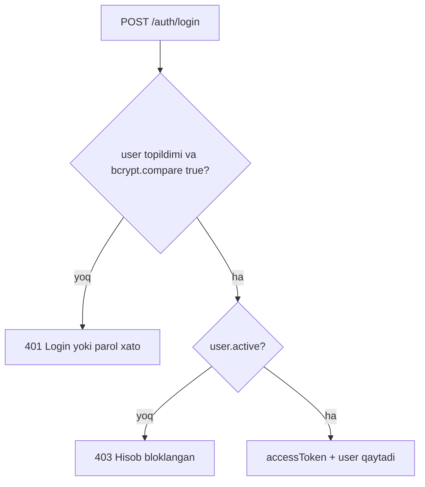
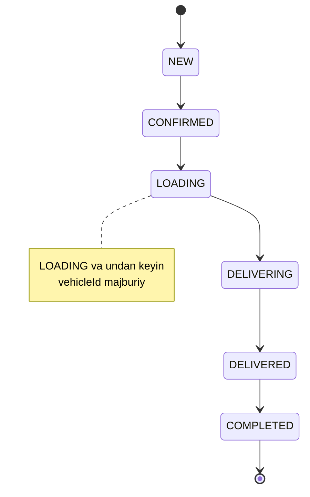
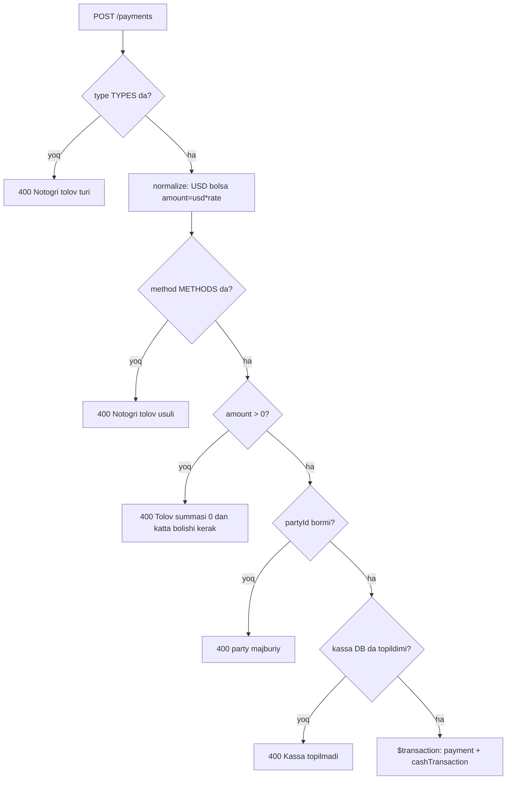

# 7. API spetsifikatsiyasi

> Loyiha: SmartBlok CRM/ERP | Hujjat: Texnik topshiriq (TZ) | Versiya: 1.0 | Sana: 2026-07-09 | Branch: main (v2 order-lifecycle)

---

> ## ⚠️ SUPERSEDED — transport & client-debt model
>
> Bu hujjat **v1/v2 modelini** tasvirlaydi: bitta `transportFee` maydoni, `TransportMode`
> enum'i yo'q, `LedgerEntry` yo'q, va transport haqi «summa ustiga qo'shiladigan / foydadan
> ayriladigan alohida xarajat» sifatida ko'rsatilgan. **Bu endi noto'g'ri.**
>
> Egasining 2026-07-20 dagi qoidasi: **transport HAR DOIM `saleTotal` ICHIDA.** Masalan
> `saleTotal = 22 000 000`, `transportCost = 2 000 000` va rejim `CLIENT_PAYS_DRIVER` bo'lsa —
> mijoz 2 000 000 ni shofyorga o'z qo'li bilan beradi, dillerga esa **20 000 000** qarzdor
> bo'ladi, **buyurtma ochilgan paytdanoq**; dillerning shofyorga qarzi **0**.
>
> Yagona haqiqiy manba:
> [docs/design/00-business-map.md § TRANSPORT MODEL — AUTHORITATIVE](design/00-business-map.md#transport-authoritative).
> Bu yerdagi transport/qarz arifmetikasi tarixiy ma'lumot sifatida qoldirilgan — spetsifikatsiya
> sifatida ishlatilmasin.

---

## 7.1. Umumiy qoidalar

Ushbu bob SmartBlok backend (NestJS 10) tizimining barcha REST API endpointlarini rasmiy tarzda hujjatlashtiradi. Quyida sanab otilgan **faqat koda haqiqatan mavjud** endpointlar keltirilgan — hech qanday rejalashtirilgan yoki taxminiy endpoint kiritilmagan. Malumotlar modeli tafsilotlari uchun 4-bob (Malumotlar modeli), rollar va ruxsatlar mantiqi uchun 5-bob (RBAC) ga qarang.

### 7.1.1. Bazaviy manzil (Base URL)

Barcha endpointlar global prefiks bilan ochiladi:

```
app.setGlobalPrefix('api')
```

| Muhit | Base URL |
|---|---|
| Development | `http://localhost:4000/api` |
| Frontend proxy orqali | `/api` (Vite `/api` → `http://localhost:4000`) |

Port `process.env.API_PORT` yoki default `4000`. Frontend `VITE_API_URL` (default `/api`) orqali murojaat qiladi.

### 7.1.2. Autentifikatsiya

Tizim **JWT Bearer token** modelidan foydalanadi.

- Token olish: `POST /api/auth/login`.
- Har bir himoyalangan sorovda header:

```http
Authorization: Bearer <accessToken>
```

- Token strategiyasi: `passport-jwt`, `ExtractJwt.fromAuthHeaderAsBearerToken()`, `ignoreExpiration: false`.
- Token muddati: `JWT_EXPIRES_IN` (default `7d`).
- JWT payload tarkibi: `{ sub, username, role, name, agentId }`.
- **Muhim:** token validatsiyasida DB dan qayta yuklash yoq — `role`/`agentId` token ichidan olinadi. Rol ozgarishi yoki hisob bloklanishi token muddati tugagunicha kuchga kirmasligi mumkin (5-bobga qarang).

### 7.1.3. Kontent turi va serializatsiya

- Sorov va javob tanasi: `application/json` (import endpointidan tashqari — u `multipart/form-data`).
- Barcha `id` maydonlari — **UUID string** (`@default(uuid())`), ketma-ket raqamlash yoq.
- Sana maydonlari ISO-8601 formatida (`DateTime`).

### 7.1.4. Validatsiya (ValidationPipe)

Global `ValidationPipe` sozlamalari (`main.ts`):

| Parametr | Qiymat | Izoh |
|---|---|---|
| `whitelist` | `true` | DTO da elon qilinmagan maydonlar tashlab yuboriladi |
| `transform` | `true` | Kirish obyekti DTO tipiga aylantiriladi |
| `enableImplicitConversion` | `true` | String → number/boolean implicit konversiya |
| `forbidNonWhitelisted` | (yoq) | Ortiqcha maydonlar rad etilmaydi, faqat olib tashlanadi |

**Diqqat:** Aksariyat kontrollerlar `@Body() d: any` qabul qiladi — yani `class-validator` DTO klasslari deyarli qollanilmagan. Validatsiya asosan servis darajasida qolda (`BadRequestException`) amalga oshiriladi. Yagona formal DTO — `LoginDto` va `UpdateProfileDto` (auth moduli).

### 7.1.5. CORS

- `origin` = `process.env.CORS_ORIGIN` (vergul bilan ajratilgan bir nechta origin) yoki default `http://localhost:5173`.
- `credentials: true`.

### 7.1.6. Xato javob formati

NestJS standart istisno (exception) filtri ishlaydi. Xatolik javobi shakli:

```json
{
  "statusCode": 400,
  "message": "Mijoz majburiy",
  "error": "Bad Request"
}
```

`message` maydoni ozbek tilidagi biznes-xabar (frontend uni `e.response.data.message` orqali toast sifatida korsatadi).

| HTTP status | Istisno klass | Yuzaga kelish holati |
|---|---|---|
| `400` | `BadRequestException` | Validatsiya xatosi, notogri status/usul/tur, majburiy maydon yoq |
| `401` | `UnauthorizedException` | Login/parol xato, token yoq yoki muddati otgan |
| `403` | `ForbiddenException` | Hisob bloklangan (`!active`), rol yetarli emas (`RolesGuard`) |
| `404` | `NotFoundException` | Resurs topilmadi (order/mijoz/agent va h.k.) |
| `500` | Internal | Prisma xatosi (mas. unique constraint P2002, FK P2025 tutilmagan holatlar) |

### 7.1.7. Guardlar va rollar modeli

Ikki guard ishlatiladi:

- **`JwtAuthGuard`** (`AuthGuard('jwt')`) — token mavjudligini va haqiqiyligini tekshiradi.
- **`RolesGuard`** — `@Roles(...)` metadata bilan rol tekshiradi. `@Roles` bolmasa yoki bosh bolsa — barcha autentifikatsiyalangan foydalanuvchilarga ruxsat.

Rollar (Prisma enum EMAS, `String`): `ADMIN`, `ACCOUNTANT`, `AGENT`, `CASHIER`.

Global guard yoq — har kontroller alohida `@UseGuards(...)` bilan himoyalangan. `RolesGuard` ozi autentifikatsiya qilmaydi, doim `JwtAuthGuard` bilan birga ishlatiladi.

**AGENT-scoping:** ayrim modullarda (`clients`, `orders`, `payments`) AGENT roli faqat oz `agentId` siga tegishli yozuvlarni koradi. Bu scoping asosan `findAll` (royxat) darajasida qollaniladi; detal/ozgartirish operatsiyalarida egalik tekshiruvi cheklangan (5-bobga qarang).

---

## 7.2. Modullar va endpointlar xaritasi

Backend 17 ta funksional modulni ochadi:

```mermaid
flowchart LR
  A[/api] --> AUTH[auth]
  A --> USR[users]
  A --> AG[agents]
  A --> CL[clients]
  A --> RG[regions]
  A --> FC[factories]
  A --> PR[products]
  A --> VH[vehicles]
  A --> OR[orders]
  A --> PAY[payments]
  A --> KS[kassa]
  A --> DBT[debts]
  A --> EXP[expenses]
  A --> PROC[procurement]
  A --> DSH[dashboard]
  A --> REP[reports]
  A --> IMP[import]
```

| Modul | Prefiks | Yozuv (write) | Asosiy rollar | Yon tasir |
|---|---|---|---|---|
| auth | `/api/auth` | login, profil | ochiq / JWT | JWT imzolash |
| users | `/api/users` | CRUD | ADMIN | — |
| agents | `/api/agents` | CRUD | ADMIN, ACCOUNTANT | user auto-yaratish |
| clients | `/api/clients` | CRUD | ADMIN, ACCOUNTANT, AGENT | — |
| regions | `/api/regions` | CRUD | ADMIN, ACCOUNTANT | — |
| factories | `/api/factories` | CRUD | ADMIN, ACCOUNTANT | — |
| products | `/api/products` | CRUD | ADMIN, ACCOUNTANT | — |
| vehicles | `/api/vehicles` | CRUD | ADMIN, ACCOUNTANT | — |
| orders | `/api/orders` | CRUD + lifecycle | ADMIN, ACCOUNTANT, AGENT | payment uzish |
| payments | `/api/payments` | create/delete | ADMIN, ACCOUNTANT, AGENT, CASHIER | **kassaga posting** |
| kassa | `/api/kassa` | tx CRUD | ADMIN, ACCOUNTANT, CASHIER | ledger |
| debts | `/api/debts` | read-only | ADMIN, ACCOUNTANT | — |
| expenses | `/api/expenses` | CRUD | ADMIN, ACCOUNTANT, CASHIER | **kassaga posting** |
| procurement | `/api/procurement` | matrix + prices/routes CRUD | ADMIN, ACCOUNTANT (matrix + AGENT) | — |
| dashboard | `/api/dashboard` | read-only | har JWT | — |
| reports | `/api/reports` | read-only | ADMIN, ACCOUNTANT | — |
| import | `/api/import` | Excel upload | ADMIN, ACCOUNTANT | massiv yozuv |

---

## 7.3. Auth moduli — `/api/auth`

Guardlar: `login` — ochiq (guardsiz); `me`/`updateProfile` — `JwtAuthGuard` (rol cheklovi yoq).

| Metod | Yol | Rollar | Sorov | Javob | Tavsif |
|---|---|---|---|---|---|
| POST | `/api/auth/login` | ochiq | Body `LoginDto { username, password }` | `{ accessToken, user{ id, username, name, role, agentId } }` | Kirish, JWT imzolash |
| GET | `/api/auth/me` | JWT | — (`@CurrentUser('userId')`) | `safe` user | Joriy foydalanuvchi profili |
| PUT | `/api/auth/me` | JWT | Body `UpdateProfileDto` | yangilangan `safe` user | Oz profilini tahrirlash |

**`LoginDto`:** `username` (`@IsString @IsNotEmpty`), `password` (`@IsString @IsNotEmpty`).

**`UpdateProfileDto`** (barcha `@IsOptional @IsString`): `name?`, `username?`, `email?` (format validatsiyasi yoq), `phone?`, `password?` (`@MinLength(4)`).

**`safe` select (auth):** `{ id, username, email, name, role, phone, active, agentId }` (bu yerda `createdAt` yoq).

### Login mantiqi



- Parol xeshi: `bcryptjs`, 10 rounds.
- User mavjudligi va parol xatosi bir xil xabar bilan qaytadi (user enumeration yoq).
- `active` tekshiruvi parol tekshiruvidan **keyin**.

**Namuna — sorov:**

```http
POST /api/auth/login
Content-Type: application/json

{ "username": "admin", "password": "admin123" }
```

**Namuna — javob:**

```json
{
  "accessToken": "eyJhbGciOiJIUzI1NiIs...",
  "user": { "id": "uuid", "username": "admin", "name": "Administrator", "role": "ADMIN", "agentId": null }
}
```

> Demo hisoblar: `admin/admin123` (ADMIN), `hisob/hisob123` (ACCOUNTANT), `kassa/kassa123` (CASHIER), `jamol/agent123` (AGENT).

---

## 7.4. Users moduli — `/api/users`

Guardlar (kontroller darajasida): `@UseGuards(JwtAuthGuard, RolesGuard)`, `@Roles('ADMIN')` — **barcha endpointlar faqat ADMIN**.

| Metod | Yol | Rollar | Sorov | Javob | Tavsif |
|---|---|---|---|---|---|
| GET | `/api/users` | ADMIN | — | User[] (`safe` + `agent{id,name}`), `createdAt asc` | Foydalanuvchilar royxati |
| POST | `/api/users` | ADMIN | Body `any` | yaratilgan `safe` user | Yangi foydalanuvchi |
| PUT | `/api/users/:id` | ADMIN | Param `id`, Body `any` | yangilangan `safe` user | Foydalanuvchini tahrirlash |
| DELETE | `/api/users/:id` | ADMIN | Param `id` | ochirilgan user (hard delete) | Foydalanuvchini ochirish |

**`safe` select (users):** `{ id, username, email, name, role, phone, active, agentId, createdAt }` (auth `safe` dan farqli — `createdAt` bor).

**Create maydonlari va defaultlari:**

| Maydon | Qoida |
|---|---|
| `password` | `dto.password` yoki default `'smartblok'`, bcrypt(10) |
| `email` | `dto.email \|\| null` |
| `role` | `dto.role \|\| 'AGENT'` |
| `phone` | `dto.phone ?? null` |
| `active` | `dto.active ?? true` |
| `agentId` | `dto.agentId \|\| null` |

- Body `any` — DTO validatsiyasi yoq; ixtiyoriy `role` string yuborilishi mumkin.
- `update` — avval `findUnique`, topilmasa `NotFoundException('Foydalanuvchi topilmadi')`; faqat `!== undefined` maydonlar yangilanadi; `password` faqat truthy bolsa qayta xeshlanadi.
- `remove` — **hard delete** (soft-delete emas).

---

## 7.5. Agents moduli — `/api/agents`

Guardlar: `@UseGuards(JwtAuthGuard, RolesGuard)` kontroller darajasida. GET larda `@Roles` yoq (har JWT).

| Metod | Yol | Rollar | Sorov | Javob | Tavsif |
|---|---|---|---|---|---|
| GET | `/api/agents` | har JWT | — | Agent[] + korsatkichlar | Agentlar royxati (sales/profit/collected) |
| GET | `/api/agents/:id` | har JWT | Param `id` | Agent + clients + orders + totals | Agent tafsiloti |
| POST | `/api/agents` | ADMIN, ACCOUNTANT | Body `any` | yaratilgan agent (+ login malumoti) | Agent + auto-user yaratish |
| PUT | `/api/agents/:id` | ADMIN, ACCOUNTANT | Param `id`, Body `any` | yangilangan agent | Agent tahrirlash |
| DELETE | `/api/agents/:id` | ADMIN | Param `id` | ochirilgan agent | Agent ochirish |

**`findAll` korsatkichlari (har agent uchun):**
- `sales = Σ saleTotal` (status ∈ {DELIVERED, COMPLETED});
- `profit = Σ profit` (shu statuslar);
- `collected = Σ payment.amount` (type=CLIENT);
- `_count { clients, orders, payments }`; tartib `groupNo asc`.

**`findOne` totals:**
- `outstanding = Σ over clients max(0, delivered_c − paid_c)` — mijozlar bizga qarzi;
- `advance = Σ over clients max(0, paid_c − delivered_c)` — mijoz avansi;
- netlash **mijoz darajasida** amalga oshadi.

**`create` yon tasiri (auto-user):** agar `d.createUser !== false`:
1. `base` username `d.username || d.name` dan generatsiya (lowercase, `[^a-z0-9]` olib tashlanadi, 16 belgi);
2. unikallik uchun `base + i` qidiriladi;
3. parol `d.password || 'agent123'`, bcrypt(10);
4. `$transaction` ichida agent + user (`role:'AGENT'`, `agentId`) atomik yaratiladi;
5. javobda `createdUsername` va (parol berilmagan bolsa) `defaultPassword: 'agent123'` ochiq qaytadi.

**Namuna — javob (create):**

```json
{ "id": "uuid", "name": "Sardor oga", "groupNo": 5, "createdUsername": "sardoroga", "defaultPassword": "agent123" }
```

---

## 7.6. Clients moduli — `/api/clients`

Guardlar: `@UseGuards(JwtAuthGuard, RolesGuard)`, kontroller darajasida `@Roles('ADMIN','ACCOUNTANT','AGENT')`.

| Metod | Yol | Rollar | Sorov | Javob | Tavsif |
|---|---|---|---|---|---|
| GET | `/api/clients` | ADMIN, ACCOUNTANT, AGENT | `@CurrentUser()` | Client[] + `{ delivered, paid, balance }` | Mijozlar royxati (AGENT-scoped) |
| GET | `/api/clients/:id` | ADMIN, ACCOUNTANT, AGENT | Param `id` | Client + statement | Mijoz hisob-varaqasi |
| POST | `/api/clients` | ADMIN, ACCOUNTANT, AGENT | `@CurrentUser()`, Body `any` | yaratilgan mijoz | Yangi mijoz |
| PUT | `/api/clients/:id` | ADMIN, ACCOUNTANT, AGENT | Param `id`, Body `any` | yangilangan mijoz | Mijoz tahrirlash |
| DELETE | `/api/clients/:id` | **ADMIN** (metod override) | Param `id` | ochirilgan mijoz | Mijoz ochirish |

**AGENT-scoping:** `scope(user) = role==='AGENT' && agentId ? { agentId } : {}`. Faqat `findAll` da qollaniladi.

**Balance formulasi:** `balance = delivered − paid`, bunda `delivered = Σ saleTotal` (status ∈ {DELIVERED, COMPLETED}), `paid = Σ payment.amount` (type=CLIENT). `balance > 0` → mijoz bizga qarzdor; `balance < 0` → avans.

**`findOne` statement:** `{ ...client, orders[], payments[], totals{ delivered, paid, balance, ordersCount } }` (orders `date desc`, payments type=CLIENT `date desc`).

**`create` biznes qoidasi:** AGENT bolsa `agentId` majburan `user.agentId`; aks holda `d.agentId`. `agentId` yoq → `BadRequestException("Mijoz agentga bog'lanishi shart — agent tanlang")`. `creditLimit` saqlanadi lekin hech qanday order/tolov mantiqida tekshirilmaydi.

---

## 7.7. Regions moduli — `/api/regions`

Guardlar: `@UseGuards(JwtAuthGuard, RolesGuard)`. GET — har JWT.

| Metod | Yol | Rollar | Sorov | Javob | Tavsif |
|---|---|---|---|---|---|
| GET | `/api/regions` | har JWT | — | Region[] (`name asc`) | Hududlar royxati |
| POST | `/api/regions` | ADMIN, ACCOUNTANT | Body `{ name, note? }` | yaratilgan region | Yangi hudud |
| PUT | `/api/regions/:id` | ADMIN, ACCOUNTANT | Param `id`, Body `any` | yangilangan region | Hudud tahrirlash |
| DELETE | `/api/regions/:id` | ADMIN | Param `id` | ochirilgan region | Hudud ochirish |

> Eslatma: `update` da butun body toridan-tori Prisma ga uzatiladi (`data: d`), whitelist yoq. Frontend faqat `GET` va `POST` ni chaqiradi.

---

## 7.8. Factories moduli — `/api/factories`

Guardlar: `@UseGuards(JwtAuthGuard, RolesGuard)`. GET — har JWT.

| Metod | Yol | Rollar | Sorov | Javob | Tavsif |
|---|---|---|---|---|---|
| GET | `/api/factories` | har JWT | — | Factory[] + `{ costTotal, paid, balance }` | Zavodlar royxati (biz qarzdorligimiz) |
| GET | `/api/factories/:id` | har JWT | Param `id` | Factory + orders + payments + prices + routes + totals (yoki `null`) | Zavod tafsiloti |
| POST | `/api/factories` | ADMIN, ACCOUNTANT | Body `{ name, note? }` | yaratilgan factory | Yangi zavod |
| PUT | `/api/factories/:id` | ADMIN, ACCOUNTANT | Param `id`, Body `any` | yangilangan factory | Zavod tahrirlash |
| DELETE | `/api/factories/:id` | ADMIN | Param `id` | ochirilgan factory | Zavod ochirish |

**Balance formulasi:** `balance = costTotal − paid`, bunda `costTotal = Σ order.costTotal` (status ∈ {DELIVERED, COMPLETED}), `paid = Σ payment.amount` (type=FACTORY). `balance > 0` → biz zavodga qarzdormiz; `< 0` → oldindan tolaganmiz (avans).

**`findOne`** payments — faqat type=FACTORY, cashbox include bilan; totals `{ cost, paid, balance, ordersCount }`.

---

## 7.9. Products moduli — `/api/products`

Guardlar: `@UseGuards(JwtAuthGuard, RolesGuard)`. GET — har JWT.

| Metod | Yol | Rollar | Sorov | Javob | Tavsif |
|---|---|---|---|---|---|
| GET | `/api/products` | har JWT | Query `factoryId?` | Product[] + `factory` + `_count.orders` (`name asc`) | Mahsulotlar royxati (zavod boyicha filtr) |
| POST | `/api/products` | ADMIN, ACCOUNTANT | Body `{ factoryId, name, size?, unit?, costPrice?, salePrice? }` | yaratilgan product | Yangi mahsulot |
| PUT | `/api/products/:id` | ADMIN, ACCOUNTANT | Param `id`, Body `any` | yangilangan product | Mahsulot tahrirlash |
| DELETE | `/api/products/:id` | **ADMIN, ACCOUNTANT** | Param `id` | ochirilgan product | Mahsulot ochirish |

**Create normalizatsiyasi:** `size: d.size ?? null`, `unit: d.unit || 'm3'`, `costPrice: Number(d.costPrice) || 0`, `salePrice: Number(d.salePrice) || 0`. `update` da faqat `['factoryId','name','size','unit','active']` (`!== undefined`) + narxlar (`Number(...) || 0`).

> DELETE roli bu yerda `ADMIN, ACCOUNTANT` (factories/vehicles DELETE dan farqli — ular faqat `ADMIN`).

---

## 7.10. Vehicles moduli — `/api/vehicles`

Guardlar: `@UseGuards(JwtAuthGuard, RolesGuard)`. GET — har JWT.

| Metod | Yol | Rollar | Sorov | Javob | Tavsif |
|---|---|---|---|---|---|
| GET | `/api/vehicles` | har JWT | — | Vehicle[] + `{ transportTotal, paid, balance }` | Moshinalar royxati |
| GET | `/api/vehicles/:id` | har JWT | Param `id` | Vehicle + orders + payments + totals (yoki `null`) | Moshina tafsiloti |
| POST | `/api/vehicles` | ADMIN, ACCOUNTANT | Body `{ name, plate?, driver?, phone? }` | yaratilgan vehicle | Yangi moshina |
| PUT | `/api/vehicles/:id` | ADMIN, ACCOUNTANT | Param `id`, Body `any` | yangilangan vehicle | Moshina tahrirlash |
| DELETE | `/api/vehicles/:id` | ADMIN | Param `id` | ochirilgan vehicle | Moshina ochirish |

**Balance formulasi:** `balance = transportTotal − paid`, bunda `transportTotal = Σ order.transportFee` (status ∈ {DELIVERED, COMPLETED}), `paid = Σ payment.amount` (type=VEHICLE). Totals `{ owed, paid, balance, ordersCount }`.

---

## 7.11. Orders moduli — `/api/orders`

Guardlar: `@UseGuards(JwtAuthGuard, RolesGuard)`, kontroller darajasida `@Roles('ADMIN','ACCOUNTANT','AGENT')`.

| Metod | Yol | Rollar | Sorov | Javob | Tavsif |
|---|---|---|---|---|---|
| GET | `/api/orders` | ADMIN, ACCOUNTANT, AGENT | Query `status,agentId,clientId,factoryId,vehicleId`; `@CurrentUser()` | Order[] (agent, client, factory, product, vehicle include) | Buyurtmalar royxati (AGENT-scoped) |
| GET | `/api/orders/:id` | ADMIN, ACCOUNTANT, AGENT | Param `id` | Order + payments | Bitta buyurtma |
| POST | `/api/orders` | ADMIN, ACCOUNTANT, AGENT | Body `any` | yaratilgan order | Yangi buyurtma |
| PUT | `/api/orders/:id` | ADMIN, ACCOUNTANT, AGENT | Param `id`, Body `any` | yangilangan order | Buyurtma tahrirlash |
| PATCH | `/api/orders/:id/status` | ADMIN, ACCOUNTANT, AGENT | Param `id`, Body `{ status }` | yangilangan order | Statusni togridan-togri qoyish |
| PATCH | `/api/orders/:id/advance` | ADMIN, ACCOUNTANT, AGENT | Param `id` | keyingi statusdagi order | Keyingi bosqichga otish |
| DELETE | `/api/orders/:id` | **ADMIN, ACCOUNTANT** (override) | Param `id` | ochirilgan order | Buyurtma ochirish |

**`create` DTO maydonlari (asosiy):** `date?`, `agentId?`, `clientId` (majburiy), `factoryId?`, `productId` (majburiy), `vehicleId?`, `quantity`, `costPricePerUnit?`, `salePricePerUnit?`, `transportFee?`, `status?`, `note?`.

**Totals formulasi:**

```
costTotal = quantity * costPricePerUnit
saleTotal = quantity * salePricePerUnit
profit    = saleTotal - costTotal - transportFee
```

> `transportFee` `profit` dan ayriladi, lekin `saleTotal`/`costTotal` ga qoshilmaydi.

**`create` validatsiyasi va default:**
- `clientId` yoq → `400 Mijoz majburiy`; `productId` yoq → `400 Mahsulot majburiy`;
- client/product topilmasa mos `404`;
- `factoryId = dto.factoryId || product.factoryId`; nomuvofiq bolsa `400 Mahsulot tanlangan zavodga tegishli emas`;
- `agentId = dto.agentId || client.agentId`; ikkalasi yoq → `400 Agent majburiy — mijozga agent biriktirilmagan`;
- narx default: `numOr(dto.x, product.costPrice/salePrice)`;
- `orderNo = 'B-' + (order.count()+1).padStart(4,'0')` (ochirish/concurrency da dublikat xavfi).

**Status lifecycle:**



- `ORDER_FLOW = [NEW, CONFIRMED, LOADING, DELIVERING, DELIVERED, COMPLETED]`; `CANCELLED` flowdan tashqarida, faqat `setStatus` orqali qoyiladi.
- `advance` — ketma-ket bir bosqich oldinga; oxirgi COMPLETED yoki CANCELLED da `400 Bu buyurtmani yana oldinga surib bolmaydi`.
- `setStatus` — istalgan statusga sakrash mumkin (transition validatsiyasi yoq); notogri qiymat → `400 Notogri status`.
- Ikkalasida `assertVehicleFor` — LOADING (idx≥2) uchun `vehicleId` majburiy, aks holda `400 Avval moshina biriktiring`.
- **Muhim:** vehicle constrainti `create`/`update` da EMAS — faqat `setStatus`/`advance` da.

**`remove` yon tasiri:** avval `payment.updateMany({ orderId: null })` (tolovlar uziladi, ochirilmaydi), keyin `order.delete` (hard delete, tranzaksiyasiz).

---

## 7.12. Payments moduli — `/api/payments`

Guardlar: `@UseGuards(JwtAuthGuard, RolesGuard)`, kontroller darajasida `@Roles('ADMIN','ACCOUNTANT','AGENT','CASHIER')`.

| Metod | Yol | Rollar | Sorov | Javob | Tavsif |
|---|---|---|---|---|---|
| GET | `/api/payments` | ADMIN, ACCOUNTANT, AGENT, CASHIER | Query `type,clientId,factoryId,vehicleId`; `@CurrentUser()` | Payment[] (agent, client, factory, vehicle, order, cashbox), `date desc` | Tolovlar royxati (AGENT-scoped) |
| POST | `/api/payments` | class rollari | Body (DTO quyida); `@CurrentUser()` | yaratilgan Payment | Yangi tolov (+ kassaga posting) |
| DELETE | `/api/payments/:id` | **ADMIN, ACCOUNTANT** (override) | Param `id` | ochirilgan Payment | Tolov ochirish (+ reversal) |

**DTO maydonlari (`any`):** `type`, `method`, `amount`, `usdAmount?`, `rate?`, `clientId|factoryId|vehicleId` (turga qarab), `agentId?`, `orderId?`, `payerName?`, `note?`, `date?`.

**Konstantalar:**

```
CASHBOX_BY_METHOD = { CASH:'Naqt kassa (UZS)', USD:'Naqt kassa (USD)',
  CLICK:'Click kassa', TERMINAL:'Click kassa', BANK:'Bank kassa', TRANSFER:'Bank kassa' }
TYPES   = ['CLIENT','FACTORY','VEHICLE']
METHODS = ['CASH','USD','CLICK','TERMINAL','BANK','TRANSFER']
PARTY_KEY = { CLIENT:'clientId', FACTORY:'factoryId', VEHICLE:'vehicleId' }
```

> `TRANSFER` usuli backendda qollab-quvvatlanadi (Bank kassa), lekin schema izohida va frontendda korsatilmaydi.

**`create` mantiqi va validatsiya:**



- `direction = type==='CLIENT' ? 'IN' : 'OUT'` (mijoz tolaydi = kirim; biz zavod/moshinaga = chiqim);
- `boxAmount = box.currency==='USD' ? usdAmount : amount`;
- **AGENT-scoping:** AGENT bolsa `agentId = user.agentId` (dto.agentId etiborsiz);
- Payment va `CashTransaction` (`source:'PAYMENT'`, `paymentId`, direction) **bitta `$transaction`** ichida — ledger drift bolmaydi.

**`remove` reversal:** `$transaction` ichida `cashTransaction.deleteMany({ paymentId: id })` + `payment.delete`. Kassa yozuvi ochirish orqali teskari qilinadi (kompensatsion yozuv emas).

**Namuna — sorov (USD tolov):**

```http
POST /api/payments
{ "type":"CLIENT", "clientId":"uuid", "method":"USD", "usdAmount":100, "rate":12700, "date":"2026-07-09" }
```

Bu holda `amount = 100 * 12700 = 1 270 000`, kassaga `Naqt kassa (USD)` ga `usdAmount=100` yoziladi.

---

## 7.13. Kassa moduli — `/api/kassa`

Guardlar: `@UseGuards(JwtAuthGuard, RolesGuard)`, kontroller darajasida `@Roles('ADMIN','ACCOUNTANT','CASHIER')` (**AGENT kira olmaydi**).

| Metod | Yol | Rollar | Sorov | Javob | Tavsif |
|---|---|---|---|---|---|
| GET | `/api/kassa/summary` | ADMIN, ACCOUNTANT, CASHIER | — | `{ boxes[], totalUZS, totalUSD }` | Kassalar jami balansi |
| GET | `/api/kassa/cashboxes` | ⇧ | — | Cashbox[] (`balance, inTotal, outTotal`) | Kassalar royxati (balans bilan) |
| POST | `/api/kassa/cashboxes` | ⇧ | Body `{ name, type?, currency? }` | yaratilgan Cashbox | Yangi kassa |
| GET | `/api/kassa/transactions` | ⇧ | Query `cashboxId?` | CashTransaction[] (max 200, cashbox include, `date desc`) | Kassa amaliyotlari |
| POST | `/api/kassa/transactions` | ⇧ | Body `{ cashboxId, direction, amount, rate?, note?, date? }` | yaratilgan CashTransaction (`source:'MANUAL'`) | Qolda kirim/chiqim |
| DELETE | `/api/kassa/transactions/:id` | ⇧ | Param `id` | ochirilgan CashTransaction | Amaliyotni ochirish |

**Balans hisobi:** `balance = inSum − outSum` (IN yigindisi − OUT yigindisi), har kassa bir valyutada. `rate` saqlanadi lekin balans/summary da konvertatsiya uchun **ishlatilmaydi**. `summary`: `totalUZS`/`totalUSD` — currency boyicha ajratilgan yigindilar.

**`createTransaction`:** `direction` nomalum → default `IN`; `amount: Number || 0` (0 ga ruxsat); `source:'MANUAL'` (qattiq belgilangan); `paymentId/expenseId` toldirilmaydi.

> Cheklov: `DELETE /transactions/:id` PAYMENT/EXPENSE manbali yozuvni ham ochira oladi — bu holda parent payment/expense qoladi va ledger boglanishi buziladi.

**Seed kassalari (resolveCashbox nomlari):** `Naqt kassa (UZS)` (CASH/UZS), `Naqt kassa (USD)` (CASH/USD), `Click kassa` (CLICK/UZS), `Bank kassa` (BANK/UZS).

---

## 7.14. Debts moduli — `/api/debts`

Guardlar: `@UseGuards(JwtAuthGuard, RolesGuard)`, `@Roles('ADMIN','ACCOUNTANT')`. Faqat oqish. Alohida "Debt" jadvali yoq — qarzlar Order + Payment dan real vaqtda aggregatsiya qilinadi.

| Metod | Yol | Rollar | Sorov | Javob | Tavsif |
|---|---|---|---|---|---|
| GET | `/api/debts/summary` | ADMIN, ACCOUNTANT | — | `{ clients[], factories[], vehicles[], totals{} }` | Uch tomonlama qarzlar xulosasi |

**Qator shakllari:**
- `clients`: `{ id, name, agent, delivered, paid, balance }`;
- `factories`: `{ id, name, cost, paid, balance }`;
- `vehicles`: `{ id, name, owed, paid, balance }`.

Har guruh `.filter(r => r.balance !== 0).sort((a,b) => b.balance - a.balance)`.

**Formulalar** (barchasi status ∈ {DELIVERED, COMPLETED} orderlardan):
- mijoz: `balance = delivered − paid` (delivered=saleTotal, paid=type CLIENT);
- zavod: `balance = cost − paid` (cost=costTotal, paid=type FACTORY);
- moshina: `balance = owed − paid` (owed=transportFee, paid=type VEHICLE).

**`totals`:**

| Maydon | Formula |
|---|---|
| `clientsOweUs` | `Σ max(0, r.balance)` |
| `clientsAdvance` | `Σ max(0, -r.balance)` |
| `weOweFactories` | `Σ r.balance` (manfiy ham qoshiladi) |
| `weOweVehicles` | `Σ r.balance` (manfiy ham qoshiladi) |

> Mijozlar uchun qarz/avans `max` bilan ajratilgan; zavod/moshina uchun ajratilmagan (ortiqcha tolov umumiy qarzni kamaytiradi).

---

## 7.15. Expenses moduli — `/api/expenses`

Guardlar: `@UseGuards(JwtAuthGuard, RolesGuard)`, `@Roles('ADMIN','ACCOUNTANT','CASHIER')`.

| Metod | Yol | Rollar | Sorov | Javob | Tavsif |
|---|---|---|---|---|---|
| GET | `/api/expenses` | ADMIN, ACCOUNTANT, CASHIER | — | Expense[] (category, cashbox, `date desc`) | Xarajatlar royxati |
| GET | `/api/expenses/summary` | ⇧ | — | `{ total }` | Jami xarajat |
| GET | `/api/expenses/categories` | ⇧ | — | ExpenseCategory[] + `_count.expenses` | Kategoriyalar |
| POST | `/api/expenses` | ⇧ | Body `{ amount, categoryId, cashboxId, date?, note? }` | yaratilgan Expense (+category,+cashbox) | Yangi xarajat (+ kassaga chiqim) |
| POST | `/api/expenses/categories` | ⇧ | Body `{ name }` | yaratilgan ExpenseCategory | Yangi kategoriya |
| DELETE | `/api/expenses/categories/:id` | ⇧ | Param `id` | ochirilgan kategoriya | Kategoriya ochirish |
| DELETE | `/api/expenses/:id` | ⇧ | Param `id` | ochirilgan Expense | Xarajat ochirish (+ reversal) |

**`create` validatsiyasi:**
- `amount <= 0` → `400 Xarajat summasi 0 dan katta bolishi kerak`;
- `!categoryId` → `400 Xarajat kategoriyasi majburiy`;
- `!cashboxId` → `400 Kassa majburiy — pul qaysi kassadan chiqishini tanlang`.

**Yon tasir (`$transaction`):** `expense.create` + `cashTransaction.create({ direction:'OUT', source:'EXPENSE', expenseId })` — birga yoziladi. **`remove`:** `cashTransaction.deleteMany({ expenseId })` + `expense.delete`.

> Xarajatni UPDATE qilish endpointi **yoq** (faqat create/delete). `removeCategory` bogliq xarajatlarni tekshirmaydi.

---

## 7.16. Procurement moduli — `/api/procurement`

Guardlar: `@UseGuards(JwtAuthGuard, RolesGuard)`. `matrix` — `@Roles('ADMIN','ACCOUNTANT','AGENT')`; qolgan CRUD — `@Roles('ADMIN','ACCOUNTANT')`.

| Metod | Yol | Rollar | Sorov | Javob | Tavsif |
|---|---|---|---|---|---|
| GET | `/api/procurement/matrix` | ADMIN, ACCOUNTANT, AGENT | Query `regionId` | `{ region, regionId, cheapest, rows[] }` | Tannarx matritsasi (landed cost) |
| GET | `/api/procurement/prices` | ADMIN, ACCOUNTANT | — | FactoryPrice[] (+factory) | Narxlar royxati |
| POST | `/api/procurement/prices` | ADMIN, ACCOUNTANT | Body `{ factoryId, paymentMethod?, pricePerM3, dealerBonusPct? }` | yaratilgan FactoryPrice | Narx qoshish |
| PUT | `/api/procurement/prices/:id` | ADMIN, ACCOUNTANT | Param `id`, Body `any` | yangilangan FactoryPrice | Narx tahrirlash |
| DELETE | `/api/procurement/prices/:id` | ADMIN, ACCOUNTANT | Param `id` | ochirilgan yozuv | Narx ochirish |
| GET | `/api/procurement/routes` | ADMIN, ACCOUNTANT | — | LogisticsRoute[] (+factory,+region) | Marshrutlar royxati |
| POST | `/api/procurement/routes` | ADMIN, ACCOUNTANT | Body `{ factoryId, regionId, costPerTruck, truckCapacityM3? }` | yaratilgan LogisticsRoute | Marshrut qoshish |
| PUT | `/api/procurement/routes/:id` | ADMIN, ACCOUNTANT | Param `id`, Body `any` | yangilangan LogisticsRoute | Marshrut tahrirlash |
| DELETE | `/api/procurement/routes/:id` | ADMIN, ACCOUNTANT | Param `id` | ochirilgan yozuv | Marshrut ochirish |

**Landed cost formulasi:**

```
landedCostPerM3 = pricePerM3 + costPerTruck / truckCapacityM3   (truckCapacityM3 <= 0 bolsa faqat pricePerM3)
netCostPerM3    = landedCostPerM3 * (1 - dealerBonusPct)          (dealerBonusPct 0..1 ulush)
```

- `matrix`: faqat berilgan hududda marshruti bor zavodlar qatnashadi; har zavod uchun eng yangi (`effectiveFrom desc`) marshrut olinadi; qatorlar `landedCostPerM3 asc` boyicha saralanadi; `cheapest = rows[0] ?? null`.
- `dealerBonusPct` alohida rebate — korsatiladigan `landedCostPerM3` ni ozgartirmaydi, faqat `netCostPerM3` da qollaniladi.
- Bosh hudud yoki marshrutsiz hudud → `rows: []`, `cheapest: null`.

---

## 7.17. Dashboard moduli — `/api/dashboard`

Guardlar: `@UseGuards(JwtAuthGuard)` — **rol tekshiruvi yoq**, har autentifikatsiyalangan foydalanuvchi kira oladi. Faqat oqish, body/param qabul qilmaydi.

| Metod | Yol | Rollar | Javob | Tavsif |
|---|---|---|---|---|
| GET | `/api/dashboard/summary` | har JWT | KPI obyekti (quyida) | Asosiy KPI |
| GET | `/api/dashboard/sales-trend` | har JWT | `[{ date, sales, profit }]` | Kunlik sotuv/foyda dinamikasi |
| GET | `/api/dashboard/agent-performance` | har JWT | `[{ agentId, agent, groupNo, sales, profit, deliveries, collected }]` | Agent reytingi (`sales desc`) |
| GET | `/api/dashboard/order-funnel` | har JWT | `[{ status, count }]` | Status boyicha voronka |

**`summary` javobi:**

| Maydon | Formula |
|---|---|
| `totalSales` | `Σ saleTotal` (DELIVERED/COMPLETED) |
| `totalProfit` | `Σ profit` |
| `totalCubes` | `Σ quantity` |
| `ordersCount` | yakunlangan orderlar soni |
| `activeOrders` | NEW+CONFIRMED+LOADING+DELIVERING soni |
| `totalPaid` | `Σ payment.amount` (CLIENT) |
| `paymentsCount` | CLIENT tolovlar soni |
| `clientsDebtToUs` | `sale − paidCli` |
| `weOweFactory` | `cost − paidFac` |
| `weOweVehicle` | `transport − paidVeh` |
| `clientCount` | `client.count()` |
| `agentCount` | `agent.count()` |
| `totalExpense` | `Σ expense.amount` (butun tarix) |
| `cashBalance` | `cashIn − cashOut` |

> `sales-trend` UTC sana (`toISOString().slice(0,10)`) boyicha kunlik guruhlaydi. `order-funnel` barcha statuslarni (filtrsiz) korsatadi. Rolga qarab farqli KPI (mas. kassir uchun boshqa) backendda **yoq** — bu farq faqat frontend `Dashboard.tsx` da amalga oshiriladi.

---

## 7.18. Reports moduli — `/api/reports`

Guardlar: `@UseGuards(JwtAuthGuard, RolesGuard)`, `@Roles('ADMIN','ACCOUNTANT')`. Faqat oqish.

| Metod | Yol | Rollar | Javob | Tavsif |
|---|---|---|---|---|
| GET | `/api/reports/svod` | ADMIN, ACCOUNTANT | `{ perAgent[], totals{} }` | Agentlar boyicha yigma svodka |

**`perAgent` (har agent, `groupNo asc`):** `{ agentId, agent, groupNo, delivered, paid, balance, profit }`, bunda `balance = delivered − paid`.

**`totals`:**

| Maydon | Formula |
|---|---|
| `totalGoods` | `Σ saleTotal` (DELIVERED/COMPLETED) |
| `totalCost` | `Σ costTotal` |
| `totalProfit` | `Σ profit` |
| `factoryPaid` | `Σ payment.amount` (FACTORY) |
| `factoryBalance` | `totalCost − factoryPaid` |

> Svod faqat DELIVERED/COMPLETED orderlarni oladi; sana/davr filtri yoq (butun tarix). Backendda Excel/PDF eksport endpointi yoq.

---

## 7.19. Import moduli — `/api/import`

Guardlar: `@UseGuards(JwtAuthGuard, RolesGuard)`, `@Roles('ADMIN','ACCOUNTANT')`.

| Metod | Yol | Rollar | Sorov | Javob | Tavsif |
|---|---|---|---|---|---|
| POST | `/api/import/excel` | ADMIN, ACCOUNTANT | `multipart/form-data` maydon `file`; Query `replace?` | `{ ok, replaced, sheets, imported }` | Excel workbook import |

- Interceptor: `@UseInterceptors(FileInterceptor('file'))`; fayl `file.buffer` orqali oqiladi.
- `replace` boolean: `replace === 'true' || replace === '1'`.
- Fayl yoq → `400 Fayl yuborilmadi`; oqib bolmasa → `400 Excel faylni oqib bolmadi`.

**Uchta varaq → yozuvlar:**

| Varaq | Topish | Natija |
|---|---|---|
| `Tovar` / `товар` | Orders (status `COMPLETED`, note `Import`) | `imported.orders` |
| `Оплата` / `oplata` | Client payments (type `CLIENT`, method aniqlanadi) | `imported.payments` |
| `Оплата Завод` | Factory payments (type `FACTORY`, method `BANK`) | `imported.factoryPayments` |

**`replace=true` rejimi:** `deleteMany` tartibida `payment → order → product → client` (agent/vehicle/region/factory ochirilmaydi). Tranzaksiya yoq.

**Javob namuna:**

```json
{ "ok": true, "replaced": true, "sheets": ["Tovar","Oplata"], "imported": { "orders": 120, "payments": 85, "factoryPayments": 12, "skipped": 4 } }
```

> Import to'gridan-to'gri order/payment yaratadi — **kassaga posting yoq** (payments modulidan farqli). Ustunlar qatiy indeks boyicha oqiladi (nomlar boyicha emas). Batafsil ustun xaritasi uchun malumot import bobiga qarang.

---

## 7.20. Endpointlar boyicha yigma jadval (RBAC matritsasi)

| Endpoint | ADMIN | ACCOUNTANT | AGENT | CASHIER |
|---|:--:|:--:|:--:|:--:|
| `POST /auth/login` | ochiq | ochiq | ochiq | ochiq |
| `GET/PUT /auth/me` | ✔ | ✔ | ✔ | ✔ |
| `/users/**` | ✔ | — | — | — |
| `GET /agents`, `GET /agents/:id` | ✔ | ✔ | ✔ | ✔ |
| `POST/PUT /agents` | ✔ | ✔ | — | — |
| `DELETE /agents/:id` | ✔ | — | — | — |
| `/clients` (GET/POST/PUT) | ✔ | ✔ | ✔ (scoped) | — |
| `DELETE /clients/:id` | ✔ | — | — | — |
| `GET /regions`, `GET /factories`, `GET /products`, `GET /vehicles` | ✔ | ✔ | ✔ | ✔ |
| `POST/PUT` katalog | ✔ | ✔ | — | — |
| `DELETE /factories`, `/vehicles`, `/regions` | ✔ | — | — | — |
| `DELETE /products` | ✔ | ✔ | — | — |
| `/orders` (GET/POST/PUT/PATCH) | ✔ | ✔ | ✔ (scoped) | — |
| `DELETE /orders/:id` | ✔ | ✔ | — | — |
| `/payments` (GET/POST) | ✔ | ✔ | ✔ (scoped) | ✔ |
| `DELETE /payments/:id` | ✔ | ✔ | — | — |
| `/kassa/**` | ✔ | ✔ | — | ✔ |
| `/debts/summary` | ✔ | ✔ | — | — |
| `/expenses/**` | ✔ | ✔ | — | ✔ |
| `/procurement/matrix` | ✔ | ✔ | ✔ | — |
| `/procurement/prices`, `/routes` | ✔ | ✔ | — | — |
| `/dashboard/**` | ✔ | ✔ | ✔ | ✔ |
| `/reports/svod` | ✔ | ✔ | — | — |
| `/import/excel` | ✔ | ✔ | — | — |

> Eslatma: `✔ (scoped)` — AGENT faqat oz `agentId` siga tegishli yozuvlarni koradi (asosan `findAll` da). Katalog GET endpointlari `@Roles` siz — barcha JWT ega foydalanuvchilar koradi.

---

## 7.21. Enum/domen qiymatlari (API kontekstida)

Prisma da haqiqiy `enum` yoq — barcha turlar `String`. API qabul qiladigan qiymatlar servis darajasida tekshiriladi.

| Domen | Ruxsat etilgan qiymatlar |
|---|---|
| User `role` | `ADMIN`, `ACCOUNTANT`, `AGENT`, `CASHIER` |
| Order `status` | `NEW`, `CONFIRMED`, `LOADING`, `DELIVERING`, `DELIVERED`, `COMPLETED`, `CANCELLED` |
| Payment `type` | `CLIENT` (IN), `FACTORY` (OUT), `VEHICLE` (OUT) |
| Payment `method` | `CASH`, `CLICK`, `TERMINAL`, `USD`, `BANK`, `TRANSFER` |
| Cashbox `type` | `CASH`, `CLICK`, `BANK` |
| Cashbox `currency` | `UZS`, `USD` |
| CashTransaction `direction` | `IN`, `OUT` |
| CashTransaction `source` | `MANUAL`, `PAYMENT`, `EXPENSE` |

Batafsil maydon tariflari uchun **4-bob. Malumotlar modeli** ga qarang.

---

## 7.22. Umumiy chekka holatlar va cheklovlar (API darajasida)

1. **DTO validatsiyasi cheklangan** — aksariyat endpointlar `@Body() d: any` qabul qiladi; validatsiya servis darajasida qolda. Notogri tur/summa/majburiy maydon `BadRequestException` beradi.
2. **Kassaga posting faqat `payments` va `expenses` da** — orders va import to'gridan-to'gri yaratadi, ledgerga yozmaydi.
3. **Reversal simmetriyasi** — payment/expense ochilganda kassa yozuvi `deleteMany` orqali teskari qilinadi; lekin `kassa/transactions/:id` DELETE bu yozuvlarni qolda ochirishga tosiq qoymaydi.
4. **`orderNo` dublikat xavfi** — `count()+1` asosida; ochirish/concurrency da collision bolishi mumkin.
5. **AGENT-scoping toliq emas** — faqat royxat (`findAll`) darajasida; `findOne`/`update` da egalik tekshirilmaydi.
6. **Hard delete** — barcha `remove` operatsiyalari fizik ochirish; FK bogliqlik bolsa Prisma xatosi (500) berishi mumkin (cascade yoq).
7. **Token freshness yoq** — rol/active token muddati (7 kun) davomida qayta tekshirilmaydi.
8. **Rolga qarab Dashboard KPI farqi** faqat frontendda; backend barcha rollarga bir xil malumot beradi.
