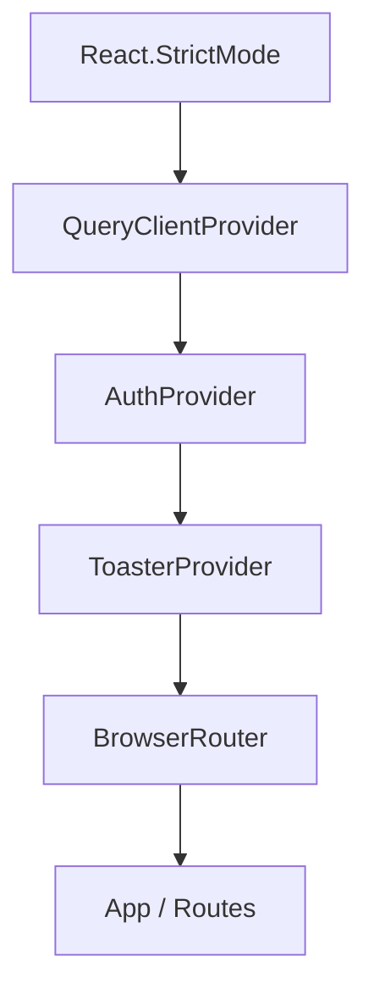
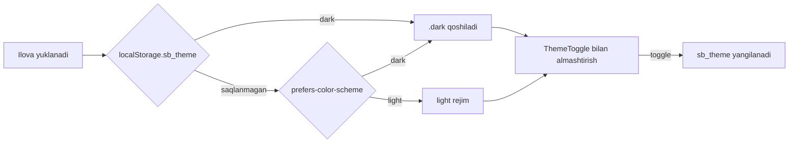
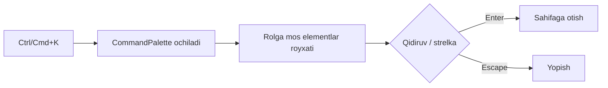
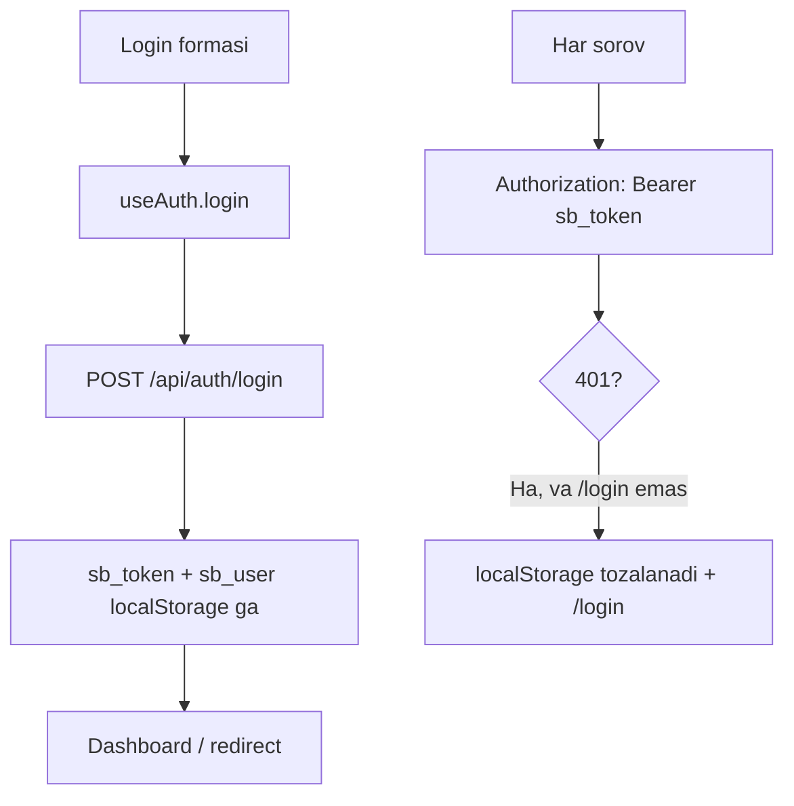

# 8. Foydalanuvchi interfeysi va UX

Loyiha: SmartBlok CRM/ERP | Hujjat: Texnik topshiriq (TZ) | Versiya: 1.0 | Sana: 2026-07-09 | Branch: main (v2 order-lifecycle)

---

## 8.1. Umumiy tavsif va texnologik asos

SmartBlok foydalanuvchi interfeysi — **React 18.3** asosidagi bir sahifali ilova (SPA), **Vite 6** bilan qurilgan va **Tailwind CSS v4** yangi engine (`@theme` + CSS custom properties) yordamida uslublanadi. Interfeys butunlay ozbek tilida (`<html lang="uz">`), professional ERP korinishida ishlab chiqilgan.

UI qatlamining asosiy tamoyillari:

- **Ma'lumot boshqaruvi backendda.** Barcha moliyaviy hisob-kitoblar (qarzlar, foyda, tannarx matritsasi, kassa balansi) serverda amalga oshiriladi; sahifalar faqat tayyor qiymatlarni korsatadi. Faqat ikkita mahalliy hisob mavjud: `Payments` sahifasidagi `amountPreview` (USD × kurs) va `Reports` sahifasidagi `Math.max(0, factoryBalance)`.
- **Server holati** — `@tanstack/react-query` (v5) orqali; global holat uchun Redux/Zustand ishlatilmaydi — faqat React Context (`AuthProvider`, `ToasterProvider`) + TanStack Query keshi.
- **Yagona komponentlar kutubxonasi** — barcha sahifalar umumiy UI primitivlaridan (`EntityTable`, `KpiCard`, `Drawer`, `Field`, `MoneyInput`, `Badge`, `Button`, `Card` va h.k.) foydalanadi, bu vizual izchillikni ta'minlaydi.

| Xususiyat | Texnologiya / qiymat |
|---|---|
| UI kutubxonasi | React 18.3.1 |
| Router | React Router 6.28 |
| Server holati / kesh | TanStack Query 5.62 |
| Uslublar | Tailwind CSS v4 (`@theme`) |
| Animatsiya | Framer Motion 11.15 |
| Grafiklar | Recharts 2.15 |
| Ikonkalar | lucide-react 0.469 |
| HTTP klient | axios 1.7 |
| Yordamchi | clsx 2.1 |
| Build | Vite 6.0.7 (`tsc --noEmit && vite build`) |

Dev serverning porti — **5173**; `/api` sorovlari proksi orqali backendning **4000**-portiga yonaltiriladi.

> Ma'lumotlar modeli va API endpointlarining toliq tavsifi uchun **4-bob (Ma'lumotlar modeli)** va tegishli backend boblariga qarang. Ushbu bob faqat UI/UX qatlamini yoritadi.

---

## 8.2. Ilova qobigi va provayderlar iyerarxiyasi

Ilova `main.tsx` da quyidagi provayderlar iyerarxiyasi bilan yuklanadi (tashqidan ichkariga):

**TanStack Query global sozlamalari:**

| Parametr | Qiymat | Izoh |
|---|---|---|
| `refetchOnWindowFocus` | `false` | Oyna fokusida qayta yuklamaydi |
| `retry` | `1` | Xatoda bir marta qayta uriniladi |
| `staleTime` | `30_000` (30 s) | Ma'lumot 30 soniya "yangi" hisoblanadi |

**Layout tuzilishi:** Har bir himoyalangan sahifa `Layout` qobigida joylashadi:

- **Chap sidebar** (`lg:` breakpointda 64 en kenglikda; kichik ekranda drawer sifatida slide-in — Framer Motion spring animatsiyasi bilan).
- **Yuqori header** (balandligi `h-16`): mobil menyu tugmasi, breadcrumb (`SmartBlok / {crumb}`), markazda "Qidirish..." tugmasi (`Ctrl K` kbd yorligi bilan), `ThemeToggle`, `UserMenu`.
- **Asosiy maydon** (`max-w-[1600px]`): `Outlet` orqali joriy sahifa.

---

## 8.3. Navigatsiya tuzilishi

Navigatsiya `lib/nav.ts` da guruhlangan holda e'lon qilinadi. Har bir `NavItem` `{ to, label, icon, roles }` shakliga ega; menyu foydalanuvchi roliga qarab filtrlanadi (`visibleGroups(role)`).

### 8.3.1. Navigatsiya guruhlari

| Guruh | Element (path) | Yorliq | Ikonka | Ruxsat etilgan rollar |
|---|---|---|---|---|
| **UMUMIY** | `/` | Boshqaruv paneli | LayoutDashboard | ALL (barcha rollar) |
| **SAVDO** | `/orders` | Buyurtmalar | ClipboardList | ADMIN, ACCOUNTANT, AGENT |
| | `/clients` | Mijozlar | Users | ADMIN, ACCOUNTANT, AGENT |
| | `/agents` | Agentlar | UserCog | ADMIN, ACCOUNTANT |
| **KATALOG** | `/factories` | Zavodlar | Factory | ADMIN, ACCOUNTANT |
| | `/products` | Mahsulotlar | Package | ADMIN, ACCOUNTANT |
| | `/vehicles` | Moshinalar | Truck | ADMIN, ACCOUNTANT |
| | `/procurement` | Tannarx matritsasi | Calculator | ADMIN, ACCOUNTANT |
| **MOLIYA** | `/payments` | To'lovlar | Wallet | ADMIN, ACCOUNTANT, AGENT, CASHIER |
| | `/debts` | Qarzlar | Scale | ADMIN, ACCOUNTANT |
| | `/expenses` | Xarajatlar | Receipt | ADMIN, ACCOUNTANT, CASHIER |
| | `/kassa` | Kassalar | Landmark | ADMIN, ACCOUNTANT, CASHIER |
| **HISOBOTLAR** | `/reports` | Hisobot | BarChart3 | ADMIN, ACCOUNTANT |
| **TIZIM** | `/users` | Foydalanuvchilar | Shield | ADMIN |
| | `/import` | Excel import | Upload | ADMIN, ACCOUNTANT |

`/profile` (Profil) — marshrut sifatida mavjud va `routeLabels` da breadcrumb yorligi bor, ammo menyuda korinmaydi (`UserMenu` dropdown orqali kiriladi).

### 8.3.2. Rolga asoslangan korinish (RBAC UI darajasida)

`visibleGroups(role)` funksiyasi har guruh ichidagi elementlarni `roles.includes(role)` boyicha filtrlaydi va bosh qolgan guruhlarni tashlab yuboradi. Agar rol `undefined` bolsa, barcha elementlar korinadi.

> **Muhim xavfsizlik eslatmasi:** UI darajasida rol tekshiruvi faqat **menyu korinishini** boshqaradi. Marshrut darajasida (`App.tsx` dagi `Protected` guard) faqat token/user mavjudligi tekshiriladi — URL ni qolda kiritsa, har qanday autentifikatsiyalangan foydalanuvchi istalgan sahifaga kira oladi. Haqiqiy himoya backend `@Roles` dekoratorlari orqali ta'minlanadi (2-bob va tegishli backend boblariga qarang).

`Protected` guard mantiqi: `localStorage.sb_token` **yoki** `user` boridan biri yetarli; ikkalasi ham yoq bolsa `/login` ga yonaltiriladi.

---

## 8.4. Dizayn tizimi

### 8.4.1. Rang palitrasi

Ranglar `index.css` da Tailwind v4 `@theme` va CSS custom properties orqali semantik tokenlar sifatida e'lon qilinadi. Dark rejim `.dark` klassiga bogliq (`@custom-variant dark`).

> **Izoh vs haqiqat:** `index.css` sharhlarida "Teal (primary) + Amber + Slate" deb yozilgan, ammo **haqiqiy brend rangi — kok (blue)**. Bu "blue palette" commit tarixiga mos keladi.

**Light rejim semantik tokenlari (`:root`) — VERBATIM:**

| Token | Qiymat | Vazifasi |
|---|---|---|
| `--app` | `#F4F6FA` | Ilova foni |
| `--surface` | `#FFFFFF` | Kartalar/panellar |
| `--surface-2` | `#F8FAFC` | Ikkilamchi yuza |
| `--hover` | `#F1F5F9` | Hover holati |
| `--border` | `#E6EAF1` | Chegaralar |
| `--text` | `#0F172A` | Asosiy matn |
| `--text-body` | `#1E293B` | Tana matni |
| `--text-2` | `#56637A` | Ikkilamchi matn |
| `--text-dis` | `#94A3B8` | Ochirilgan matn |
| `--primary` | `#2563EB` | Brend / asosiy rang |
| `--primary-strong` | `#1D4ED8` | Kuchli brend |
| `--primary-soft` | `#DBEAFE` | Yumshoq brend fon |
| `--ring` | `#93C5FD` | Fokus halqasi |

**Dark rejim tokenlari (`.dark`) — VERBATIM:**

| Token | Qiymat |
|---|---|
| `--app` | `#0A0F1C` |
| `--surface` | `#111827` |
| `--border` | `#263248` |
| `--text` | `#F1F5F9` |
| `--text-body` | `#E2E8F0` |
| `--primary` | `#60A5FA` |
| `--primary-strong` | `#3B82F6` |
| `--primary-soft` | `#1E3A8A` |
| `--ring` | `#1E40AF` |

**Primitiv rang skalalari:**

- **Brand (BLUE):** `brand-50 #EFF6FF` … `brand-500 #3B82F6`, `brand-600 #2563EB`, `brand-700 #1D4ED8`, `brand-800 #1E40AF`, `brand-900 #1E3A8A`.
- **Accent (AMBER):** `accent-50 #FFFBEB` … `accent-500 #F59E0B`, `accent-600 #D97706`, `accent-700 #B45309`.
- **Neutral (SLATE):** `ink-50 #F8FAFC` … `ink-900 #0F172A`, `ink-950 #020617`.

`@theme` semantik tokenlarni Tailwind utility nomlariga bordaydi: `bg-app`, `bg-surface`, `surface2`, `subtle`, `hover`, `line` (=border), `line-soft`, `content` (=text), `body`, `muted` (=text-2), `faint` (=text-dis), `primary`, `primary-strong`, `primary-soft`, `ring`.

### 8.4.2. Light / Dark rejim

Mavzu boshqaruvi uch bosqichda ishlaydi:

- **Boshlangich init** (`main.tsx`, render oldidan): `localStorage.getItem('sb_theme')` oqiladi. Agar `=== 'dark'` yoki (saqlanmagan va tizim `prefers-color-scheme: dark`) bolsa — `document.documentElement.classList.add('dark')`.
- **`ThemeToggle`** komponenti: `classList.toggle('dark', dark)` va `localStorage.sb_theme` ga yozadi. Sun/Moon ikonkasi Framer Motion rotate animatsiyasi bilan almashadi.

### 8.4.3. Tipografika, radiuslar va soyalar

| Element | Qiymat |
|---|---|
| Font oilasi (`--font-sans`) | `"Inter", "Manrope", "Segoe UI", system-ui, sans-serif` |
| Radiuslar | `sm 0.5rem`, `md 0.75rem`, `lg 1rem`, `xl2 1.25rem` |
| Soyalar (elevation) | `e1`, `e2`, `e3` (shadow-color RGB ustida) |

**Global uslublar:** `box-sizing: border-box`; body foni `var(--app)`; `::selection` primary bilan aralashtirilgan; `:focus-visible` uchun 2px `--ring` outline (a11y); maxsus scrollbar; skeleton shimmer animatsiyasi (`@keyframes shimmer`, 1.4s). `prefers-reduced-motion` yoqilgan foydalanuvchilar uchun barcha animatsiyalar `0.01ms` ga tushiriladi (a11y).

---

## 8.5. Komponentlar kutubxonasi

Barcha sahifalar umumiy UI primitivlaridan foydalanadi. Quyida asosiy komponentlar va ularning imkoniyatlari.

### 8.5.1. EntityTable — universal jadval

Ro'yxat sahifalarining asosiy komponenti.

**Props:** `columns` (`Column<T>`: `key`, `header`, `align`, `render`, `value`, `className`), `data`, `rowKey`, `searchKeys`, `toolbar`, `actions`, `onRowClick`, `emptyLabel`, `pageSize=12`, `exportName`.

**Imkoniyatlari:**

| Imkoniyat | Tavsif |
|---|---|
| Qidiruv | Mijoz tomonida `searchKeys` boyicha filtr |
| Sahifalash | 12 qator/sahifa (default) |
| Zichlik | Compact rejim toggle (Rows3/Rows4 ikonka) |
| CSV eksport | `;` ajratgichli, `` BOM bilan (ruscha Excel uchun), qoshtirnoq escape, `{exportName}.csv` |
| Skeleton | `data === undefined` bolsa `TableSkeleton` |
| Bosh holat | Inbox ikonka + `emptyLabel` |
| Animatsiya | Sticky header; qatorlar Framer stagger effekti bilan |

> Eslatma: CSV eksport haqiqiy `.xlsx` emas — oddiy CSV (ruscha Excel muvofiqligi uchun `;` va BOM). `Reports` sahifasi `EntityTable` dan foydalanmaydi (oddiy `<table>`, eksport/qidiruv yoq).

### 8.5.2. KpiCard — korsatkich kartasi

**Props:** `label`, `value`, `suffix`, `icon`, `tone` (`teal|amber|green|red|blue|violet|slate`), `delay`, `hint`, `delta`, `hero`.

- `useCountUp` bilan animatsion son (0 dan `target` gacha).
- `delta` — yashil/qizil strelka + foiz ozgarish.
- `hero` — brend gradient (600→700) fon, oq matn; aks holda blur rangli dog (tone boyicha).
- Formatlash `fmtNum` orqali.

### 8.5.3. Modal va Drawer

| Komponent | Tavsif |
|---|---|
| `Modal` | Markaziy modal (`max-w-lg`, `wide` → `max-w-3xl`), spring animatsiya, `title/subtitle`, `max-h-[75vh]` scroll, backdrop blur |
| `Drawer` | Ongdan chiquvchi panel (`max-w-xl`), spring, `title/subtitle/children/footer`, backdrop blur, X tugmasi |

Loyihada yaratish/tahrirlash/tolov formalari uchun asosan **Drawer** ishlatiladi (Modal emas).

### 8.5.4. Formalar: Field, Input, MoneyInput

- **`Field`** — label (required yulduzcha bilan), hint/error korsatuvchi orab oluvchi.
- **`Input`** (`h-10`), **`Textarea`** (`min-h-80px`), **`Select`** (`h-10`) — umumiy `base` klass (fokusda primary border + ring).
- **`MoneyInput`** — ming ajratgichli formatlash (`ru-RU`), `inputMode="numeric"`, faqat raqam qabul qiladi (`replace(/[^\d]/g,'')`), `onChange(number)`, ong tomonda valyuta addon (default "so'm").

### 8.5.5. Badge va StatusBadge

**`Badge`** — `Tone`: `neutral | green | red | amber | blue | teal | violet` (amber=accent, teal=brand rang xaritasi).

**`StatusBadge`** — tolov/transport taksonomiyasi (`statusMap`):

| Status | Yorliq | Tone |
|---|---|---|
| PAID | To'landi | green |
| UNPAID | To'lanmagan | red |
| PARTIAL | Qisman | amber |
| DEBT | Qarzdor | red |
| ADVANCE | Avans | green |
| SETTLED | Yopilgan | neutral |

Buyurtma holatlari uchun alohida `statusMeta` (`lib/orderStatus.ts`):

| Status | Yorliq | Tone |
|---|---|---|
| NEW | Yangi | neutral |
| CONFIRMED | Tasdiqlandi | blue |
| LOADING | Yuklanmoqda | amber |
| DELIVERING | Yetkazilmoqda | violet |
| DELIVERED | Yetkazildi | teal |
| COMPLETED | Yakunlandi | green |
| CANCELLED | Bekor qilindi | red |

### 8.5.6. Boshqa primitivlar

| Komponent | Tavsif |
|---|---|
| `Button` | Variantlar: `primary | outline | ghost | danger | subtle`; olchamlar `sm (h-8) | md (h-10)`; `loading` → Loader2 spin + disabled; Framer `whileTap scale 0.97` |
| `Card` / `CardTitle` | Fade+y kirish animatsiyasi; `interactive` → hover -3px + shadow-e2; `padded` (p-5); `delay` prop |
| `PageHeader` | Sarlavha (h1 2xl), subtitle, `breadcrumb` (ChevronRight ajratgichli), `action` slot; Framer fade-down |
| `Skeleton` | `Skeleton`, `TableSkeleton` (6 qator default), `CardSkeleton` (h-28 default) — shimmer CSS |
| `Toaster` | Context asosidagi toast: `success` (CheckCircle2/emerald), `error` (XCircle/red), `info` (Info/sky); avto-yopilish **3200ms**; pastki-ong burchak, Framer slide-in |
| `Logo` / `LogoMark` | 48×48 SVG, kok gradient (`#3B82F6`→`#1D4ED8`), running-bond gazoblok devori |

---

## 8.6. CommandPalette (Ctrl/Cmd+K)

Global tez qidiruv paneli — `Layout` da `Ctrl/Cmd+K` global `keydown` hodisasi orqali ochiladi (sidebar va header dagi "Qidirish..." tugmasi ham shu panelni ochadi).

**Ishlash mantiqi:**

- `visibleGroups` dan tekis (flat) royxat quriladi — foydalanuvchi roliga mos elementlar.
- Qidiruv `label` va `group` boyicha.
- Klaviatura: `Escape` (yopish), `ArrowDown`/`ArrowUp` (navigatsiya), `Enter` (otish).
- Ochilganda input tozalanadi (`setQ('')`).
- Modal overlay + spring animatsiya; natijasiz — "Hech narsa topilmadi".

---

## 8.7. Animatsiyalar (Framer Motion)

| Element | Animatsiya |
|---|---|
| `PageTransition` | `opacity 0→1`, `y 10→0`, exit `y -8`, `duration 0.25`, ease `[0.22, 1, 0.36, 1]` |
| Faol navigatsiya | `layoutId="active-nav"` — Framer shared-layout spring; chap chetda primary indikator chizigi |
| Mobil sidebar | Spring slide-in |
| `useCountUp` | 0 → `target`, default `duration=850ms`, cubic ease-out (`1 - (1-p)^3`), `requestAnimationFrame`, cleanup bilan |
| KPI kartalari | `useCountUp` bilan animatsion son |
| Jadval qatorlari | Framer stagger (ketma-ket) paydo bolish |
| Tugma bosish | `whileTap scale 0.97` |
| ThemeToggle | Sun/Moon rotate |

Har bir sahifa `App.tsx` da `P` wrapper orqali `PageTransition` bilan oraladi va `key` beriladi (animatsiya toidligini ta'minlaydi). `prefers-reduced-motion` yoqilganda barcha animatsiyalar deyarli otkaziladi (a11y).

---

## 8.8. Formatlash (som/USD, sana)

Barcha formatlash `lib/format.ts` da markazlashtirilgan; pul qiymatlari `ru-RU` locale (probel ajratgichlari) bilan korsatiladi.

| Funksiya | Tavsif | Namuna |
|---|---|---|
| `fmtUZS(n)` | `Intl.NumberFormat('ru-RU', { maximumFractionDigits: 0 })` × `Math.round(v)` + `" so'm"`; null/undefined → 0 | `1 250 000 so'm` |
| `fmtNum(n, digits=0)` | `ru-RU` locale, `maximumFractionDigits: digits` | `12 700` |
| `fmtDate(d)` | null → `'—'`; aks holda `toLocaleDateString('ru-RU', {day:'2-digit', month:'2-digit', year:'numeric'})` | `09.07.2026` |
| `fmtShort(n)` | `>=1e9` → `X.XX mlrd`, `>=1e6` → `X.X mln`, `>=1e3` → `X ming`, aks holda butun son | `1.2 mlrd` |

**Valyuta korsatish konvensiyasi:** UZS kassalar uchun suffix `so'm`, USD kassalar uchun `$`. `Payments` va `Kassa` sahifalarida USD tolov summasi oldindan korsatiladi (`usdAmount × rate`), default kurs `12700`.

**Balans belgisi konvensiyasi** (barcha detail sahifalarda bir xil):

- `balance > 0` — kontekstga qarab: mijoz bizga qarzdor **yoki** biz zavod/moshinaga qarzdormiz.
- `balance < 0` — avans (ortiqcha tolov).
- `balance = 0` — qarz yoq.

---

## 8.9. Sahifalar UX xatti-harakati

### 8.9.1. Boshqaruv paneli (Dashboard)

Rolga bogliq bosh panel: `user?.role === 'CASHIER'` bolsa alohida **CashierDashboard** (faqat kassa KPI va boxlar) render qilinadi va boshqa querylar ishga tushmaydi. Boshqa rollar uchun umumiy KPI kartalari + grafiklar + agentlar reytingi.

- **Grafiklar (Recharts):** "Sotuv va foyda dinamikasi" — AreaChart (`sales` stroke `#2563EB`, `profit` stroke `#F59E0B`, sana `dd.mm` formatda); "Buyurtmalar holati" — BarChart (funnel).
- KPI: Jami sotuv (hero), Umumiy foyda, Faol buyurtmalar, Kassa balansi, Mijoz qarzi, Zavodga qarz, Moshinaga qarz, Xarajatlar.

### 8.9.2. Ro'yxat va detail sahifalar

Savdo/katalog/moliya sahifalari yagona shabloni: `PageHeader` + `EntityTable` + yaratish/tolov uchun `Drawer`. Detail sahifalar (`ClientDetail`, `AgentDetail`, `FactoryDetail`, `VehicleDetail`) KPI kartalari + bogliq buyurtmalar/tolovlar royxatini korsatadi.

> **UX nomuvofiqligi (hujjatlashtirilgan):** Tolov usullari (`methods`) royxati sahifadan sahifaga farq qiladi (hardcoded):
> - `ClientDetail`: `CASH, CLICK, TERMINAL, USD, BANK` (5 ta), default `CASH`.
> - `FactoryDetail`: `CASH, CLICK, BANK, USD` (4 ta), default `BANK`.
> - `VehicleDetail`: `CASH, CLICK, BANK` (3 ta), default `CASH`.

**Mutatsiya xatti-harakati:** Aksariyat sahifalarda mutatsiyadan keyin `qc.invalidateQueries()` **argumentsiz** chaqiriladi — ya'ni har ozgarish butun keshni yangilaydi (global refetch). Istisnolar: `Kassa` faqat `['kassa']`/`['kassaTx']`, `Users` faqat `['users']`, `Expenses` kategoriya qoshishda faqat `['expenseCategories']` invalidatsiya qiladi.

**Xatolik korinishi:** Barcha sahifalarda xato toasti `e?.response?.data?.message` orqali backend xabarini korsatadi.

### 8.9.3. Excel import (Import)

Drag&drop yoki fayl tanlash orqali `.xlsx/.xls` yuklanadi. Fayl validatsiyasi `/\.(xlsx|xls)$/i` regex bilan. "Almashtirish" (replace) rejimi default **true**. Import natijasi — 4 statistika kartasi: Buyurtmalar / Tolovlar / Zavod tolovlari / Otkazib yuborildi.

---

## 8.10. Login va Profil UX

### 8.10.1. Login sahifasi

Ikki panelli tuzilish:

- **Chap panel** — brendlash: `LogoMark`, "SmartBlok", xususiyatlar grid (Sotuv va foyda / Kassa va to'lovlar / Zavod tannarxi / Rollar va nazorat), "© 2026 SmartBlok · Xorazm".
- **Ong panel** — forma: Foydalanuvchi nomi (`autoComplete username`), Parol (`autoComplete current-password`), Kirish tugmasi (loading holati bilan).

**Demo hisoblar** — tugma bosilganda formani toldiradi:

| Login | Parol | Rol |
|---|---|---|
| `admin` | `admin123` | Administrator |
| `hisob` | `hisob123` | Buxgalter |
| `jamol` | `agent123` | Agent |
| `kassa` | `kassa123` | Kassir |

Default holat oldindan toldirilgan (`admin` / `admin123`). Submitda `username.trim()`. Xatolik `catch` blokida umumiy "Login yoki parol xato" matni bilan korsatiladi (aniq matn backenddan olinmaydi).

### 8.10.2. Autentifikatsiya oqimi (frontend)

- **API klient** (`lib/api.ts`): `baseURL = import.meta.env.VITE_API_URL || '/api'`. Request interceptor `sb_token` bor bolsa `Authorization: Bearer` qoshadi. Response interceptor 401 da (yol `/login` bolmasa) `sb_token`/`sb_user` ni ochirib, majburiy `/login` ga otadi.
- **LocalStorage kalitlari:** `sb_token` (JWT), `sb_user` (JSON user), `sb_theme` (mavzu).
- `AuthContext` mount vaqtida `sb_token` bor lekin `user` yoq bolsa `endpoints.me()` bilan userni tiklaydi; xato jimgina yutiladi (`.catch(() => {})`).

**Rol yorliqlari** (`UserMenu`, `Users`, `Profile` da bir xil `roleLabel`/`roleTone`):

| Rol | Yorliq | Tone |
|---|---|---|
| ADMIN | Administrator | violet |
| ACCOUNTANT | Buxgalter | blue |
| AGENT | Agent | teal |
| CASHIER | Kassir | amber |

### 8.10.3. Profil sahifasi

Ikki mustaqil forma, ikkalasi ham `PUT /api/auth/me` ni chaqiradi:

- **Shaxsiy ma'lumot:** Ism (required), Foydalanuvchi nomi (required), Email (ixtiyoriy), Telefon. Muvaffaqiyatda `refresh()` (AuthContext) + "Profil yangilandi" toasti.
- **Parolni ozgartirish:** Yangi parol + tasdiqlash. Mijoz tomoni validatsiyasi: `password !== confirm` → "Parollar mos emas"; `password.length < 4` → "Parol juda qisqa" (ikkala holatda ham yuborilmaydi). Muvaffaqiyatda maydonlar tozalanadi.

Yuqorida summary karta: avatar (ism birinchi harfi), ism, `@username`, rol Badge.

---

## 8.11. Responsivlik va foydalanish qulayligi (a11y)

| Jihat | Amalga oshirilishi |
|---|---|
| Sidebar | `lg:` da doimiy panel; kichik ekranda drawer (Framer spring slide) + mobil menyu tugmasi |
| Asosiy maydon | `max-w-[1600px]` markazlashtirilgan konteyner |
| Fokus korinishi | `:focus-visible` uchun 2px `--ring` outline |
| Harakatni kamaytirish | `prefers-reduced-motion` → animatsiyalar `0.01ms` |
| Mavzu afzalligi | `prefers-color-scheme` boyicha default rejim |
| Klaviatura navigatsiyasi | CommandPalette (strelka/Enter/Escape); `Ctrl/Cmd+K` global |
| Skeleton yuklash | Ma'lumot kutilganda shimmer skeletonlar |
| Til | Butun interfeys ozbek tilida (`lang="uz"`) |

---

## 8.12. Ma'lum cheklovlar va chekka holatlar (UI qatlami)

1. **Marshrut darajasida RBAC yoq** — `Protected` faqat token/user borligini tekshiradi; rol himoyasi faqat menyu filtri va backend `@Roles` orqali (8.3.2).
2. **Tip nomuvofiqligi:** `AuthUser.id` va `agentId` frontendda `number` deb e'lon qilingan, lekin API/schema UUID (string) ishlatadi — v2 UUID migratsiyasidan qolgan potentsial nomuvofiqlik.
3. **Rang izohi vs haqiqat:** `index.css` sharhi "Teal + Amber" deydi, real palitra kok (blue).
4. **Tolov usullari sahifalar orasida farqli** (8.9.2).
5. **`invalidateQueries()` argumentsiz** — koplab sahifalarda har mutatsiya butun keshni yangilaydi (samaradorlik nuqtai nazaridan keng qamrovli).
6. **CSV eksport** haqiqiy Excel emas — `;` ajratgichli BOM'li CSV.
7. **`me()` xatosi jimgina yutiladi** (`.catch(() => {})`).
8. `Reports` sahifasi `EntityTable` ishlatmaydi (oddiy `<table>`, qidiruv/eksport yoq).
9. Ro'yxat sahifalarida faqat matnli qidiruv (`searchKeys`) mavjud — sana/status boyicha alohida filtr UI yoq.

---

*Ushbu bob UI/UX qatlamini yoritadi. Backend biznes-mantiq, RBAC va ma'lumotlar modeli uchun tegishli boblarga qarang.*
