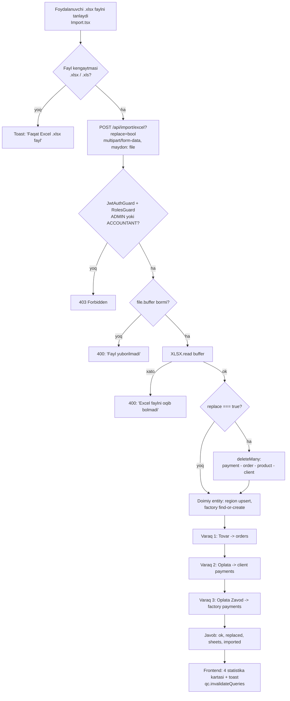
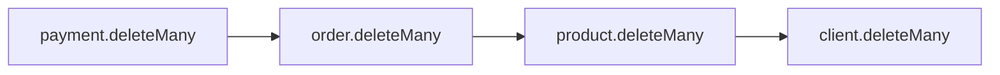
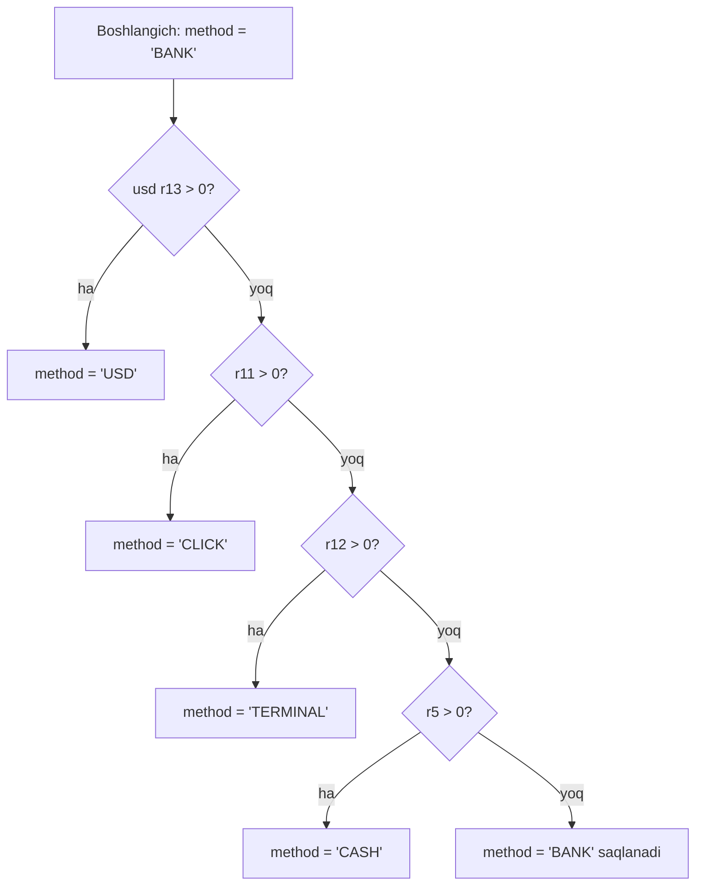

# 9. Excel import va malumotlar migratsiyasi

Loyiha: SmartBlok CRM/ERP | Hujjat: Texnik topshiriq (TZ) | Versiya: 1.0 | Sana: 2026-07-09 | Branch: main (v2 order-lifecycle)

---

> ## ⚠️ SUPERSEDED — butun import moduli
>
> Bu hujjatdagi **import moduli endi mavjud emas**: `POST /api/import/excel`,
> `apps/web/src/pages/Import.tsx` va bir bosqichli «oʼqi-va-yoz» oqimi 2026-07-15 da
> bosqichli (upload → qoidalar → preview → commit → rollback) import bilan almashtirilgan.
>
> Importning **haqiqiy** tavsifi — ustunlar xaritasi, kassa kanallari, zavod cho'ntaklari,
> FIFO taqsimot va solishtirish raqamlari:
> [docs/design/excel-import-mapping.md](design/excel-import-mapping.md).
>
> Quyidagisi tarixiy maʼlumot sifatida qoldirilgan.

> ## ⚠️ SUPERSEDED — transport & client-debt model
>
> Bu hujjat **v1/v2 modelini** tasvirlaydi: bitta `transportFee` maydoni, `TransportMode`
> enum'i yo'q, `LedgerEntry` yo'q, va transport haqi «summa ustiga qo'shiladigan / foydadan
> ayriladigan alohida xarajat» sifatida ko'rsatilgan. **Bu endi noto'g'ri.**
>
> Egasining 2026-07-20 dagi qoidasi: **transport HAR DOIM `saleTotal` ICHIDA.** Masalan
> `saleTotal = 22 000 000`, `transportCost = 2 000 000` va rejim `CLIENT_PAYS_DRIVER` bo'lsa —
> mijoz 2 000 000 ni shofyorga o'z qo'li bilan beradi, dillerga esa **20 000 000** qarzdor
> bo'ladi, **buyurtma ochilgan paytdanoq**; dillerning shofyorga qarzi **0**.
>
> Yagona haqiqiy manba:
> [docs/design/00-business-map.md § TRANSPORT MODEL — AUTHORITATIVE](design/00-business-map.md#transport-authoritative).
> Bu yerdagi transport/qarz arifmetikasi tarixiy ma'lumot sifatida qoldirilgan — spetsifikatsiya
> sifatida ishlatilmasin.

---

## 9.1. Umumiy tavsif va maqsad

SmartBlok tizimi mavjud biznesning qolyozma/yarim-avtomatlashtirilgan hisob-kitob amaliyotidan (`Gazoblok Schet.xlsx` Excel fayli) yangi tuzilgan CRM/ERP bazasiga malumotlarni bir martalik yoki takroriy koʻchirish imkonini beradi. Import moduli mavjud Excel varaqlaridagi savdo (tovar), mijoz toʻlovlari va zavod toʻlovlarini oʻqib, tizimning `order` va `payment` jadvallariga yozadi hamda kerakli bogʻliq katalog obyektlarini (agent, mijoz, mahsulot, moshina, hudud, zavod) avtomatik yaratadi.

Import quyidagi tamoyillarga asoslanadi:

| Tamoyil | Amalga oshirilishi |
|---|---|
| Faylni tizim orqali yuklash | `POST /api/import/excel` (multipart, maydon nomi `file`) |
| Varaqlarni nom boʻyicha topish | `findSheet()` — normallashtirilgan nomdan aniq/qism-mos qidirish |
| Katalogni avtomatik yaratish | find-or-create (agent, client, product, vehicle) + upsert (region) |
| "0 dan almashtirish" rejimi | `?replace=true` — order/payment/product/client toʻliq tozalanadi |
| Natija hisoboti | `{ orders, payments, factoryPayments, skipped }` |

> **Diqqat:** Import moduli hisob-buxgalteriya kassa yozuvlarini (CashTransaction) **yaratmaydi**. Bu, toʻlovlar odatdagi `POST /api/payments` orqali kiritilganidan farqli oʻlaroq, kassaga posting qilmasligini bildiradi (batafsil 9.9-boʻlim). Kassa mexanizmi uchun 8-bob. Toʻlovlar va kassalarga qarang.

Ishtirok etadigan fayllar:

| Fayl | Vazifasi |
|---|---|
| `apps/api/src/import/import.controller.ts` | HTTP endpoint, fayl qabul qilish, RBAC |
| `apps/api/src/import/import.service.ts` | Excel oʻqish, parsing, entity yaratish, replace |
| `apps/api/src/import/import.module.ts` | NestJS moduli |
| `apps/web/src/pages/Import.tsx` | Frontend: drag&drop yuklash, natija koʻrsatish |
| `apps/api/prisma/seed.ts` | Demo malumot (import bilan chalkashtirmaslik uchun — 9.10) |

---

## 9.2. Import jarayonining umumiy oqimi



### 9.2.1. Qadamlar (batafsil)

1. **Fayl tanlash (frontend).** Foydalanuvchi `Import.tsx` sahifasida drag&drop zonasiga faylni tashlaydi yoki tanlaydi. Kengaytma `/\.(xlsx|xls)$/i` regex bilan tekshiriladi; mos kelmasa "Faqat Excel (.xlsx) fayl" toasti chiqadi.
2. **Yuborish.** `importExcel(file, replace)` chaqiruvi `POST /api/import/excel?replace=<bool>` ga `FormData` (`file` maydoni, `Content-Type: multipart/form-data`) yuboradi. `replace` — **query parametr**, forma tanasida emas.
3. **RBAC va fayl tekshiruvi (backend).** Controller `@Roles('ADMIN', 'ACCOUNTANT')` ni talab qiladi. `file?.buffer` yoʻq boʻlsa `BadRequestException('Fayl yuborilmadi')`.
4. **Workbook oʻqish.** `XLSX.read(buffer, { cellDates: true })`. Xatoda `BadRequestException('Excel faylni oqib bolmadi')`.
5. **Replace (ixtiyoriy).** `replace === true` boʻlsa order/payment/product/client tozalanadi (9.6).
6. **Doimiy entitylar.** Region `Xorazm Beruniy` (upsert) va zavod `CAOLS KS` (find-or-create) taʼminlanadi.
7. **Varaqlarni ketma-ket qayta ishlash.** Tovar → Oplata → Oplata Zavod.
8. **Natija.** `{ ok, replaced, sheets, imported }` qaytariladi va frontend uni 4 statistika kartasi bilan koʻrsatadi.

---

## 9.3. Endpoint, ruxsat va soʻrov formati

| Xususiyat | Qiymat |
|---|---|
| Metod / yoʻl | `POST /api/import/excel` (controller `import`, metod `excel`, global `/api` prefiks) |
| Guardlar | `JwtAuthGuard`, `RolesGuard` (butun controller darajasida) |
| Ruxsat etilgan rollar | `ADMIN`, `ACCOUNTANT` (AGENT va CASHIER import qila olmaydi) |
| Interceptor | `FileInterceptor('file')` — form-data maydon nomi **`file`** |
| Fayl kirishi | `@UploadedFile() file` → `file.buffer` |
| Query parametri | `replace` (ixtiyoriy string) |
| `replace` parsing | `replace === 'true' || replace === '1'` → `true`; aks holda `false` |
| Javob | `{ ok, replaced, sheets, imported }` |

`replace` boolean rostlanishi: faqat `?replace=true` yoki `?replace=1` `true` beradi. Frontendda `replace` **default `true`** (checkbox belgilangan holatda keladi).

---

## 9.4. Qoʻllab-quvvatlanadigan varaqlar va kutilgan ustunlar

Import faqat **uchta** varaqni tanib oladi. Varaq nomi `findSheet()` orqali normallashtiriladi (`toLowerCase()` + barcha boʻshliqlarni olib tashlash), avval **aniq mos**, keyin **qism-mos** (`includes`) qidiriladi. Har varaq `sheet_to_json(..., { header: 1, defval: null, raw: true })` bilan **massivlar massivi** sifatida (satr → ustun indeksi) oʻqiladi.

> **Muhim cheklov:** Malumot **ustun nomlari boʻyicha emas, qatʼiy ustun indeksi boʻyicha** oʻqiladi. Yaʼni faylda ustunlar tartibi oʻzgarsa yoki qoʻshimcha ustun kiritilsa — notoʻgʻri malumot import boʻladi. Ustun sarlavhalari tekshirilmaydi. Migratsiyadan oldin ustun tartibi quyidagi jadvallarga aynan mos kelishi shart (9.11-tavsiyalar).

### 9.4.1. Varaq 1 — "Tovar" (rus: "Товар") → Orders

- **Topish kalitlari:** `findSheet(wb, 'tovar', 'товар')`.
- **Boshlanish satri:** `i = 3` (dastlabki 3 satr — sarlavha/shapka — oʻtkaziladi).

| Ustun indeksi (`r[]`) | Maydon | Konvertatsiya | Order maydoniga |
|---|---|---|---|
| `r[2]` | agent nomi | `str` | (agent yaratish/topish) |
| `r[3]` | mijoz nomi | `str` | (client yaratish/topish) |
| `r[4]` | sana | `toDate` | `date` |
| `r[5]` | davlat raqami (plate) | `str` → `getVehicle` | `vehicleId` |
| `r[6]` | oʻlcham (size) | `str` | (product yaratish/topish) |
| `r[7]` | miqdor | `num` | `quantity` |
| `r[8]` | kirim narxi (birlik) | `num` | `costPricePerUnit` |
| `r[14]` | sotuv narxi (birlik) | `num` | `salePricePerUnit` |
| `r[18]` | transport haqi | `num` | `transportFee` |

### 9.4.2. Varaq 2 — "Oplata" (rus: "Оплата") → Client payments (`type: 'CLIENT'`)

- **Topish kalitlari:** `findSheet(wb, 'оплата', 'oplata')`.
- **Boshlanish satri:** `i = 1` (1 sarlavha satri oʻtkaziladi).

| Ustun indeksi | Maydon | Izoh |
|---|---|---|
| `r[0]` | sana (`toDate`) | `date` |
| `r[1]` | agent nomi (`getAgent`) | `agentId` |
| `r[2]` | mijoz nomi | `clientId` (majburiy — boʻsh boʻlsa satr oʻtkaziladi) |
| `r[3]` | summa (zaxira) | `amount` uchun ikkilamchi manba |
| `r[4]` | toʻlovchi (`payerName`) | `payerName` |
| `r[5]` | CASH summasi | metod aniqlash uchun |
| `r[11]` | CLICK summasi | metod aniqlash uchun |
| `r[12]` | TERMINAL summasi | metod aniqlash uchun |
| `r[13]` | USD summasi (`usdAmount`) | metod aniqlash + `usdAmount` |
| `r[14]` | kurs (`rate`) | `rate` |
| `r[17]` | summa (asosiy) | `amount` uchun birlamchi manba |
| `r[19]` | izoh (`note`) | `note` |

### 9.4.3. Varaq 3 — "Oplata Zavod" (rus: "Оплата Завод") → Factory payments (`type: 'FACTORY'`)

- **Topish kalitlari:** `findSheet(wb, 'оплата завод', 'oplata zavod')`.
- **Boshlanish satri:** `i = 2` (2 shapka satri oʻtkaziladi).

| Ustun indeksi | Maydon | Order/Payment maydoniga |
|---|---|---|
| `r[0]` | sana (`toDate`) | `date` |
| `r[1]` | summa (`num`) | `amount` (boʻsh/0 boʻlsa satr oʻtkaziladi) |
| `r[2]` | toʻlovchi (`payerName`) | `payerName` |
| `r[3]` | izoh (`note`) | `note` |

> Agar workbookda bu uch varaqdan biri topilmasa, mos import bloki jimgina oʻtkazib yuboriladi (xato bermaydi) — faqat topilgan varaqlar qayta ishlanadi. Javobdagi `sheets` maydoni faylning barcha varaq nomlarini qaytaradi.

---

## 9.5. Avtomatik entity yaratish (find-or-create)

Import har bir satr uchun kerakli bogʻliq obyektlarni topadi yoki yaratadi. Ishlash tezligi uchun har entity turi uchun nom → id **kesh** (`Map`, `toLowerCase()` kalit) ishlatiladi — bir nomga qayta murojaatda DB soʻrovi takrorlanmaydi.

### 9.5.1. Doimiy (hardcoded) obyektlar

| Obyekt | Mexanizm | Qiymat |
|---|---|---|
| Region | `upsert` | `{ name: 'Xorazm Beruniy' }` — barcha yaratilgan mijozlar shu hududga bogʻlanadi |
| Factory | `findFirst` yoki `create` | `{ name: 'CAOLS KS' }` — barcha orders va product shu bitta zavodga bogʻlanadi |

### 9.5.2. Find-or-create funksiyalari

| Funksiya | Boʻsh kirishda | Topish sharti | Yaratish maydonlari |
|---|---|---|---|
| `getAgent(name)` | `null` | `agent.findFirst({ name })` | `{ name }` |
| `getClient(name, agentId)` | `null` | `client.findFirst({ name })` | `{ name, agentId, regionId: region.id }` |
| `getProduct(size, cost, sale)` | (kalit `size \|\| 'gazoblok'`) | `product.findFirst({ factoryId, size: size \|\| null })` | `{ factoryId, name: 'Gazoblok '+size, size, unit: 'm3', costPrice, salePrice }` |
| `getVehicle(plate)` | `null` | `vehicle.findFirst({ plate })` | `{ name: plate, plate }` |

**Muhim jihatlar:**

- **Mahsulot narxi faqat birinchi yaratishda olinadi.** Kesh tufayli, bir oʻlchamdagi mahsulot birinchi marta yaratilgach, keyingi satrlardagi kirim/sotuv narxi `product` yozuviga yozilmaydi (order oʻzining `costPricePerUnit`/`salePricePerUnit` snapshotini alohida saqlaydi — 6-bob. Buyurtmalar).
- **Moshina nomi = davlat raqami.** `getVehicle` yaratganda `name` sifatida `plate` qiymati qoʻyiladi (chunki Excelda alohida moshina nomi yoʻq).
- **Mijoz hududi doim `Xorazm Beruniy`.** Excelda hudud maydoni oʻqilmaydi.
- **Nom boʻyicha global unikallik.** `Agent.name`, `Client.name` (schema `@unique`) — `findFirst` nom boʻyicha topadi, shuning uchun bir xil nomli takroriy yozuv yaratilmaydi.

---

## 9.6. "0 dan almashtirish" (replace) rejimi

`replace === true` boʻlsa, doimiy entitylar taʼminlanishidan **oldin** quyidagi jadvallar toʻliq tozalanadi (filtrsiz `deleteMany()`), FK bogʻliqligiga mos tartibda (avval bola yozuvlar):



| Tozalanadigan | Tozalanmaydigan (saqlanadi) |
|---|---|
| `payment` | `agent` |
| `order` | `vehicle` |
| `product` | `region` |
| `client` | `factory` |

> **Diqqat — atomik emas:** Replace bosqichi va butun import **`$transaction` ichida emas**. Har `deleteMany` va har `create` alohida, mustaqil bajariladi. Import oʻrtasida xato yuz bersa, malumot **yarim koʻchgan** holatda qolishi mumkin (masalan, replace jadvallarni tozalab boʻlgan, ammo import qisman toʻxtagan). Bu — migratsiya rejalashtirishda hisobga olinishi kerak boʻlgan xavf (9.11-tavsiyalar).

> **Kassa bilan nomuvofiqlik:** Replace `cashTransaction` yozuvlarini tozalamaydi. Import kassaga posting qilmagani uchun bu odatda muammo tugʻdirmaydi, ammo agar bazada avval `POST /api/payments` orqali kiritilgan toʻlovlar (va ularning kassa yozuvlari) boʻlsa — replace `payment` yozuvlarini oʻchiradi, lekin ularga bogʻliq `cashTransaction` (`source='PAYMENT'`) yozuvlari **yetim** boʻlib qoladi (`paymentId` FK emas). Bu holatda kassa balansi haqiqatni aks ettirmaydi.

---

## 9.7. Parsing va konvertatsiya yordamchi funksiyalari

| Funksiya | Xatti-harakati |
|---|---|
| `toDate(v)` | `Date` boʻlsa — oʻzini; `number` boʻlsa Excel serial sana: `new Date(Math.round((v-25569)*86400*1000))`; boʻsh boʻlmagan string boʻlsa `new Date(v)` (agar amal qilsa); **boshqa/parse boʻlmaydigan holatda → hozirgi sana `new Date()`** |
| `num(v)` | Raqam boʻlsa — oʻzini; aks holda `String(v)` dan `[^\d.-]` belgilarni olib tashlab `Number(...)`, NaN boʻlsa `0` |
| `str(v)` | `null`/`undefined` → `''`; aks holda `String(v).trim()` |

> **Sana chekka holati:** Notoʻgʻri yoki boʻsh sana kiritilsa, xato berilmaydi — jimgina **server vaqti (bugungi sana)** qoʻyiladi. Bu tarixiy yozuvlarga notoʻgʻri sana yozilishiga sabab boʻlishi mumkin. Migratsiyadan oldin barcha sana kataklari toʻgʻri formatlangan boʻlishi tavsiya etiladi.

---

## 9.8. Hisob-kitoblar (verbatim formulalar)

### 9.8.1. Order (Tovar varagʻi)

```text
costTotal = quantity * cost         // cost = r[8]  (kirim narxi)
saleTotal = quantity * sale         // sale = r[14] (sotuv narxi)
profit    = saleTotal - costTotal - transport   // transport = r[18]
orderNo   = 'B-' + String(orderNo).padStart(4, '0')   // masalan B-0001
status    = 'COMPLETED'   (hardcoded)
note      = 'Import'      (hardcoded)
```

`orderNo` sanagichi import boshida `order.count()` dan olinadi va har muvaffaqiyatli order uchun `++` qilinadi. Bu formula 6-bobdagi odatiy `nextOrderNo()` bilan bir xil format (`B-` + 4 xonali), lekin import doim `COMPLETED` statusini qoʻyadi (odatiy buyurtma `NEW` bilan boshlanadi).

### 9.8.2. Client payment (Oplata varagʻi)

**Metod aniqlash (birinchi mos ishlaydi):**



**Summa:** `amount = num(r[17]) || num(r[3])` — avval 17-ustun, u 0 boʻlsa 3-ustun.

Yaratiladigan `payment` maydonlari: `date, type:'CLIENT', agentId, clientId, payerName, method, usdAmount, rate, amount, note`.

### 9.8.3. Factory payment (Oplata Zavod varagʻi)

- Metod **doim `'BANK'`** (aniqlash mantiqi yoʻq).
- Yaratiladigan maydonlar: `date, type:'FACTORY', factoryId, method:'BANK', amount, payerName, note`.

---

## 9.9. Validatsiya, oʻtkazib yuborish va xatolar

Import satr darajasida **qatʼiy toʻxtatmaydi** — muammoli satrlar oʻtkazib yuboriladi va (baʼzilari) `skipped` sanagichiga qoʻshiladi. Xatti-harakat varaqqa qarab farq qiladi:

| Varaq | Shart | Natija | `skipped++` |
|---|---|---|---|
| Tovar | `!clientName && !agentName` | `continue` | Yoʻq (jimgina) |
| Tovar | `clientId` yoʻq | `continue` | Ha |
| Tovar | `!quantity && !sale` | `continue` | Ha |
| Tovar | har qanday exception | `catch` | Ha |
| Oplata | `!clientName` | `continue` | Yoʻq (jimgina) |
| Oplata | `clientId` yoʻq | `continue` | Ha |
| Oplata | `!amount` | `continue` | Ha |
| Oplata | exception | `catch` | Ha |
| Oplata Zavod | `!amount` | `continue` | Yoʻq (jimgina) |
| Oplata Zavod | exception | `catch` | Ha |

> **`skipped` toʻliq emas:** Baʼzi oʻtkazishlar (boʻsh mijoz/agent, boʻsh zavod summasi) `skipped` ni oshirmaydi — jimgina `continue` qiladi. Yaʼni hisobotdagi `skipped` soni "oʻqilmagan satrlar" ning toʻliq soni emas. Import yaxlitligini tekshirish uchun kirish satrlari soni bilan `orders + payments + factoryPayments + skipped` yigʻindisini qoʻlda solishtirish tavsiya etiladi.

**Fayl darajasidagi xatolar:**

| Holat | Xato |
|---|---|
| Fayl yuborilmagan | `400 BadRequestException('Fayl yuborilmadi')` |
| Buferni `XLSX.read` oʻqiy olmadi | `400 BadRequestException('Excel faylni oqib bolmadi')` |

**Format/MIME tekshiruvi yoʻq:** Backend fayl kengaytmasi yoki MIME turini tekshirmaydi (frontend faqat `.xlsx/.xls` regex bilan tekshiradi). Istalgan bufer `XLSX.read` ga uzatiladi.

---

## 9.10. Natija hisoboti va javob shakli

Import quyidagi obyektni qaytaradi:

```json
{
  "ok": true,
  "replaced": true,
  "sheets": ["Tovar", "Oplata", "Oplata Zavod"],
  "imported": {
    "orders": 0,
    "payments": 0,
    "factoryPayments": 0,
    "skipped": 0
  }
}
```

| Maydon | Maʼnosi |
|---|---|
| `ok` | Har doim `true` (import bosqichigacha yetgan boʻlsa) |
| `replaced` | Replace rejimi ishlatildimi (`true`/`false`) |
| `sheets` | Workbookdagi barcha varaq nomlari roʻyxati |
| `imported.orders` | Yaratilgan buyurtmalar soni (Tovar) |
| `imported.payments` | Yaratilgan mijoz toʻlovlari soni (Oplata) |
| `imported.factoryPayments` | Yaratilgan zavod toʻlovlari soni (Oplata Zavod) |
| `imported.skipped` | Oʻtkazib yuborilgan satrlar soni (toʻliq emas — 9.9) |

Frontend (`Import.tsx`) bu natijani 4 statistika kartasi bilan koʻrsatadi: **Buyurtmalar** (`orders`), **To'lovlar** (`payments`), **Zavod to'lovlari** (`factoryPayments`), **O'tkazib yuborildi** (`skipped`). Muvaffaqiyatdan soʻng `qc.invalidateQueries()` (parametrsiz) chaqiriladi — barcha React Query keshi yangilanadi, shu jumladan kassa/qarz/dashboard koʻrsatkichlari.

---

## 9.11. Demo malumot (seed) va import oʻrtasidagi farq

Tizimda malumotni toʻldirishning **ikki mustaqil** yoʻli bor. Ularni chalkashtirmaslik kerak:

| Xususiyat | Seed (`prisma/seed.ts`) | Import (`import.service.ts`) |
|---|---|---|
| Maqsad | Boʻsh bazani **demo/sinov** malumoti bilan toʻldirish | **Real biznes** malumotini Exceldan koʻchirish |
| Ishga tushirish | `npm run seed` / `tsx prisma/seed.ts` (CLI) | `POST /api/import/excel` (UI/HTTP) |
| Kirish manbasi | Kodga qattiq yozilgan qiymatlar | Foydalanuvchi yuklagan `.xlsx` fayl |
| Tozalash | Barcha jadvallarni FK tartibida `deleteMany` | Faqat `replace=true` da: payment/order/product/client |
| Kassa yozuvlari | **Yaratadi** (`CashTransaction`, `source='PAYMENT'/'EXPENSE'`) | **Yaratmaydi** |
| Yaratadigan obyektlar | Region(5), Factory(5), FactoryPrice, LogisticsRoute, Product(4), Agent(7), User(4), Client(13), Vehicle(3), Cashbox(4), Order(10), Payment(10), Expense(3) | Order, Payment (CLIENT/FACTORY) + zarur agent/client/product/vehicle/region/factory |
| Login foydalanuvchilar | Yaratadi (`admin`, `hisob`, `kassa`, `jamol`) | **Yaratmaydi** |
| Zavod/region | Koʻp (5+5) | Bitta zavod (`CAOLS KS`), bitta region (`Xorazm Beruniy`) |
| Order statusi | Aralash (NEW…COMPLETED) | Doim `COMPLETED` |

> **Amaliy tavsiya:** Seed asosan ishlab chiqish/demo uchun. Real migratsiyada odatda avval `db:setup` (yoki `db push`) bilan sxema tayyorlanadi, soʻng `admin` foydalanuvchi seed orqali yoki qoʻlda yaratiladi (import login foydalanuvchi yaratmaydi), keyin Excel import `replace=true` bilan bajariladi. Seed va importni ketma-ket ishlatishda seed avval barcha jadvallarni tozalashini yodda tuting.

### 9.11.1. Muhim uygʻunlik: kassa nomlari

Import kassaga yozmasa-da, importdan **keyin** kiritiladigan har qanday `POST /api/payments` toʻlovi kassa nomlari (`Naqt kassa (UZS)`, `Naqt kassa (USD)`, `Click kassa`, `Bank kassa`) bazada mavjud boʻlishini talab qiladi (`resolveCashbox` qatʼiy nom-moslashtiradi). Bu kassalar odatda seed orqali yaratiladi. Yaʼni faqat import ishlatilib, seed oʻtkazib yuborilsa — importdan keyingi toʻlovlar "Kassa topilmadi" bilan yiqiladi (8-bob. Toʻlovlar va kassalar).

---

## 9.12. Migratsiya boʻyicha tavsiyalar

Quyidagi tavsiyalar koddagi haqiqiy xatti-harakat va aniqlangan chekka holatlarga asoslanadi:

1. **Ustun tartibini muzlating.** Import ustun **indeksi** boʻyicha oʻqiydi (sarlavha emas). Migratsiyadan oldin `Gazoblok Schet.xlsx` dagi Tovar/Oplata/Oplata Zavod varaqlarida ustunlar 9.4-boʻlimdagi indekslarga aynan mos kelishini tasdiqlang. Ustun qoʻshish/oʻchirish/koʻchirish barcha keyingi indekslarni buzadi.

2. **Varaq nomlarini saqlang.** `findSheet` nomni normallashtirib (kichik harf + boʻshliqlarsiz) qidiradi, aniq yoki qism-mos. `Tovar`/`Товар`, `Oplata`/`Оплата`, `Oplata Zavod`/`Оплата Завод` nomlaridan foydalaning. Nom keskin oʻzgarsa varaq topilmaydi va jimgina oʻtkazib yuboriladi.

3. **Sana kataklarini toʻgʻrilang.** Notoʻgʻri/boʻsh sana → bugungi sana qoʻyiladi (jimgina). Tarixiy sanalarni saqlash uchun barcha `date` kataklari haqiqiy sana formatida boʻlishi kerak.

4. **Replace rejimini ehtiyotkorona ishlating.** `replace=true` — payment/order/product/client jadvallarini **butunlay** tozalaydi. Bu operatsiya qaytarib boʻlmaydi va tranzaksiyasiz. Ishlab chiqarish bazasida bajarishdan oldin **DB zaxira nusxasini** oling (SQLite uchun `dev.db` faylini nusxalash yetarli).

5. **Yarim-import xavfini boshqaring.** Import atomik emas. Katta fayllarda xato yuz bersa qisman koʻchish qoladi. Nazorat sinovini avval **`replace=false` bilan boʻsh/test bazada** oʻtkazing, natija sonlarini kutilgan qatorlar soni bilan solishtiring.

6. **`skipped` ni qoʻlda tekshiring.** Hisobot `skipped` toʻliq emas. `orders + payments + factoryPayments + skipped` yigʻindisini Exceldagi haqiqiy satrlar soni bilan solishtirib, "yoʻqolgan" satrlarni aniqlang.

7. **Kassa balansini importdan keyin tekshiring.** Import kassaga yozmaydi. Agar tarixiy toʻlovlarning kassa balansiga taʼsir qilishini istasangiz, importdan keyin kassa boshlangʻich qoldigʻini qoʻlda `POST /api/kassa/transactions` (`source='MANUAL'`) orqali kiriting. Aks holda kassa balansi faqat importdan keyin kiritilgan toʻlovlarni aks ettiradi.

8. **Login foydalanuvchilarni alohida taʼminlang.** Import User yaratmaydi. Kirish uchun kamida bitta `ADMIN` foydalanuvchi (seed orqali yoki `POST /api/users`) mavjud boʻlishi kerak — import operatsiyasining oʻzi ham `ADMIN`/`ACCOUNTANT` tokenini talab qiladi.

9. **Bitta zavod/hudud cheklovini eʼtiborga oling.** Import barcha orderlarni `CAOLS KS` zavodiga va barcha yangi mijozlarni `Xorazm Beruniy` hududiga bogʻlaydi. Agar real malumot koʻp zavod/hudud boʻyicha taqsimlangan boʻlsa, importdan keyin bogʻlanishlarni qoʻlda tuzatish yoki katalogni oldindan sozlash kerak boʻladi.

10. **Narx yangilanmasligini yodda tuting.** Bir oʻlchamdagi mahsulot narxi faqat birinchi yaratishda yoziladi. Turli davrlar uchun turli narxlar order snapshotida (`costPricePerUnit`/`salePricePerUnit`) toʻgʻri saqlanadi, ammo `product` katalogidagi narx birinchi qiymatda qoladi.

---

## 9.13. Bogʻliq boblar

- **4-bob. Malumotlar modeli** — `Order`, `Payment`, `Client`, `Product`, `Agent`, `Vehicle` sxemasi va `@unique` cheklovlari.
- **6-bob. Buyurtmalar (order lifecycle)** — `orderNo` generatsiyasi, `costTotal/saleTotal/profit` formulalari, status oqimi.
- **8-bob. Toʻlovlar va kassalar** — `CashTransaction` posting/reversal mexanizmi, `resolveCashbox` nom-moslashtirishi, kassa nomlari.
- **3-bob. Autentifikatsiya va RBAC** — `JwtAuthGuard`, `RolesGuard`, rollar (`ADMIN`, `ACCOUNTANT`, `AGENT`, `CASHIER`).
