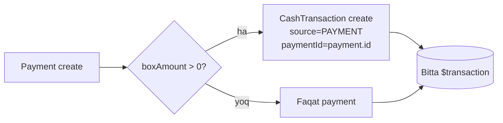
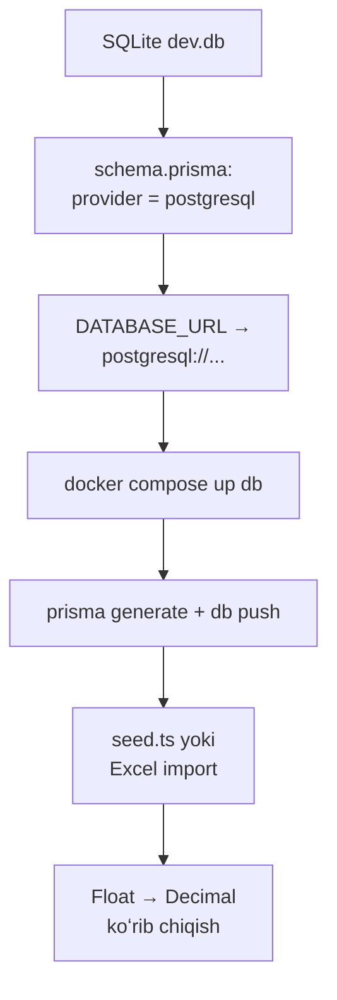

# 10. Nofunksional talablar va kelajak rejalari

> **Loyiha:** SmartBlok CRM/ERP | **Hujjat:** Texnik topshiriq (TZ) | **Versiya:** 1.0 | **Sana:** 2026-07-09 | **Branch:** main (v2 order-lifecycle)

Ushbu bob tizimning **nofunksional talablarini** (xavfsizlik, unumdorlik, ishonchlilik, lokalizatsiya, masshtablanuvchanlik) hamda **mavjud cheklovlar** va **kelajakdagi yaxshilanishlar rejasini** (roadmap) belgilaydi. Barcha bandlar tizimning haqiqiy, amalga oshirilgan kod holatiga asoslanadi. Funksional talablar va domen mantiqi uchun tegishli boblarga (masalan, *4-bob. Malumotlar modeli*, *6-bob. Tolovlar va kassa*, *7-bob. RBAC va xavfsizlik*) havola qilinadi.

---

## 10.1. Umumiy tavsif va meʼzon toifalari

Nofunksional talablar quyidagi sifat atributlariga (ISO/IEC 25010 ruhida, soddalashtirilgan) taqsimlanadi:

| Toifa | Qamrov | Bob band |
|---|---|---|
| Xavfsizlik | JWT, RBAC, parol xeshlash, CORS, kirish validatsiyasi | 10.2 |
| Unumdorlik | Real-vaqt aggregatsiya, groupBy hisob-kitoblar, indekslar | 10.3 |
| Ishonchlilik va yaxlitlik | Kassa posting/reversal, tranzaksiyalar, ledger drift | 10.4 |
| Lokalizatsiya | Ozbek UI, som/USD, sana formati | 10.5 |
| Muhit qollab-quvvatlash | Brauzer, responsive, tema | 10.6 |
| Masshtablanuvchanlik | SQLite → PostgreSQL migratsiyasi | 10.7 |
| Zaxira nusxa | Backup strategiyasi | 10.8 |
| Mavjud cheklovlar | Malum kamchiliklar royxati | 10.9 |
| Kelajak rejalari | Roadmap (bosqichma-bosqich) | 10.10 |
| Qabul mezonlari | Acceptance criteria | 10.11 |

---

## 10.2. Xavfsizlik talablari

### 10.2.1. Autentifikatsiya (JWT)

Tizim **JWT (JSON Web Token)** asosidagi stateless autentifikatsiyadan foydalanadi (`@nestjs/jwt`, `passport-jwt`).

| Parametr | Qiymat / manba | Izoh |
|---|---|---|
| Token turi | Bearer (`Authorization: Bearer <token>`) | `ExtractJwt.fromAuthHeaderAsBearerToken()` |
| Amal muddati | `JWT_EXPIRES_IN` yoki default `7d` | 7 kun |
| Maxfiy kalit | `JWT_SECRET` (fallback `dev-secret-change-me`) | Prodda **almashtirish shart** |
| Muddat tekshiruvi | `ignoreExpiration: false` | Otgan token rad etiladi |
| Payload maydonlari | `sub`, `username`, `role`, `name`, `agentId` | `auth.service.ts` `sign()` |

**JWT payload tarkibi (VERBATIM):**

```json
{ "sub": "<userId>", "username": "...", "role": "...", "name": "...", "agentId": "..." }
```

**Xavfsizlik talabi NFR-SEC-01:** `JWT_SECRET` production muhitida uzun, tasodifiy string bilan almashtirilishi **shart** (`.env.example` da placeholder: `"change-me-in-production-please-use-a-long-random-string"`). Hardcoded fallback (`dev-secret-change-me`) faqat dev uchun ruxsat etiladi.

**Muhim chekka holat (NFR-SEC-02):** `jwt.strategy.ts` `validate()` metodida token ichidagi `role`/`agentId` ishlatiladi, **DB dan qayta yuklanmaydi**. Demak, foydalanuvchi roli ozgartirilsa yoki hisob bloklansa (`active=false`), oʻzgarish token muddati (7 kun) tugagunga qadar **darhol kuchga kirmaydi**. Bu holat 10.9 va 10.10 da hisobga olingan.

### 10.2.2. Rolga asoslangan kirish nazorati (RBAC)

Tizimda **4 ta rol** mavjud (Prisma `enum` emas, `String` maydon, ruxsat etilgan qiymatlar izohda): `ADMIN | ACCOUNTANT | AGENT | CASHIER`.

RBAC ikki mexanizm orqali taʼminlanadi:

1. **`JwtAuthGuard`** — autentifikatsiya (token borligi va yaroqliligi).
2. **`RolesGuard` + `@Roles(...)`** — rol tekshiruvi (metod > class ustuvorligi, `Reflector.getAllAndOverride`).

**Endpoint darajasidagi rol matritsasi (asosiy modullar):**

| Modul / endpoint | ADMIN | ACCOUNTANT | AGENT | CASHIER |
|---|:-:|:-:|:-:|:-:|
| `GET /users`, `POST/PUT/DELETE /users` | ✅ | — | — | — |
| `POST/PUT /agents` | ✅ | ✅ | — | — |
| `DELETE /agents/:id` | ✅ | — | — | — |
| `GET/POST/PUT /clients` | ✅ | ✅ | ✅ (scoped) | — |
| `DELETE /clients/:id` | ✅ | — | — | — |
| `GET/POST/PUT/PATCH /orders` | ✅ | ✅ | ✅ (scoped) | — |
| `DELETE /orders/:id` | ✅ | ✅ | — | — |
| `GET/POST /payments` | ✅ | ✅ | ✅ (scoped) | ✅ |
| `DELETE /payments/:id` | ✅ | ✅ | — | — |
| `/kassa/*` | ✅ | ✅ | — | ✅ |
| `/expenses/*` | ✅ | ✅ | — | ✅ |
| `/debts/summary` | ✅ | ✅ | — | — |
| `/reports/svod` | ✅ | ✅ | — | — |
| `/procurement/prices`, `/routes` | ✅ | ✅ | — | — |
| `/procurement/matrix` | ✅ | ✅ | ✅ | — |
| `/import/excel` | ✅ | ✅ | — | — |
| `/dashboard/*` | ✅ | ✅ | ✅ | ✅ (faqat JWT) |

> **Diqqat (NFR-SEC-03):** `GET /agents`, `GET /regions`, `GET /factories`, `GET /products`, `GET /vehicles` va butun `/dashboard/*` endpointlarida `@Roles` **yoq** — har qanday autentifikatsiyalangan foydalanuvchi bu maʼlumotlarni koʻra oladi.

### 10.2.3. AGENT-scoping (agent boʻyicha maʼlumot cheklash)

AGENT roli faqat oʻz `agentId` siga tegishli yozuvlarni koʻrishi kerak. Scope mantiqi:

```ts
scope(user) => user?.role === 'AGENT' && user?.agentId ? { agentId: user.agentId } : {}
```

**Scoping qamrovi (NFR-SEC-04):**

| Modul | `findAll` | `findOne` | `update` | `remove` |
|---|:-:|:-:|:-:|:-:|
| Clients | ✅ scoped | ❌ scoping yoq | ❌ scoping yoq | ADMIN only |
| Orders | ✅ scoped | ❌ | ❌ | ADMIN/ACCOUNTANT |
| Payments | ✅ scoped | — | — | ADMIN/ACCOUNTANT |

> **Maʼlum boshliq:** `findOne`/`update` da ownership tekshiruvi yoʻq — AGENT ID orqali boshqa agentning mijozi/buyurtmasi tafsilotini koʻrishi yoki oʻzgartirishi mumkin. Bu 10.9 (cheklovlar) va 10.10 (roadmap) da qamrab olingan.

### 10.2.4. Parol xavfsizligi

| Talab | Amalga oshirilgan holat |
|---|---|
| Xeshlash algoritmi | `bcryptjs`, salt rounds = **10** |
| Saqlash | Faqat hash (`User.password`), plain text hech qachon saqlanmaydi |
| Chiqarishda himoya | `safe` select — `password` hech qachon API javobiga chiqmaydi |
| Minimal uzunlik | Faqat `UpdateProfileDto.password` da `@MinLength(4)` |
| Demo parollar | `admin123`, `hisob123`, `kassa123`, `agent123` — **prodda almashtirish shart** |
| Default parollar | Yangi user: `smartblok`; yangi agent: `agent123` (javobda ochiq qaytadi) |

**Talab NFR-SEC-05:** Ishlab chiqarishga chiqishdan oldin barcha demo/default parollar almashtirilishi shart; minimal parol siyosati (uzunlik ≥ 8, murakkablik) 10.10 da rejalashtirilgan.

### 10.2.5. CORS va tarmoq

| Parametr | Qiymat |
|---|---|
| CORS origin | `CORS_ORIGIN` (vergul bilan koʻp origin) yoki `http://localhost:5173` |
| `credentials` | `true` |
| Global prefiks | `/api` (`setGlobalPrefix('api')`) |
| Port | `API_PORT` yoki `4000` |

### 10.2.6. Kirish validatsiyasi (input validation)

| Mexanizm | Holat |
|---|---|
| Global `ValidationPipe` | `whitelist: true`, `transform: true`, `enableImplicitConversion: true` |
| `forbidNonWhitelisted` | **Yoq** — notanish maydonlar jimgina tashlab yuboriladi (xato bermaydi) |
| DTO klasslari | Faqat `LoginDto`, `UpdateProfileDto` (class-validator bilan) |
| Aksariyat modullar | `@Body() d: any` — **DTO validatsiyasi yoq**, faqat qoʻlbola tekshiruvlar (`BadRequestException`) |

> **Talab NFR-SEC-06:** Barcha yozish endpointlari (orders, payments, expenses va h.k.) uchun kuchli tiplangan DTO va `class-validator` dekoratorlari joriy etilishi 10.10 da rejalashtirilgan. Hozircha biznes-kritik validatsiyalar servis darajasida qoʻlda amalga oshirilgan (masalan, `amount <= 0`, majburiy party FK).

### 10.2.7. Xavfsizlik boʻyicha yigʻma xatarlar registri

| ID | Xatar | Jiddiylik | Holat |
|---|---|:-:|---|
| SEC-R1 | Hardcoded JWT fallback secret | Yuqori | Prodda `.env` majburiy |
| SEC-R2 | Rol/active ozgarishi tokenda kechikadi (7 kun) | Orta | Roadmap 10.10 |
| SEC-R3 | AGENT findOne/update ownership tekshirilmaydi | Orta | Roadmap 10.10 |
| SEC-R4 | Users create/update `any` body, rol validatsiyasiz | Orta | Roadmap DTO |
| SEC-R5 | Demo/default parollar zaif | Yuqori | Deploy oldidan almashtirish |
| SEC-R6 | Frontend marshrut himoyasi yoʻq (faqat menyu filtri) | Past | Backend `@Roles` himoya qiladi |
| SEC-R7 | `email` format validatsiyasi yoʻq | Past | Roadmap DTO |

---

## 10.3. Unumdorlik (Performance) talablari

### 10.3.1. Real-vaqt hisob-kitob arxitekturasi

Tizimda **alohida "Debt" (qarz) jadvali yoq** — barcha qarz/qoldiq/balans koʻrsatkichlari `Order` va `Payment` jadvallaridan **real-vaqt aggregatsiya** (Prisma `groupBy`/`aggregate`) orqali hisoblanadi. Tarixiy snapshot saqlanmaydi.

**Asosiy formulalar (yagona haqiqat manbasi):**

| Koʻrsatkich | Formula | Manba |
|---|---|---|
| Mijoz balansi | `delivered − paid` | `Σ saleTotal (DELIVERED,COMPLETED) − Σ payment.amount (CLIENT)` |
| Zavod balansi | `cost − paid` | `Σ costTotal − Σ payment.amount (FACTORY)` |
| Moshina balansi | `owed − paid` | `Σ transportFee − Σ payment.amount (VEHICLE)` |
| Order profit | `saleTotal − costTotal − transportFee` | Order yaratishda hisoblanadi va saqlanadi |

> **Muhim shart:** Faqat `status ∈ {DELIVERED, COMPLETED}` boʻlgan buyurtmalar qarz hisobiga kiradi. Toʻlovlar esa `type` boʻyicha, statusdan qatʼi nazar yigʻiladi.

### 10.3.2. Unumdorlik talablari (NFR)

| ID | Talab | Metrika |
|---|---|---|
| NFR-PERF-01 | Real-vaqt aggregatsiya parallel bajarilishi | `Promise.all` (masalan `debts.summary()` — 9 parallel soʻrov, `dashboard.summary()` — 9 parallel) |
| NFR-PERF-02 | Dashboard KPI javob vaqti | Demo hajm (≤10 order, ≤10 payment) uchun < 200 ms |
| NFR-PERF-03 | Tranzaksiya royxati cheklovi | `kassa/transactions` — `take: 200` (sahifasiz limit) |
| NFR-PERF-04 | Frontend query keshi | `staleTime: 30s`, `retry: 1`, `refetchOnWindowFocus: false` |
| NFR-PERF-05 | Frontend jadval sahifalash | `EntityTable` — 12 qator/sahifa, mijoz tomonida qidiruv |

### 10.3.3. Unumdorlikka taʼsir etuvchi omillar va cheklovlar

- **Kunlik guruhlash JS tarafida:** `salesTrend()` DB `groupBy` emas, `Map` orqali JS da (UTC sana kesimi `slice(0,10)`). Katta hajmda barcha DELIVERED orderlar xotiraga yuklanadi.
- **Skopingsiz groupBy:** `clients.findAll` da groupBy butun bazadan hisoblanadi, keyin Map bilan filtrlanadi — juda katta hajmda ortiqcha hisob.
- **Frontend keng invalidatsiya:** Aksariyat mutatsiyalardan keyin `qc.invalidateQueries()` **argumentsiz** chaqiriladi — barcha querylar qayta yuklanadi (soddalik uchun, lekin ortiqcha tarmoq trafigi).
- **Indekslar:** Prisma sxemasida `@unique` maydonlar (username, email, agent/client/region/factory/cashbox name, orderNo) avtomatik indekslanadi; qoʻshimcha aggregatsiya indekslari (masalan `Order.status`, `Payment.type`) sxemada aniq belgilanmagan.

> **Talab NFR-PERF-06:** PostgreSQL ga oʻtganda `Order(status, clientId, factoryId, vehicleId, agentId)` va `Payment(type, clientId, factoryId, vehicleId, agentId)` uchun aggregatsiya indekslari qoʻshilishi tavsiya etiladi (10.10).

---

## 10.4. Ishonchlilik va maʼlumotlar yaxlitligi

### 10.4.1. Kassa (ledger) yaxlitligi — posting va reversal

Tizimning eng muhim yaxlitlik prinsipi: **har qanday pul harakati (payment yoki expense) kassa yozuvi (`CashTransaction`) bilan bitta tranzaksiyada yoziladi** — "ledger hech qachon drift qilmaydi".

**Posting mexanizmi (`payments.service.create`, `$transaction` ichida):**



| Yozuv turi | direction | source | Bogʻlovchi maydon |
|---|---|---|---|
| CLIENT toʻlovi | `IN` | `PAYMENT` | `paymentId` |
| FACTORY toʻlovi | `OUT` | `PAYMENT` | `paymentId` |
| VEHICLE toʻlovi | `OUT` | `PAYMENT` | `paymentId` |
| Xarajat | `OUT` | `EXPENSE` | `expenseId` |
| Qoʻlda kirim/chiqim | `IN`/`OUT` | `MANUAL` | (bogʻlovsiz) |

**Reversal (bekor qilish) mexanizmi:** Payment yoki Expense oʻchirilganda, `$transaction` ichida avval bogʻliq `CashTransaction` `deleteMany({ where: { paymentId } })` (yoki `expenseId`) orqali oʻchiriladi, keyin asosiy yozuv oʻchiriladi. Bu kompensatsion teskari yozuv emas, balki **fizik oʻchirish** — balans qayta hisoblanadi.

### 10.4.2. Tranzaksiya qamrovi

| Operatsiya | Tranzaksiya | Izoh |
|---|:-:|---|
| Payment create + kassa posting | ✅ `$transaction` | Drift-free |
| Payment remove + reversal | ✅ `$transaction` | Drift-free |
| Expense create + kassa posting | ✅ `$transaction` | Drift-free |
| Expense remove + reversal | ✅ `$transaction` | Drift-free |
| Agent create + user create | ✅ `$transaction` | Atomik |
| Order remove + payment unlink | ❌ Alohida | `updateMany` + `delete` — atomik emas |
| Excel import | ❌ Alohida | Har delete/create mustaqil — yarim import xavfi |

### 10.4.3. Maʼlumotlar yaxlitligi boʻyicha maʼlum zaifliklar

| ID | Zaiflik | Taʼsir |
|---|---|---|
| INT-R1 | `CashTransaction.paymentId`/`expenseId` **FK emas** (oddiy `String?`) — DB kaskad yoʻq | Referensial yaxlitlik faqat qoʻlbola `deleteMany` bilan |
| INT-R2 | `kassa/transactions/:id` DELETE PAYMENT/EXPENSE manbali yozuvni ham oʻchira oladi | Ledger ↔ payment bogʻlanishi buziladi |
| INT-R3 | `orderNo = 'B-' + (count+1)` — oʻchirish/concurrency da dublikat xavfi | `orderNo @unique` collision |
| INT-R4 | Excel import tranzaksiyasiz — replace oʻchirdi, keyin xato → yarim import | Maʼlumot yoʻqolishi |
| INT-R5 | Hard delete hamma joyda (soft-delete yoʻq), kaskad sozlanmagan | Bogʻliq yozuvli obyektni oʻchirish FK xatosi |
| INT-R6 | Pul uchun `Float` (SQLite REAL) — aniqlik cheklovi | Yaxlitlash xatolari |
| INT-R7 | `enum` DB darajasida yoʻq (String) — nomaʼlum qiymat yozilishi mumkin | Faqat servis validatsiyasi himoya qiladi |

> **Talab NFR-REL-01:** Kassa balansi har doim `Σ(IN) − Σ(OUT)` formulasiga teng boʻlishi kafolatlanishi kerak — bu payment/expense posting-reversal atomikligi bilan taʼminlanadi (INT-R2 dan tashqari).

---

## 10.5. Lokalizatsiya talablari

| ID | Talab | Amalga oshirilgan holat |
|---|---|---|
| NFR-L10N-01 | UI tili — ozbek (lotin) | `index.html` `lang="uz"`; barcha label, tugma, xato xabari ozbekcha |
| NFR-L10N-02 | Asosiy valyuta — som (UZS) | `fmtUZS()` — `Intl.NumberFormat('ru-RU')` + `" so'm"` |
| NFR-L10N-03 | Ikkilamchi valyuta — USD | `method='USD'`, `usdAmount * rate`, alohida USD kassa |
| NFR-L10N-04 | Valyuta konvertatsiya | `rate` saqlanadi (default UI `12700`); kassa balansi **konvertatsiya qilmaydi** — har kassa bitta valyutada |
| NFR-L10N-05 | Sana formati | `fmtDate()` — `DD.MM.YYYY` (`ru-RU` locale) |
| NFR-L10N-06 | Raqam ajratgichi | `ru-RU` (probel), `fmtShort()` — `mlrd/mln/ming` |
| NFR-L10N-07 | Rol yorliqlari | `ADMIN→Administrator`, `ACCOUNTANT→Buxgalter`, `AGENT→Agent`, `CASHIER→Kassir` |

**Chekka holat:** `rate` (kurs) saqlansa-da, kassa `summary`/`balance` hisobida **valyutalararo konvertatsiya uchun ishlatilmaydi**. `totalUZS` va `totalUSD` alohida yigʻiladi — bu toʻgʻri, chunki har kassa yagona valyutada. Koʻp-valyutali yagona balans (kurs bilan konvertatsiya) 10.10 da rejalashtirilgan.

---

## 10.6. Brauzer/qurilma qollab-quvvatlash va responsivlik

### 10.6.1. Texnologik talablar

| Komponent | Talab |
|---|---|
| Frontend | React 18.3 SPA, Vite 6, Tailwind CSS v4 |
| Brauzer | Zamonaviy evergreen brauzerlar (ES2021+, CSS custom properties, `prefers-color-scheme`) |
| Til (build) | TypeScript 5.7 (`tsc --noEmit` build oldidan majburiy) |
| Node (runtime) | `>= 20` (monorepo `engines`) |

### 10.6.2. Responsivlik va foydalanuvchi tajribasi

| ID | Talab | Amalga oshirilgan |
|---|---|---|
| NFR-UX-01 | Adaptiv layout | Sidebar `lg:` da 64en, kichik ekranda drawer (Framer Motion spring) |
| NFR-UX-02 | Yorugʻ/qorongʻu tema | `.dark` klass, `sb_theme` localStorage, tizim afzalligiga default |
| NFR-UX-03 | Klaviatura navigatsiyasi | `Ctrl/Cmd+K` CommandPalette; `:focus-visible` outline |
| NFR-UX-04 | Kirish imkoniyati (a11y) | `prefers-reduced-motion` → animatsiya 0.01ms; fokus halqasi |
| NFR-UX-05 | Toast bildirishnomalari | 3200ms avto-yopilish, success/error/info |
| NFR-UX-06 | Skeleton yuklanish holati | `TableSkeleton`, `CardSkeleton`, shimmer animatsiya |
| NFR-UX-07 | CSV eksport | `EntityTable` — `;` ajratgich, BOM (``), ruscha Excel mos |

**Dizayn tizimi:** Asosiy rang — **koʻk (blue)** palitrasi (`--primary: #2563EB` yorugʻ, `#60A5FA` qorongʻu), aksent — amber, neytral — slate. Font: Inter/Manrope.

> **Cheklov:** Rasmiy mobil ilova yoʻq (faqat responsive web). Frontend marshrut darajasida rol himoyasi yoʻq — URL qoʻlda kiritilsa har qanday autentifikatsiyalangan foydalanuvchi sahifani ochadi (himoya backend `@Roles` orqali).

---

## 10.7. Masshtablanuvchanlik: SQLite → PostgreSQL migratsiyasi

### 10.7.1. Joriy holat

| Muhit | Maʼlumotlar bazasi | Sozlash |
|---|---|---|
| Dev (default) | **SQLite** (`file:./dev.db`) | `prisma db push` (migrationsiz) |
| Prod (ixtiyoriy) | **PostgreSQL 16** | `docker-compose.yml` (`postgres:16-alpine`) |

Barcha `id` maydonlar **opak UUID** (`@default(uuid())`) — ketma-ket raqamlash yoʻq. Bu SQLite → PostgreSQL koʻchishini soddalashtiradi (ID formatiga bogʻliqlik yoʻq).

### 10.7.2. Migratsiya bosqichlari



**Migratsiya talablari:**

| ID | Talab |
|---|---|
| NFR-SCALE-01 | `schema.prisma` da `provider` `"sqlite"` → `"postgresql"` ga oʻzgartirish |
| NFR-SCALE-02 | `DATABASE_URL` PostgreSQL connection string ga oʻtkazish (`.env.example` da namuna bor) |
| NFR-SCALE-03 | `docker-compose.yml` orqali `smartblok-db` konteyner (`5432`, volume `smartblok_pgdata`) |
| NFR-SCALE-04 | Pul maydonlari `Float` → `Decimal` ga oʻtkazish koʻrib chiqilishi (aniqlik uchun) |
| NFR-SCALE-05 | Rasmiy `prisma migrate` (versiyalangan migratsiya) joriy etish — hozircha `db push` |

> **Cheklov:** Hozirda **rasmiy migration skripti yoʻq** — `prisma db push` (migrationsiz sxema push) ishlatiladi. Production uchun `prisma migrate deploy` ga oʻtish 10.10 da rejalashtirilgan.

---

## 10.8. Zaxira nusxa (Backup) talablari

Joriy loyihada avtomatik backup mexanizmi **koddan tashqarida** (infratuzilma darajasida) taʼminlanishi kerak:

| Muhit | Backup strategiyasi (tavsiya) |
|---|---|
| SQLite (dev) | `dev.db` faylini davriy nusxalash (fayl asosidagi) |
| PostgreSQL (prod) | `pg_dump` davriy (kunlik), volume snapshot (`smartblok_pgdata`) |

**Talablar:**

| ID | Talab |
|---|---|
| NFR-BAK-01 | Production DB uchun kamida kunlik avtomatik `pg_dump` backup |
| NFR-BAK-02 | Docker volume (`smartblok_pgdata`) saqlanishi — `restart: unless-stopped` |
| NFR-BAK-03 | Excel import `replace=true` rejimi maʼlumotni **toʻliq oʻchiradi** — undan oldin backup majburiy |
| NFR-BAK-04 | Backup tiklash (restore) protsedurasi hujjatlashtirilishi |

> **Diqqat:** Excel import `replace=true` rejimida `payment`, `order`, `product`, `client` jadvallarini filtrsiz `deleteMany()` bilan tozalaydi. Bu qaytarib boʻlmaydigan amal — foydalanuvchi UI da ogohlantiriladi ("Buyurtma, toʻlov va mijozlar oʻchirilib qayta yoziladi"), lekin backend backup yaratmaydi.

---

## 10.9. Mavjud cheklovlar (Known Limitations)

Quyidagi cheklovlar **ataylab** yoki **texnik qarz** sifatida mavjud va TZ ning ushbu versiyasida qabul qilingan:

### 10.9.1. Xavfsizlik va RBAC

1. JWT ichidagi `role`/`active` DB dan qayta tekshirilmaydi — rol/blok oʻzgarishi 7 kungacha kechikadi (SEC-R2).
2. AGENT `findOne`/`update` da ownership tekshirilmaydi (SEC-R3).
3. `Users` create/update `@Body() d: any` — rol qiymati validatsiyasiz yozilishi mumkin (SEC-R4).
4. Frontend marshrut darajasida rol himoyasi yoʻq (faqat menyu filtri) (SEC-R6).
5. Bir qator GET endpointlarda `@Roles` yoʻq (SEC-R3, 10.2.2).

### 10.9.2. Maʼlumotlar yaxlitligi

6. `paymentId`/`expenseId` FK emas — DB kaskad yoʻq (INT-R1).
7. Qoʻlda kassa DELETE PAYMENT/EXPENSE yozuvini uzib qoʻyishi mumkin (INT-R2).
8. `orderNo` dublikat xavfi (oʻchirish/concurrency) (INT-R3).
9. Excel import tranzaksiyasiz — yarim import xavfi (INT-R4).
10. Hard delete + kaskad yoʻq (INT-R5).
11. Pul uchun `Float` — aniqlik cheklovi (INT-R6).

### 10.9.3. Biznes mantiq

12. `creditLimit` saqlanadi lekin **hech qanday order/tolov mantiqida tekshirilmaydi** — faqat maʼlumot.
13. Buyurtma holat oʻtishlari `setStatus` da **tekshirilmaydi** — istalgan holatdan istalganiga sakrash mumkin (faqat `advance` ketma-ket).
14. Order `create`/`update` da moshina majburiyligi (`assertVehicleFor`) tekshirilmaydi — faqat `setStatus`/`advance` da.
15. Xarajatni UPDATE qilish endpointi yoʻq (faqat create/delete).
16. `Client.name` **global unikal** (agent ichida emas) — turli agentlarda bir xil mijoz nomi mumkin emas.
17. Zavod/moshina qarz totals manfiy (ortiqcha toʻlangan) balanslarni filtrlamaydi — umumiy qarzni kamaytiradi.

### 10.9.4. Texnik va infratuzilma

18. Rasmiy `prisma migrate` yoʻq — `db push` (NFR-SCALE-05).
19. `PrismaService` da graceful shutdown (`onModuleDestroy`) yoʻq.
20. Excel import ustunlarni **qatʼiy indeks** boʻyicha oʻqiydi — ustun tartibi oʻzgarsa notoʻgʻri import; sarlavha tekshirilmaydi.
21. `toDate` fallback — notoʻgʻri sana → server vaqti (`new Date()`) jimgina qoʻyiladi.
22. Frontend `AuthUser.id`/`agentId` tipi `number`, lekin API UUID (string) — v2 migratsiyasidan qolgan tip nomuvofiqligi.
23. `Product.unit` sxema defaulti `"m³"` vs servis `'m3'` nomuvofiqligi.
24. `TRANSFER` toʻlov usuli backendda qabul qilinadi, lekin frontend/schema izohida koʻrsatilmagan.

---

## 10.10. Kelajakdagi yaxshilanishlar (Roadmap)

Yaxshilanishlar prioritet va bosqichlarga taqsimlangan:

### Bosqich 1 — Xavfsizlik va yaxlitlik (yuqori prioritet)

| ID | Yaxshilanish | Bogʻliq cheklov |
|---|---|---|
| RM-01 | Barcha yozish endpointlari uchun kuchli DTO + `class-validator` | SEC-R4, SEC-R7, 10.2.6 |
| RM-02 | JWT strategiyada DB dan foydalanuvchi/rol/active qayta yuklash (yoki qisqa token + refresh) | SEC-R2 |
| RM-03 | AGENT `findOne`/`update`/`status` da ownership tekshiruvi | SEC-R3 |
| RM-04 | Barcha demo/default parollarni deploy da almashtirish; parol siyosati (≥8) | SEC-R5 |
| RM-05 | `paymentId`/`expenseId` ni haqiqiy FK ga aylantirish (kaskad/restrict) | INT-R1, INT-R2 |
| RM-06 | Kassadan PAYMENT/EXPENSE manbali yozuvni qoʻlda oʻchirishni bloklash | INT-R2 |

### Bosqich 2 — Ishonchlilik va maʼlumot

| ID | Yaxshilanish | Bogʻliq cheklov |
|---|---|---|
| RM-07 | Excel importni yagona `$transaction` ga oʻrash | INT-R4 |
| RM-08 | `orderNo` generatsiyasini atomik/yil-prefiksli qilish | INT-R3 |
| RM-09 | Soft-delete (`active=false`) yoki kaskad sozlash | INT-R5 |
| RM-10 | Rasmiy `prisma migrate` (versiyalangan migratsiya) | NFR-SCALE-05 |
| RM-11 | Pul maydonlarini `Decimal` ga oʻtkazish | INT-R6, NFR-SCALE-04 |
| RM-12 | `PrismaService` ga graceful shutdown qoʻshish | Cheklov 19 |

### Bosqich 3 — Biznes funksionalligi

| ID | Yaxshilanish | Bogʻliq cheklov |
|---|---|---|
| RM-13 | `creditLimit` ni order yaratishda tekshirish (limit nazorati) | Cheklov 12 |
| RM-14 | Buyurtma holat oʻtish validatsiyasi (state machine) | Cheklov 13 |
| RM-15 | Xarajat UPDATE endpointi | Cheklov 15 |
| RM-16 | Koʻp-valyutali yagona balans (kurs bilan konvertatsiya) | NFR-L10N-04 |
| RM-17 | Rol boʻyicha dashboard (masalan CASHIER uchun cheklangan KPI) — hozir faqat frontend ajratadi | 10.2.2 |

### Bosqich 4 — Masshtablanuvchanlik va operatsiyalar

| ID | Yaxshilanish |
|---|---|
| RM-18 | PostgreSQL ga toʻliq migratsiya + aggregatsiya indekslari (`Order.status`, `Payment.type`) |
| RM-19 | Avtomatik backup (kunlik `pg_dump`) va restore protsedurasi |
| RM-20 | Frontend marshrut darajasida rol himoyasi (defense-in-depth) |
| RM-21 | Server-side sahifalash va filtr (katta hajm uchun) |
| RM-22 | Excel import ustunlarni sarlavha nomi boʻyicha oʻqish (indeks emas) |
| RM-23 | Hisobot eksporti (Excel/PDF) backend endpointi |

---

## 10.11. Qabul qilish mezonlari (Acceptance Criteria)

Tizim quyidagi mezonlarni qanoatlantirsa, ushbu versiya **qabul qilingan** hisoblanadi. Har mezon oʻlchanadigan va kod holatiga mos.

### 10.11.1. Xavfsizlik

- [ ] **AC-SEC-01:** Autentifikatsiyasiz (`Authorization` headersiz) har qanday himoyalangan endpointga soʻrov `401 Unauthorized` qaytaradi.
- [ ] **AC-SEC-02:** Notoʻgʻri rol bilan cheklangan endpointga (masalan CASHIER → `POST /orders`) soʻrov `403 Forbidden` (`Ruxsat yetarli emas`) qaytaradi.
- [ ] **AC-SEC-03:** Login xato parol/username bilan `Login yoki parol xato` qaytaradi (user enumeration yoʻq — bir xil xabar).
- [ ] **AC-SEC-04:** Bloklangan hisob (`active=false`) login qila olmaydi — `Hisob bloklangan` (`403`).
- [ ] **AC-SEC-05:** Hech qanday API javobida `password` maydoni chiqmaydi.
- [ ] **AC-SEC-06:** AGENT `GET /clients` da faqat oʻz `agentId` mijozlarini koʻradi.
- [ ] **AC-SEC-07:** Production `.env` da `JWT_SECRET` va barcha demo parollar almashtirilgan.

### 10.11.2. Maʼlumotlar yaxlitligi (ledger)

- [ ] **AC-INT-01:** CLIENT toʻlovi yaratilganda mos kassa (`CASHBOX_BY_METHOD`) da `IN` `CashTransaction` (`source=PAYMENT`) paydo boʻladi.
- [ ] **AC-INT-02:** FACTORY/VEHICLE toʻlovi `OUT` kassa yozuvi yaratadi.
- [ ] **AC-INT-03:** Toʻlov oʻchirilganda bogʻliq kassa yozuvi ham oʻchadi (balans tiklanadi).
- [ ] **AC-INT-04:** Xarajat yaratish/oʻchirish `OUT` (`source=EXPENSE`) kassa yozuvini sinxron yaratadi/oʻchiradi.
- [ ] **AC-INT-05:** Har kassa balansi doim `Σ(IN.amount) − Σ(OUT.amount)` ga teng.
- [ ] **AC-INT-06:** `method='USD'` toʻlovda `amount = usdAmount * rate` toʻgʻri hisoblanadi va USD kassaga `usdAmount` yoziladi.
- [ ] **AC-INT-07:** `amount <= 0` toʻlov/xarajat rad etiladi (`0 dan katta bo'lishi kerak`).

### 10.11.3. Biznes mantiq

- [ ] **AC-BIZ-01:** Mijoz balansi `Σ saleTotal(DELIVERED,COMPLETED) − Σ payment.amount(CLIENT)` ga teng.
- [ ] **AC-BIZ-02:** Zavod balansi `Σ costTotal − Σ payment(FACTORY)`, moshina balansi `Σ transportFee − Σ payment(VEHICLE)`.
- [ ] **AC-BIZ-03:** Order profit `saleTotal − costTotal − transportFee` (create/update da qayta hisoblanadi).
- [ ] **AC-BIZ-04:** `advance` buyurtmani `ORDER_FLOW` boʻyicha ketma-ket bir bosqich oldinga suradi; oxirgi (COMPLETED) da xato beradi.
- [ ] **AC-BIZ-05:** LOADING va undan keyingi holatga oʻtish uchun `vehicleId` majburiy (`Avval moshina biriktiring`).
- [ ] **AC-BIZ-06:** AGENT biriktirilmagan mijozga order yaratib boʻlmaydi (`Agent majburiy`).
- [ ] **AC-BIZ-07:** Tannarx matritsasi `landedCostPerM3 = pricePerM3 + costPerTruck / truckCapacityM3` ni toʻgʻri hisoblab, eng arzonini `cheapest` ga chiqaradi.

### 10.11.4. Lokalizatsiya va UX

- [ ] **AC-UX-01:** Butun UI ozbek (lotin) tilida; pul `so'm` bilan, sana `DD.MM.YYYY` formatida.
- [ ] **AC-UX-02:** Yorugʻ/qorongʻu tema ishlaydi va `sb_theme` da saqlanadi.
- [ ] **AC-UX-03:** `Ctrl/Cmd+K` CommandPalette ochadi.
- [ ] **AC-UX-04:** Har foydalanuvchi faqat oʻz roliga ruxsat etilgan menyu elementlarini koʻradi (`visibleGroups`).
- [ ] **AC-UX-05:** 401 javobda foydalanuvchi avtomatik `/login` ga yoʻnaltiriladi.

### 10.11.5. Infratuzilma

- [ ] **AC-INF-01:** `npm run db:setup` (generate + db push + seed) demo maʼlumotni muvaffaqiyatli yaratadi.
- [ ] **AC-INF-02:** `npm run dev` api (`4000`) va web (`5173`) ni parallel ishga tushiradi.
- [ ] **AC-INF-03:** `tsc --noEmit && vite build` frontend build type-xatosiz oʻtadi.
- [ ] **AC-INF-04:** Excel import (`POST /import/excel`) 3 varaqni (Tovar, Oplata, Oplata Zavod) oʻqib `{ orders, payments, factoryPayments, skipped }` qaytaradi.
- [ ] **AC-INF-05:** `docker compose up db` PostgreSQL 16 konteynerni ishga tushiradi (migratsiya tayyorligi).

---

## 10.12. Xulosa

SmartBlok CRM/ERP v2 nofunksional talablari **ishlab chiqarish uchun tayyor asos** yaratadi: JWT+RBAC xavfsizlik, atomik kassa ledger (drift-free posting/reversal), ozbek lokalizatsiyasi, responsiv koʻk dizayn tizimi va SQLite→PostgreSQL migratsiya yoʻli. Bir qator maʼlum cheklovlar (DTO validatsiyasi, token-rol kechikishi, AGENT ownership, `Float` aniqligi, migration skripti) ataylab qabul qilingan texnik qarz sifatida hujjatlashtirilgan va 10.10-bandagi bosqichma-bosqich roadmap orqali bartaraf etilishi rejalashtirilgan. Tizimning qabul qilinishi 10.11-banddagi oʻlchanadigan mezonlar bilan tekshiriladi.

> Bogʻliq boblar: *4-bob. Maʼlumotlar modeli* (Prisma sxema), *6-bob. Tolovlar va kassa* (posting mantiqi), *7-bob. Autentifikatsiya va RBAC* (rol matritsasi), *9-bob. Hisobotlar va boshqaruv paneli* (aggregatsiya formulalari).
